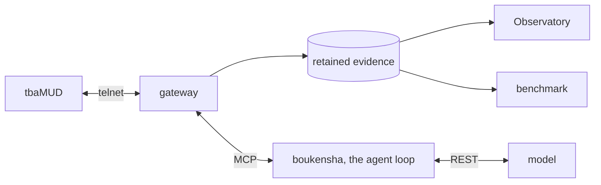

# claude-code-camp-2026-Q2

An AI agent that plays a text MUD the way a person does. It explores, fights,
gets lost, dies, and remembers what it learned. Every command it sends and
every line the game answers is retained as typed evidence, so what the agent
did and why can be read back afterwards rather than guessed at.

It is built from first principles as its own agent loop rather than on top of
a coding harness, because the pre-week experiments showed that everything
moved out of the model and into code became dependable even on a small model.

[](https://youtu.be/p8FFp4wVf3I)

*An agent launched into the live world, then its retained evidence, spatial
replay, cost, experiments and knowledge. Select the preview for the narrated
walkthrough.*

## Why

Game studios lose players to friction they cannot see. An agent that actually
plays the game surfaces the journey a new player lives: where it gets lost,
what kills it, when it gets bored. tbaMUD (CircleMUD) is the proving ground
before the agent faces a private game world.

## How it is built



- **The agent** owns its own loop: the prompt it sends, the tools it may call,
  the context it carries, and the cost it is allowed to spend.
- **The gateway** is the only thing that touches the game. It records every
  byte in both directions and turns the game's text into typed observations,
  so no later question has to be answered by re-reading prose.
- **The Observatory** is the operator surface. Watch a run live, then read its
  story, spatial replay, cost and knowledge from the same retained evidence.
- **The benchmark** runs a mission repeatedly and judges the outcome from the
  game's own output rather than from anything the agent claims about itself.

## See it run

Docker and [uv](https://docs.astral.sh/uv/) are the prerequisites, plus Node
for the Observatory's frontend.

Start the game and configure the model key:

```bash
cd week0_explore/infrastructure && docker compose up -d   # the game, port 4000
cp .boukensha/.env.example .boukensha/.env                # then add your key
```

Install the gateway, which the agent talks to, and build the Observatory once:

```bash
uv tool install --editable ./week2_capable/gateway
cd week2_capable/observatory && uv sync --extra dev
cd web && npm ci && npm run build
```

The Observatory is two processes. Run them from the repository root in
separate terminals, the supervisor that starts and stops runs, then the host
that serves the evidence and the built page:

```bash
uv run --project week2_capable/observatory observatory-launcher   # port 8792
./week2_capable/bin/observatory                                   # port 8787
```

Open <http://127.0.0.1:8787>, start a session from the launcher, and the Live
view follows the agent as it plays. Working on the frontend adds a third
process, `npm run dev`, which serves port 8791 and proxies to the other two.

To drive the agent from a terminal instead, with no Observatory at all:

```bash
week2_capable/bin/agent
```

## What was learned

The agent was made cheaper, safer and more thorough, and none of that made it
better at its mission. Five capabilities were built and measured against a
control, and the configuration carrying the most knowledge was the slowest and
the only one that failed to finish.

The reason was not missing information. A progress counter shown as a readout
became the objective the agent optimised, and the summary that helped a lost
agent made a found one walk four times as far. Attention turned out to be
scarcer than knowledge.

- [Technical journal](docs/journal/): one entry per week, including what
  failed and why
- [Reports](docs/reports/): the measurements, kept apart from the conclusions
  drawn from them
- [Architecture exploration](docs/explore_architectures.md): why the project
  runs its own loop

## Repository

| Path | What it holds |
| --- | --- |
| [`week0_explore/`](week0_explore/) | The MUD infrastructure, world exploration, and the architecture experiments that chose the design |
| [`week1_baseline/`](week1_baseline/README.md) | **boukensha**, the agent, built step by step |
| [`week2_capable/`](week2_capable/README.md) | The gateway, the Observatory, the benchmark, and the capability work |
| [`docs/`](docs/) | Plans, reports, and the weekly journal |

The capability work lives under `week2_capable/` rather than a folder of its
own, because the graded layout fixes that name.

## Status

Weeks 0 to 3 are complete. The mission the project set itself, finding and
killing the Massive Minotaur from a cold start, is not solved. Locating the
target, preparing for it, and holding the agent's attention on the mission are
all still open.
