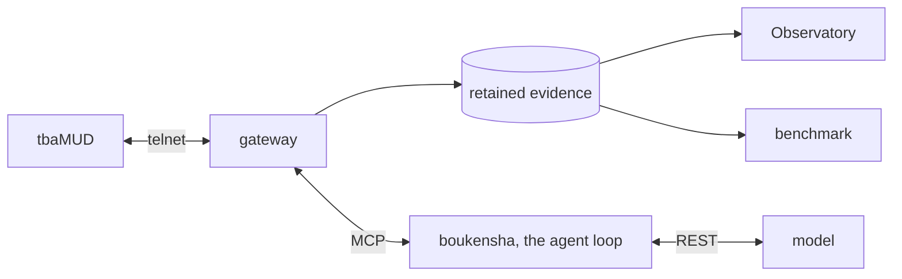

# claude-code-camp-2026-Q2

An AI agent built from first principles, and a text MUD used as the hard
environment to find out what actually makes one capable.

The agent has no framework under it. It owns its loop, its prompt, its tools,
its context and its budget. It plays tbaMUD, a real multiplayer game with
mazes, darkness, hunger and monsters that kill it, on a small model, because
an agent that only works on the largest model is not an answer to anything.
Every byte it sends and receives is retained as typed evidence, so what it did
and why can be read back rather than guessed at.

[](https://youtu.be/p8FFp4wVf3I)

*An agent launched into the live world, then its retained evidence, spatial
replay, cost, experiments and knowledge. Select the preview for the narrated
walkthrough.*

## The question, four weeks of it

| | Asked | Found |
| --- | --- | --- |
| Week 0 | What is the cheapest architecture that can do this at all | An agent file and a bundled skill hit the same wall. The loop has to be owned |
| Week 1 | Can that loop be built from nothing | Yes. Typed messages, a tool host, five model providers, context and cost, in one loop |
| Week 2 | What is it actually doing | Nothing is knowable without owning the wire, so every layer became evidence |
| Week 3 | What makes it capable | Not more knowledge. Attention was the scarce thing, not information |

The mission set for the agent is to find and kill a specific strong monster in
an unexplored world, without dying or spending the budget wandering. It is not
solved. What the attempts revealed is the substance of this repository.

## What is here



- **boukensha**, the agent. Its own loop over typed messages, a tool host, and
  one interface to five model providers. It decides what to carry in context
  and stops when the money runs out.
- **The gateway**, the only thing that touches the game. It records every byte
  in both directions and turns game text into typed observations, so a later
  question is answered from evidence rather than by re-reading prose.
- **The Observatory**, the operator surface. Watch a run live, then read its
  story, spatial replay, cost, experiments and knowledge from that evidence.
- **The benchmark**, which runs a mission repeatedly and judges the outcome
  from the game's own output, never from what the agent claims about itself.

## See it run

Docker, [uv](https://docs.astral.sh/uv/) and Node are the prerequisites.

Start the game and set a model key:

```bash
cd week0_explore/infrastructure && docker compose up -d   # the game, port 4000
cp .boukensha/.env.example .boukensha/.env                # then add your key
```

Install the gateway and build the Observatory once:

```bash
uv tool install --editable ./week2_capable/gateway
cd week2_capable/observatory && uv sync --extra dev
cd web && npm ci && npm run build
```

The Observatory runs as two processes, the supervisor that starts and stops
runs, and the host that serves the evidence and the page:

```bash
uv run --project week2_capable/observatory observatory-launcher   # port 8792
./week2_capable/bin/observatory                                   # port 8787
```

Open <http://127.0.0.1:8787> and start a session from the launcher. Frontend
work adds `npm run dev` on port 8791, which proxies to both.

To run the agent in a terminal with no Observatory:

```bash
week2_capable/bin/agent
```

## What was learned

The agent was made cheaper, safer and more thorough, and none of that made it
better at its mission. Five capabilities were built. Survival, knowledge and
navigation were measured against a control, and the configuration carrying the
most knowledge was the slowest and the only one that failed to finish.

The cause was not missing information. A progress counter shown as a readout
became the objective the agent optimised, and the same summary that helped a
lost agent made a found one walk four times as far.

- [Technical journal](docs/journal/) records each week, including what failed
- [Reports](docs/reports/) hold the measurements, apart from the conclusions
- [Architecture exploration](docs/explore_architectures.md) explains why the
  project owns its loop

## Repository

| Path | What it holds |
| --- | --- |
| [`week0_explore/`](week0_explore/) | The game infrastructure, world exploration, and the architecture experiments that chose the design |
| [`week1_baseline/`](week1_baseline/README.md) | **boukensha**, the agent, built one step at a time |
| [`week2_capable/`](week2_capable/README.md) | The gateway, the Observatory, the benchmark, and the capability work |
| [`docs/`](docs/) | Plans, reports, and the weekly journal |

The capability work sits under `week2_capable/` rather than its own folder,
because the graded layout fixes that name.

## Status

Weeks 0 to 3 are complete. The mission is unsolved: locating the target,
preparing for it, and keeping the agent's attention on it are all open. Two of
the five capabilities were never measured, and the intermediate missions that
would rank them were never built.
