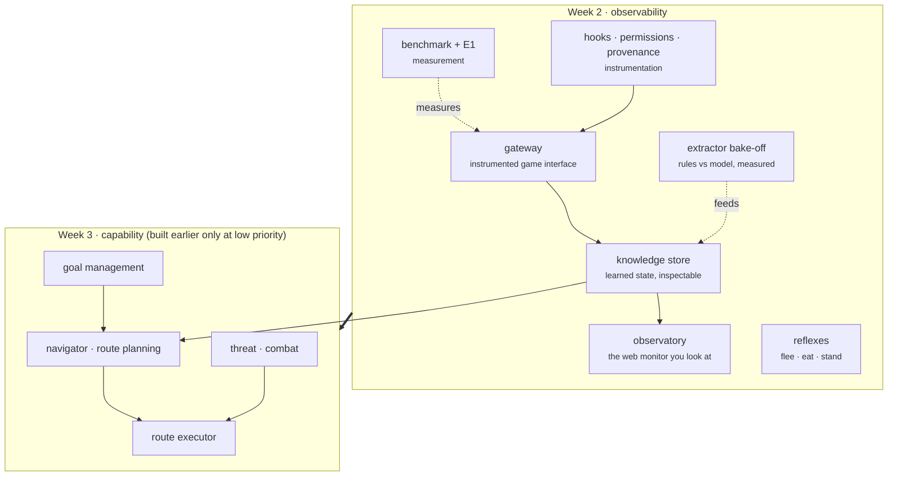

# Week 2 · Observability

Week 2 makes the agent observable: an instrumented game interface, a
knowledge store as inspectable state, a benchmark that measures, and a web
observatory to look at. Week 3 makes it capable. The line sets priority and
framing, not a wall: a week 3 piece can be built earlier, it just ranks lower
and is not polished this week.

## The map

## Placement

| Component | Week | Priority | Why |
|---|---|---|---|
| gateway | 2 | core | the seam that makes everything observable |
| benchmark + E1 baseline | 2 | core | measurement is the backbone of observability |
| knowledge store | 2 | core | the agent's learned state, made inspectable |
| observatory | 2 | core | the thing you look at, the deliverable |
| hooks · permissions · provenance | 2 | core | the instrumentation layer |
| extractor bake-off | 2 | mid | "does a model beat rules" is a measurement question |
| reflexes | 2 | mid | local reactions, observable and cheap |
| navigator · route planning | 3 | low | route choice is capability |
| route executor | 3 | low | executes a plan, week 3 territory |
| threat · combat | 3 | low | scoring danger feeds acting, not seeing |
| goal management | 3 | low | resolving goals to routes is navigation |

## Plans

- [gateway.md](gateway.md): the instrumented game interface.
- [benchmark.md](benchmark.md): the E1 journey measurement through the gateway.
- [observatory.md](observatory.md): the causal flight recorder, debugger, and
  experiment studio.
- [observatory/sessions.md](observatory/sessions.md): the universal recorded-run
  workspace, from session aggregates to exact agent, model, tool, gateway,
  Telnet, MUD, parsed, and state evidence.
- [observatory/session_ask.md](observatory/session_ask.md): a prospective
  grounded natural-language investigator with typed evidence tools, verified
  citations, explicit verdicts, and bounded model use.
- [observatory/experiments.md](observatory/experiments.md): registry-backed
  comparisons, repeated samples, cost, behavior alignment, and safe execution.
- Further plans land here as each component starts, one plan per component,
  reviewed before its code.

## Reports

- [Week 2 experiments and findings](../../reports/week2_experiments.md):
  reproducible measurements, corrected dead ends, and evidence-backed findings.
