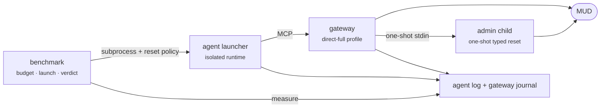

# Week 2 · E1 benchmark

## Goal

Measure complete game journeys through the gateway so later changes are judged
by correct play and total cost, not by schema size alone.

## Boundary

The benchmark is a separate package at `week2_capable/benchmark/`.

- The launcher creates one selected mortal gateway session before admin
  mutation.
- A one-off benchmark character can be supplied at launch with its password
  read from standard input.
- The private admin process receives no mortal credential.
- Reset uses the selected gateway control endpoint and authenticated session
  id. There is no persistent privileged socket.
- Play uses the mortal gateway MCP surface.
- The agent and gateway run from their current packages.
- Secrets enter through process environment and never enter benchmark output.

## E1 contract

E1 uses the session-static `direct-full` profile with no rendering or grouped
surface optimisation. This is the same profile used by the default REPL and
TUI configuration. Each run starts from a verified reset.

The first journey is the Week 1 bakery task:

| Id | Order | Success |
|---|---|---|
| J1 | Find the bakery and read the menu. | a bakery menu row and bakery good are observed |
| J2 | Find the Massive Minotaur in the newbie zone north of the Temple. | an observation names the Massive Minotaur |

The harness records one row per attempt:

- journey success and evidence
- final observable state
- wall time and model calls
- tool calls by capability, including invalid and corrective calls
- fresh, cache-read, cache-write, output and occupancy tokens
- schema input bytes and an explicitly labelled token estimate
- cost in dollars
- cumulative cost after each model call
- gateway profile id and capability digest
- model-facing result mode and delivered result characters
- gateway parse misses and wire provenance

The report compares the run with two reproducible Week 1 views. The corpus has
451 executed calls, including 316 moves. Of those, 447 calls re-entered a later
model prompt, including 314 moves. The earlier 448-call working figure remains
labelled as legacy because the corpus does not reproduce it. The comparison
reports the differences, it does not require E1 to reproduce either ratio.

Approved comparisons use one result mode per ledger and a target sample count.
The report separates setup failures from priced journey outcomes, then reports
success rate and cost, call, correction and token distributions.

## Isolation

Each attempt gets:

- a temporary settings overlay pointing the agent at the gateway
- a launcher-owned session manifest and registry row
- a dedicated per-session agent JSONL log
- a dedicated per-session gateway SQLite journal
- a one-shot admin journal and durable mutation progress
- a reset request before the model is called

The overlay contains no secrets. The launcher resolves the selected mortal
secret. The gateway reads only the named admin secret at one-shot child
creation. Neither secret enters benchmark output.

## Cost safety

Offline tests and dry runs spend nothing.

A paid run requires:

- an explicit `--spend` flag
- a cumulative cap
- an explicit `--runs` target for multi-sample experiments
- headroom for the agent's configured per-turn ceiling before each attempt
- a priced result after each attempt, otherwise the sequence stops

The initial live gate is one J1 attempt. Rendering comparisons use ten
reset-verified J1 attempts per mode under an approved cumulative cap.

## Files

| File | Responsibility |
|---|---|
| `benchmark/config.py` | temporary gateway settings overlay |
| `benchmark/journeys.py` | journey orders and success predicates |
| `benchmark/metrics.py` | agent and gateway measurements |
| `benchmark/runner.py` | process lifecycle and attempt isolation |
| `benchmark/e1.py` | budgeted command-line entry point |
| `benchmark/report.py` | JSONL and Markdown reports |
| `tests/` | offline contract, metric and failure-path tests |

## Quality bar

- Public interfaces are typed.
- New Python tests use pytest.
- Each module has one responsibility.
- Subprocess arguments use lists, never shell interpolation.
- Reports escape untrusted text before rendering.
- The package imports neither the agent nor gateway internals.
- Dependencies are pinned and justified where introduced.

## Gates

Offline:

- dry run proves the gateway command and 25-tool `direct-full` surface
- reset failure prevents the first model call
- incomplete or unpriced runs never enter baseline aggregates
- setup failures are reported outside the journey success denominator
- multi-run aggregates include success rate and distribution statistics
- recorded Week 1 calls reproduce 451 executed calls and 447 context-confirmed
  calls, while the legacy 448 figure is flagged rather than manufactured
- report rows trace back to both source logs

Live:

- reset is verified before the model call
- one J1 attempt completes through the gateway
- success evidence is present in the gateway journal
- no credential appears in either output
- the E1 row contains every required metric and provenance field

## Done when

The live gate passes and a reviewed E1 report exists for the unoptimised
gateway. Later surface and rendering experiments replay the same journey and
compare total cost, correctness and corrective calls against it.

The first rendering experiment holds the journey and `direct-full` surface
constant while comparing raw text, text plus completion state, and the full
typed envelope. The gateway journal keeps the full envelope in every mode.
