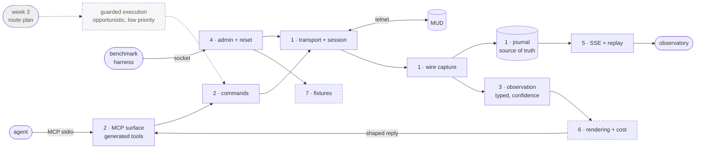

# Week 2 · The gateway

## Goal

Build a Python game interface, the gateway, that the agent uses to reach the
MUD in place of the week 1 Ruby `mud_manager`. The `mud_manager` works and
stays the baseline the course expects. This is a deliberate deviation, taken
to explore, and documented as one.

Why we build our own:

- Language consistency. Our boukensha is Python. A Python game interface stays
  in the same language and toolchain as the agent it serves, so we read, test
  and tweak it the same way, instead of maintaining a Ruby gem beside a Python
  agent.
- Wire visibility on our terms. Today the agent sees the manager's parsed tool
  results, not the raw telnet exchange beneath them. We could get more by
  depending on a newer Ruby manager, and we would rather not take that
  dependency. Capturing the wire ourselves keeps the observability we want
  inside code we own.
- Cost work at the right level. We intend to push token and character
  optimisation down into the interface, close to where game text enters,
  rather than higher up where the cheap savings are already spent.
- Room to grow. It does more than relay commands. It captures the wire, keeps
  an event journal, types observations and measures rendering cost. Because it
  is more than a manager, it earns its own name, the gateway.

What we are not claiming: not that the `mud_manager` cannot do these things.
The Ruby version may already support wire logging and admin operations. Our
reason is flexibility and ownership in our own language, and a documented
choice to explore beyond the baseline, with the manager still there to fall
back on if the exploration does not pay off.

Week 2 is the observability week. So the gateway is framed observability first:
it is the instrumented seam that turns every interaction with the game into
inspectable, measurable, replayable truth. You cannot observe an agent whose
contact with the world is a black box.

## Shape

One component, two session-owning processes under a single launcher.

- Mortal process: the player session, the parser, the event journal (the sole
  writer), the renderers, the mortal MCP server over stdio, the SSE hub and the
  web API.
- Admin process: an immortal session and typed admin operations, serving the
  benchmark harness over a local socket. The mortal artifact holds no admin
  command, no admin credential and no admin client.

The data flows one way from the wire and fans out to every consumer. Boxes are
numbered in landing order. Solid boxes are the core (parity), long-dash boxes
are the extended optimisations measured against E1, and the faint box is the
opportunistic guarded executor a week 3 route plan would reach the game through.

## Scope

The gateway replaces the manager as a working game interface first, and carries
its observability by construction. The core reaches functional parity with the
manager and is what makes the week. The extended work optimises from there and
is cut or left rough before Saturday if it must be. Week 3 capability is
deferred.

### Core, the working instrumented interface (functional parity)

- Transport and session: open the telnet connection, log the character in, hold
  the session, send a command and read the reply. Every byte in and out is
  captured, timestamped and credential redacted.
- The event journal: the single source of truth, transactional before any
  publication, with rebuildable read models and a JSONL export the week 1 viewer
  can still read.
- Observation: turn game text into typed state the agent uses, room, exits,
  vitals and position, each field carrying confidence, method and a reference
  back into the wire. Unknown lines are kept as events and the parse-miss rate
  is a metric.
- The agent surface: the mortal actions exposed as MCP tools whose schemas are
  generated from one set of command definitions, so the schema cannot drift.
- Live view and replay: SSE from the journal with reconnect replay, the same
  serializer for live and replay, and runtime-switchable log verbosity whose
  changes are themselves audited events.

- Repeatable reset: a minimal typed admin operation that returns the character
  to a known state, verified from mortal-observable output. This is in the core
  because a measured run needs a clean start, and it lands before the baseline.

### Extended, built after the baseline and measured against it

- Rendering and cost: shape what the agent is told through a tagged-span IR,
  with config-owned budgets, a belief-diff delivery record per consumer, and an
  offline cost simulator. This is the token-work-at-this-level idea, measured
  against E1.
- Manufactured fixtures: the states the recorded corpus lacks (death, dark
  room, locked door, reconnect), each recorded as a reproducible fixture
  against a dedicated character.

### Opportunistic, low priority

Week and week map placement is a priority signal, not a wall. These lean toward
week 3 capability, and they may still land in week 2 when they are logically
adjacent to work in hand, cheap to add now, or costly to retrofit later. They
are cut first if time runs short, and never at the observability core's expense.

- Guarded execution: declarative batches with step and time budgets, abort
  guards, resume tokens and interrupt acknowledgement. The mechanism is a
  natural extension of single-command execution and the interrupt observation
  the core already surfaces. Route policy that decides a destination stays out,
  it belongs to the week 3 navigator.
- Acting reflex policy (flee, eat, stand). The core already classifies and
  surfaces the triggers as observations, so acting on them is a small step, but
  it is capability and ranks below the core.
- The threat classifier and the goal matcher, per the week map in
  [README.md](README.md).

The core gateway never chooses a destination and never acts on its own. Anything
opportunistic above is additive and does not gate the core.

## Capability coverage and surface selection

The gateway does not mirror the mud_manager's tool surface. The manager is
evidence for what capabilities exist and a benchmark reference, not the target
architecture. Week 1 usage is highly concentrated (451 executed calls: move
316, then poll 26, look 19, check 19, attack 16, and a long tail, most
advertised tools never used), so a blind mirror optimises a surface the agent
barely uses. The target is correct, efficient play at lower total model cost.

### One capability registry, many advertised profiles

Every supported game capability is defined once in an internal typed registry.
The advertised MCP surface is GENERATED from an explicit allowlisted profile,
so completeness of capability is separate from what the agent is exposed to.

- The registry covers every currently supported mortal capability, coverage
  measured against capability evidence, so a profile never lacks a capability
  that exists. It does not promise the game can never reveal a new capability
  gap: any such gap is logged and becomes a candidate typed definition.
- A profile is a deny-by-default allowlist selecting which capabilities the
  agent sees. Trimming to a high-frequency surface is a config choice, and
  re-enabling a capability is a config change, not a rebuild.
- Candidate profiles: full direct surface, minimal high-frequency surface,
  grouped hybrid surface, and hybrid plus guarded navigate once observation
  exists. Any profile may explicitly add the audited raw fallback.

Rules, which are also what makes this observable and reproducible:

- The profile is fixed for a whole run, so the advertised tool schema stays
  byte-stable and remains a cache read rather than fresh input each turn. A
  profile change takes effect on a new session, never mid-turn.
- Authorization is enforced server-side, not merely hidden from the schema. A
  call to a capability the profile disables returns a typed permission error.
- A generic single-line `send_raw` tool is in the mortal registry like any
  other capability, deny-by-default and not in the agent's default profile. It
  sends a MORTAL game line only, which the game bounds to the character's own
  privileges, so allowlisting it is about controlling the agent's surface, not
  security. When enabled its use emits a capability-gap metric.
- Immortal/admin commands (goto, trans, restore and the rest) are a different
  boundary and stay structurally unreachable from the mortal server: they live
  in the separate admin process, mortal never imports them (the two-process
  split and AST no-import proof). Profiles do not govern that boundary.
- The profile id and a capability-set digest are journaled at session start,
  and every candidate profile reports its schema bytes and capability
  coverage, so any run states exactly which surface produced its numbers.

### Direct and hybrid surfaces, both generated, both measured

Two shapes are generated from the same registry:

- Direct: one tool per primitive capability.
- Hybrid: a small stable set (observe, move, guarded navigate, and grouped
  act / interact enums) that collapses the move-heavy tail and attaches a
  fresh observation to every mutating result so the model spends no follow-up
  call on poll, look or check.

Neither is assumed to win. Which surface an agent should use is a measured
decision: the benchmark and cost simulator replay the same journeys through
each profile and report journey success, final game state, model calls, total
tokens, schema tokens, INVALID and CORRECTIVE calls, and latency. A grouped
enum that raises corrective calls can erase its own token saving, so
corrective and invalid calls are first-class metrics, not an afterthought.

### Capability gate

Contract tests assert the registry covers every capability the mud_manager
evidences (magic, training, tracking, containers, status, commerce, social,
combat, movement, perception, self, lifecycle), each with a typed observation
result and a typed error, proven against recorded traffic. The default
bring-up profile is the simple direct projection, chosen for a clean baseline,
not declared the winner. observe and guarded navigate are defined here but not
exposed at runtime until group 3 provides trustworthy observation and position
(observe carries observation age, confidence, parser version and source wire
sequence, and never presents stale state as current. Navigate does not expose
until blocked-exit, combat, vitals, unexpected-room and interrupt stops are
each testable from journal evidence). The live bakery journey proves
representative end-to-end integration. Only after the capability gate and the
journey pass does the benchmark measure E1, against the week 1 baseline (the
451-call executed distribution), through the chosen bring-up profile.

## Build order

Each group lands code, its tests and one journal observation, verified before
the next. The numbers are the actual landing order. Two milestones sit between
the core groups and the extended ones: the parity journey and the E1 baseline.

| # | Group | Kind | Functional job | Observability woven in |
|---|---|---|---|---|
| 1 | transport, session, journal | core | connect, log in, hold the session, send and read | capture every byte, append to the journal |
| 2 | commands and the agent surface | core | the mortal command families as generated MCP tools | each command traced end to end |
| 3 | observation and parsing | core | room, exits, vitals, position from game text | typed observations with confidence and provenance, parse-miss metric |
| 4 | admin and repeatable reset | core | return the character to a known state | reset verified from mortal-observable output |
| 5 | live view and replay | core | the observatory's live and replay feed | SSE live view, journal replay, audited verbosity |

Milestone A, parity: with groups 1 to 5 in, the parity contract tests cover
every command family, the default agent configuration points both REPL and TUI
at the gateway, and the agent completes the live bakery journey through it.
Functional bar, no paid measurement.

Milestone B, E1 baseline: the benchmark measures the baseline through the
unoptimised gateway. Its own plan owns this. Every later group is judged against
it.

| # | Group | Kind | Functional job | Observability woven in |
|---|---|---|---|---|
| 6 | rendering and cost | extended | shape what the agent is told, budgets | measure characters and cost per rendering vs E1, replay a policy offline |
| 7 | manufactured fixtures | extended | make the states real play does not produce | each recorded as a reproducible fixture |

Groups 1 to 5 are the core and reach parity. Groups 6 and 7 optimise from the
E1 baseline and are cut or left rough first if Saturday gets close. Guarded
execution and acting reflexes are opportunistic and low priority: they may land
in week 2 when cheap and adjacent, they never gate the core, and route policy
that picks a destination waits for the week 3 navigator.

## Design

### What the wire capture is for

Every byte in and out, timestamped, with credentials redacted at capture.
Everything derived carries a reference back into it. This is what makes a claim
about a run checkable rather than asserted, and it is what lets the parser be
tested against real traffic with no server running.

Byte-exact replay applies to that canonical redacted stream, not to the literal
socket bytes. The login password is never written to the journal, an export or a
test fixture. Redaction happens before anything is stored, so a persisted
artifact reproducing a run contains no secret, and the determinism a parser test
needs is the determinism of the redacted stream.

### Colour is data

The server labels its own output. Measured across the recorded corpus:

| Code | What it wraps |
|---|---|
| `ESC[0;33m` | room title |
| `ESC[0;36m` | the exits line |
| `ESC[0;32m` | objects on the ground |
| `ESC[0;31m` | combat, and closed doors inside the exits line |

Stripping that and then training a model to recover it is work this design
declines by not throwing it away. Rules run first and a model is adopted only if
the measured residual justifies one.

### Position carries confidence, and recovers

The served world holds 12,700 rooms, 1,520 titles are shared by more than one
room, the worst is shared by 98, and 64% of rooms carry an ambiguous title
(measured against the served world files, reproducible once the knowledge store
lands). Position is tracked by the exit taken, which is cheap and right most of
the time, and wrong at one-way exits, closed doors and death.

So position is never a bare room number. It carries how it was derived and how
sure the layer is, and on arrival at an ambiguous title the layer issues `exits`
and resolves against the neighbourhood. A position that cannot be resolved is
reported unresolved rather than guessed, because a confidently wrong position
corrupts everything downstream and surfaces far from its cause.

### Delivery, and why the diff is against the consumer

A repeat arrival is 86% of movement in the recorded corpus, and 65% of a room's
text never changes between visits. Detecting that by hashing the payload does
not work: the most-visited room was entered 41 times and only 2 payloads were
byte-identical, because the mobs and objects standing in it change.

So the layer records what each consumer has been told and sends the corrections,
not the state. Anything elided leaves a reference the consumer can expand, and an
expansion is recorded as a miss attributed to the policy that hid it.

### The reply window has to be drained

The world speaks without being asked, and every unsolicited message ends in a
prompt. Left in the buffer they satisfy the next read, so each reply arrives
shifted by one. This was measured while building the benchmark harness: an
immortal acting on the character mid-session made every parsed field come back
absent and the room title read "You are 17 years old." The transport drains
pending input before each command and keeps it as unsolicited output, because
discarding it would make an interrupted run look like a quiet one.

### Domain facts this layer implements for itself

Each fact below was measured against the live server, and each was wrong on the
first attempt somewhere, so they are written down rather than left to be
rediscovered.

Logging in takes four steps rather than two: name, then password, then a MOTD
ending in `*** PRESS RETURN:`, then a MENU ending in `Make your choice:` where
`1` enters the game. Sending newlines at the menu loops forever.

The greeting pauses. The server opens with `Attempting to Detect Client, Please
Wait...` and then goes quiet while it probes. A read that gives up on silence
returns 47 bytes and reports no name prompt, so prompt reads must wait for their
pattern while command reads keep a quiet fallback for asynchronous output.

The reply delimiter is the vitals prompt, matching `\d+H\s+\d+M\s+\d+V`, present
on 766 of 772 recorded tool results. Matching a bare `> ` also matches the login
menu.

`set` has two forms and choosing wrong fails silently. `set file <player> ...`
applies to a character who is logged out, and using it on a live character
discards the change. The field names are not the obvious ones: current health is
`hitpoints`, the room a character enters on login is `loadroom`.

`hunger` and `thirst` count down toward starvation, so zero is starving rather
than fed. Since hunger stalls regeneration, a reset that set 0 would start every
run in the worst state while reporting success.

`trans` and `restore` cover position and vitals only. Gold, level, experience,
alignment, hunger and thirst are untouched and need explicit fields.

The immortal `where` reports room numbers, which mortals never see. It is the
only ground truth for where a character actually is, and it lists logged-in
players only, so it must be asked while the session is open.

### Every derived fact says where it came from

An observation carries the confidence it was typed with, the method that typed
it, the parser version that did it, and a reference into the wire log. A fact
that cannot be traced to the bytes that produced it is an assertion.

Parse-miss rate is a first-class metric, because the decision about whether a
local model earns its place rests on the size of the residual. A parser version
is promoted only after replaying the recorded corpus with no regression against
the version it replaces, so a parser change can never quietly lose a class it
used to type.

Events carry wall time and a monotonic clock always, and game time when an
observation supplies it. Game time is never interpolated between observations,
because a fabricated timestamp is worse than an absent one.

### The journal is durable, and owns only the session

The journal is a SQLite database in WAL mode with a single writer. Events carry
a per-session monotonic sequence and are committed transactionally before any
publication, so a crash leaves a consistent committed prefix and never a
published event that was not durable. Read models, current state and timelines,
are projections rebuilt from it. The schema is versioned and a reader refuses a
version it does not know rather than misreading it. A JSONL projection is
exported alongside as a supported output the week 1 viewer reads, so that viewer
keeps its independence.

The gateway owns session evidence only: the wire, the journal, and observations
derived within the current session, including position, which is a
current-session inference and is not persisted as world knowledge. Learned
cross-session world state belongs to the separate knowledge store, which is not
this plan. Naming the boundary here stops the two overlapping.

### The rendering IR, and what queries it

A rendering is a list of spans, each carrying its content, the reason it was
included, and the policy id that decided. The text the agent receives is a
projection of that list. Three features are queries over those fields: cost
attribution groups characters by reason, the cost simulator replays a session
through a changed policy and sums the projection, and miss telemetry blames the
policy that hid content the agent then asked for.

Immutable fragments are content-addressed: each earns a session-local symbol
keyed by a hash of its canonical form, so a description already sent becomes a
short reference. Hash equality is content identity and never claims room
identity.

### Budgets, priority, and what may never be dropped

Budgets are configuration with an optional per-call override, so the common case
costs no argument tokens. `move` is 70% of recorded tool calls, and putting a
budget parameter on it would price a session constant as a variable.

Priority is fixed and ordered: safety, then the outcome of the action, then
changed state, then novel content, then anything already sent. A budget that
dropped a threat to fit a room description would be worse than no budget, so
safety spans survive a budget they do not fit in.

A budget has a floor as well as a ceiling. A request whose budget cannot carry
the safety and outcome spans is rejected rather than served a mutilated reply.
Overflow is signalled explicitly and carries a continuation cursor.

Nothing is elided without a reference the consumer can expand, and the consumer
is told something was withheld. Elision it can reverse is compression. Elision
it cannot detect is a summary it has to trust.

### Affordances go at the tail, never in the schema

The parse already yields open exits, present mobs, takeable objects and whether
a shopkeeper is here, so attaching that turns a guess into a selection. Narrowing
the advertised tool list per turn is the intuitive implementation and the
protocol allows it, but the tool schema sits in the cached prefix, so a list that
changes every turn invalidates the cache behind it. Affordances are data at the
end of the observation and the tool schema stays byte-stable for the session.

### Actions, batches and interrupts

Primitives are defined once and the MCP schemas are generated from those
definitions, so the schema cannot drift from the command builder. `send_raw`
exists for the harness and for debugging and is role-gated, never on the agent's
surface.

A guarded batch is a declarative script of steps with step and time budgets,
abort guards, digest reporting and a resume token, so an aborted route can be
continued rather than restarted.

Every event carries a numeric priority from local classification. The executor
aborts at two or above, the agent is woken at three or above, and the store
ingests everything. Delivery has a preemption lane so an urgent event never
queues behind bulk output.

A disconnect after a command was sent yields `uncertain`, never an automatic
retry, and a new connection epoch is explicit. Retrying a command whose outcome
is unknown is how a single move becomes two.

An interrupt carries an acknowledgement cursor. On reconnect the layer replays
unacknowledged interrupts before normal traffic, because an urgent event
delivered after the ordinary events that followed it has lost the thing that made
it urgent.

### Observability and the live plane

The caller's trace id arrives over MCP `_meta` and is stamped on the command, the
bytes, the observations and the result, so one tool call can be followed from the
model's decision to the telnet bytes with timings at every hop.

Journal capture is always full for benchmark sessions. Operational verbosity is a
separate setting, switchable at runtime, and a level change is itself an audited
event, because a quiet period is otherwise indistinguishable from a period nobody
was recording.

Metrics are events, and a snapshot endpoint serves the current values so a viewer
does not have to replay history to draw a gauge.

Live subscription is SSE with `Last-Event-ID` bound to the journal sequence, so a
reconnecting subscriber replays exactly what it missed and then goes live.
Delivery is at-least-once and clients deduplicate by session and sequence. Replay
uses the same cursor and the same serializer as the live path.

## Local intelligence

The gateway decides as much as possible below the paid model. The layers, from
cheapest to most expensive, each answering only when confident and escalating
with its evidence attached:

| Layer | Decides | Escalates when |
|---|---|---|
| rules and state machines | parsing, refusals, posture, vitals, door state | a line matches no shape |
| cached results | anything already answered for identical input | the input is new |
| reflex policies | flee below an HP floor, eat when hungry, stand before moving | the policy's own guard trips |
| classical local model | a class rules cannot separate, once measured better | confidence below threshold |
| paid model | strategy, novel situations, plan repair | never, it is the top |

Local models enter only where a measurement says rules lose, through a bake-off
on a frozen split, never as an assumption. The bake-off is itself part of the
observability this week owes.

In week 2 the core gateway classifies and surfaces: parsing, threat and priority
arrive as observations. Acting on them, reflex policies and route execution, is
lower priority and opportunistic, built in week 2 only when cheap and adjacent
and never ahead of the core. Week 2 observes the decision, the acting layer
takes it when it earns its place.

- Line extraction: rules first, measured. A bag of words classifier trained on
  the recorded lines is compared to the corrected rules on a frozen split, and
  rules ship unless the model clears them. Forcing the test is what exposes
  incomplete rules, so the measurement pays off even when rules win.
- Look-target extraction: the slot for a model that proposes what is worth
  examining in a room. Rules and the room's own parsed contents answer first,
  and the slot is filled only if a measurement shows they miss targets the agent
  then needed.
- Threat classification: lower priority, capability leaning. Rules first over the
  manufactured combat fixtures, and a small classifier evaluated on the same
  frozen-split discipline. Its evaluation table is a deliverable, and it ships
  into the local-model layer only if at least competitive.
- Goal matching: carried with the navigator in week 3. A small local embedding
  model resolves a stated goal against remembered sightings, with a measured
  resolution-accuracy gate.

## Cost and decision metrics

Beyond the journal's health metrics, the gateway and the harness report:

- paid model calls per completed objective
- characters read per completed objective
- share of events resolved without the paid model
- escalation rate at each layer boundary
- interrupt recall and false stop rate

Route choice is agent-side and execution is gateway-side. This layer never
chooses a destination, so a router lives with the agent and the guarded batch is
how its plan reaches the game. Naming the boundary here stops it being
rediscovered.

## Deferred, and named rather than dropped

- Speculative prefetch during model latency. The currency is tokens, and
  prefetched text either costs tokens unrequested or is discarded. Revisit only
  if the baseline shows wall-clock is the binding constraint.
- Description summarisation. A later slot.

## Quality bar

| Bar item | How this meets it |
|---|---|
| Best practice by default | Bundle A as ruled: MCP SDK low-level API, starlette, uvicorn, pydantic |
| Stdlib preference scoped to the agent core | this is a product surface, so it takes the dependencies its job needs |
| Public interfaces typed | pydantic at process and MCP boundaries, type hints throughout |
| One responsibility per module | transport, parser, journal, delivery, MCP, admin, SSE are separate |
| No markup by string concatenation | this layer emits JSON and events, never markup |
| UI verified by rendering | the observability surface is verified in a browser, not by reading code |
| Tests, pytest | pytest, with the parser replayed against recorded sessions |
| Dependencies pinned and justified | one line each where introduced |
| Measured against a stated baseline | every group gate cites the E1 baseline or the recorded corpus |

## Verification

Gates, each measured against the game or a consumer rather than against any prior
implementation. No gate that reports an improvement counts unless it clears the
noise the baseline measured: repeated identical journeys varied by 43% on moves,
35% on dollars, 44% on context occupancy and 27% on wall clock, so a change
smaller than its metric's floor is reported as not measurable rather than as a
gain.

| # | Group | Gate |
|---|---|---|
| 1 | transport, session, journal | log in, issue a command, wire log replays byte-exact across split chunks, credentials absent from every log, journal recovers a consistent prefix after a killed writer |
| 2 | commands and surface | every parity family's tool matches name, arguments, result shape and error against recorded traffic, the advertised schema contains no immortal command, and the week 1 hand-rolled client completes a handshake against it |
| 3 | observation | replay all recorded sessions, report parse coverage and residual, duplicate titles never collapse |
| 4 | admin and reset | two consecutive resets produce identical mortal-observable state |
| 5 | live view and replay | live and replayed sessions render through one serializer, a reconnecting subscriber replays exactly what it missed |
| A | parity | contract tests cover every command family, REPL and TUI share the gateway configuration, typed results render as game text, and the agent completes the live bakery journey through it |
| B | E1 baseline | the benchmark records E1 through the unoptimised gateway (its own plan) |
| 6 | rendering and cost | replay the corpus, show characters delivered against E1 and a miss rate per category, exceed the detectability floor |
| 7 | manufactured fixtures | death, dark room, locked door and reconnect each recorded as a fixture from the live game against a dedicated character, each proving full-state restoration |

## Done when

### Core (the week 2 gateway is done)

- Groups 1 to 5 gates have passed with their raw transcripts recorded.
- Milestone A: the parity contract tests cover every command family, and the
  agent completes the live bakery journey through the gateway as it did through
  the mud_manager, with the wire captured and journaled and reset on the
  gateway's own admin surface. A functional bar, not a paid measurement.
- Milestone B: the benchmark has measured E1 through the unoptimised gateway.
  The old manager-side numbers are not that baseline.

### Extended (done if time allows, and never at the core's expense)

- Groups 6 and 7 gates have passed, each optimisation measured against E1 and
  reported as not measurable when it sits inside its metric's noise floor.
- Characters delivered to the agent are measured against E1 rather than
  estimated.

Guarded execution and acting reflexes are not part of either boundary. They do
not gate the observability core and may land opportunistically when adjacent to
work in hand, cheap to add now, or costly to retrofit later. Route policy that
picks a destination waits for the week 3 navigator.
