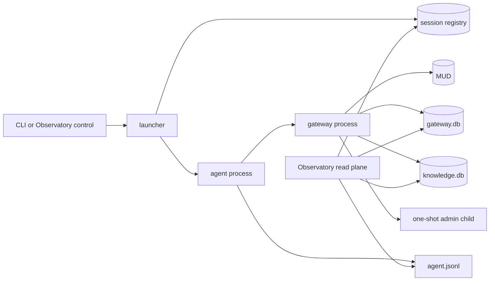
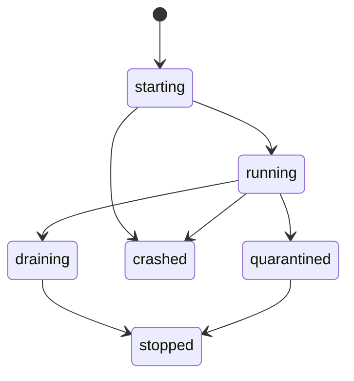
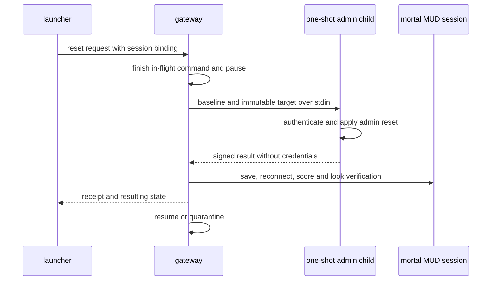

# Week 2 · Multi-player observability foundation

## Goal

Make player identity, process ownership, evidence, cost, and knowledge explicit
before the Observatory is rebuilt. Two agents must be able to run at once
without sharing credentials, files, journals, costs, or learned state.

The foundation serves four product needs:

- Live can discover and follow the intended active session.
- Sessions can organize evidence by player without guessing from file time.
- Experiments can reset and attribute the exact player and run.
- Knowledge can persist per player without cross-contamination.

Human account authentication, distributed scheduling, shared-character
collaboration, and agent-to-agent coordination remain outside this phase.

## System boundary

The launcher is the authority for runtime identity and process lifecycle. The
agent owns one gateway child. The Observatory reads evidence and uses the
launcher control surface for explicit run control.



Rules:

- Direct CLI use and Observatory launch use the same runtime bootstrap.
- One agent session owns one gateway process and one gateway journal.
- Children receive identities from the launcher and never invent them.
- The Observatory never uses a latest-file rule as identity.
- Observer truth never enters the mortal agent environment or evidence.

## Identity

The correlation spine is:

```text
player_id
  agent_id
    session_id
      gateway_session_id
      experiment_id / run_id when applicable
```

| Field | Authority | Lifetime | Meaning |
| --- | --- | --- | --- |
| `player_id` | profile configuration | across sessions | stable public profile id |
| `agent_id` | launcher | one process | agent event producer |
| `session_id` | launcher | one evidence run | replay and evidence boundary |
| `gateway_session_id` | launcher | one gateway child | gateway and wire identity |
| `experiment_id` | experiment runner | one experiment | optional cohort identity |
| `run_id` | experiment runner | one sample | optional attempt identity |

Runtime ids are UUID4 values. Time, process id, character display name, and
filename are not identities. The gateway validates its supplied identity when
it attaches. A transport connection may have its own id, but it is not a
gateway session.

## Session manifest

The launcher writes `session.json` atomically before children start. Identity
and configuration fields never change.

```json
{
  "schema_version": 1,
  "layout_version": 1,
  "player_id": "poucet",
  "character": "poucet",
  "agent_id": "uuid",
  "session_id": "uuid",
  "gateway_session_id": "uuid",
  "experiment_id": null,
  "run_id": null,
  "created_at": "UTC timestamp",
  "configuration_digest": "sha256",
  "control_socket": "short hashed path"
}
```

Mutable lifecycle state belongs in the registry and append-only lifecycle
events. Labels and archival metadata do not rewrite the manifest.

## Runtime layout

```text
.boukensha/
  registry.db
  profiles/
    <player_id>/
      .env
      knowledge.db
      sessions/
        <session_id>/
          session.json
          control.token
          control-state.json
          agent.jsonl
          gateway.db
          admin.db
          reset-progress.jsonl
      archive/
```

Properties:

- Profile and session directories use mode `0700`.
- Secret and token files use mode `0600`.
- Files are written to a temporary sibling and renamed atomically.
- The control socket uses a short system-temporary path derived from a digest
  of `session_id`, within the macOS Unix socket path limit.
- The manifest and registry retain the socket mapping.
- Archival moves a session under the same player. It does not change ids.

## Registry and locking

`.boukensha/registry.db` is a SQLite WAL registry with one launcher writer and
read-only consumers.

The registry records:

- immutable ids and paths
- character and profile binding
- lifecycle state and timestamps
- process id as diagnostic information
- control endpoint
- experiment binding
- capture and recovery status

A stable per-character file lock is the liveness authority. The operating
system releases it after process death. Registry uniqueness is a second guard.
Platforms without compatible file locking fail closed.



Discovery reconciles registry rows with manifests and locks. It never trusts a
reused process id. Launcher process state and gateway control state retain
explicit source labels. The gateway projection wins for control state, while
the registry wins for process state. Stopping a session targets only its
process group.

## Process lifecycle

Launcher sequence:

1. Validate the player profile and character.
2. Acquire the stable character lock.
3. Create all runtime ids.
4. Create the protected session directory.
5. Write the complete immutable manifest.
6. Register `starting`.
7. Spawn the agent with a restricted environment.
8. Mark `running` after agent and gateway readiness.
9. Supervise exit, then record `stopped`, `crashed`, or `quarantined`.

The agent consumes goal revisions only between iterations. A goal change never
interrupts an in-flight model or tool call. Every revision is an append-only
event with its source and effective iteration.

Gateway reconnect retains the same gateway session identity. Each transport
connection receives a separate connection id.

## Credential boundary

Public configuration belongs in `settings.yaml`. Secrets belong in the selected
profile `.env` or the shared `.boukensha/.env` compatibility fallback.

The launcher constructs child environments from allowlists:

- The mortal agent receives its selected player secret and required provider
  secret.
- The gateway receives only the selected player secret and public settings.
- The one-shot admin child receives only the admin secret and verified reset
  target.
- The gateway resolves the named admin secret from the shared secret file only
  when it creates the one-shot child. It does not add that value to its process
  environment.
- No child inherits the complete parent environment by default.
- The mortal agent never receives the admin secret or another profile secret.

One redaction module protects logs, journals, diagnostics, and subprocess
errors. Acceptance tests use secret canaries and scan retained output.

## Journal ownership

Each gateway exclusively creates and writes its session `gateway.db`.

- One process owns one journal.
- Readers open SQLite WAL in read-only mode and tail committed cursors.
- One event is one durable transaction.
- No rotation occurs within a bounded Phase A session.
- An integrity failure renames the journal with a corruption timestamp and
  surfaces a capture gap.
- Recovery never silently invents a replacement history.

The agent writes only its session `agent.jsonl`. Every record carries the
applicable identity envelope.

## Authenticated-session reset

Reset acts on an already authenticated selected mortal session. It does not
open a second mortal connection.



The request binds player, character, session, gateway session, baseline digest,
and a one-use nonce. The session control socket is mortal and unprivileged.
The gateway launches the privileged child only for the request and communicates
over parent-child pipes.

Failure behavior:

- A timeout before game mutation aborts and resumes with a failure receipt.
- A partial game mutation causes `quarantined`.
- Quarantine blocks mortal model and game commands. Only linked reset retry and
  process stop remain available.
- No fictional in-game rollback is attempted.
- A successful retry appends a linked receipt and resumes only after mortal
  verification.

## Per-player knowledge

`knowledge.db` is one append-only evidence store per player. CDC is the source
of truth. Materialized views are rebuildable.

Every assertion records:

- player, session, gateway session, and sequence
- fact type and normalized subject
- value and status
- confidence, method, parser version, and wire reference
- first and latest supporting observations

Contradictions append a new assertion with `supersedes`. Reset creates a
snapshot, then appends retractions. Restore appends new assertions linked to the
snapshot. Parser migration replays retained evidence and does not overwrite the
original observations.

Concurrent consumers use read-only WAL connections. CDC has one global cursor
per player. Source sessions and sequences remain provenance. Parser migration
orders retained sessions by registry creation time, then gateway sequence.

## Cost and token attribution

Agent response and `turn_end` usage events are authoritative.

- Every usage event carries player, agent, session, and optional experiment ids.
- Repriced response costs reconcile to the session ledger.
- Player and experiment totals are rollups, never independent estimates.
- Evidence without a valid binding enters an explicit unattributed bucket.
- Two-agent tests prove disjoint costs, tokens, journals, and knowledge.

## Compatibility and migration

REPL, TUI, gateway CLI, and benchmark CLI accept `--player-profile`. Omitting it
uses the configured default.

Legacy flat sessions are imported by an explicit, idempotent command:

- Original files remain untouched.
- Imported ids derive deterministically from source identity and digest.
- The manifest records `legacy: true`.
- Missing correlations remain visible capture gaps.
- Rollback removes only the imported tree and registry rows.

Old public configuration keys remain temporarily readable with a deprecation
notice. No old key changes behavior silently.

## Acceptance matrix

All mandatory gates are hermetic and make no paid model calls.

| Gate | Required proof |
| --- | --- |
| two agents | different profiles and goals run concurrently |
| identity | every record preserves the correct correlation spine |
| files | each process writes only inside its session |
| journal | each gateway has a distinct database and one writer |
| cost and tokens | canary values reconcile only within the owning session |
| knowledge | each player sees only its own facts and CDC |
| discovery | both sessions list, stream, and terminate independently |
| independent stop | stopping one session leaves the other writable |
| same character | a second process receives `CharacterAlreadyRunning` |
| crash recovery | a killed process releases its lock and becomes crashed |
| process id reuse | registry liveness does not trust a reused process id |
| secret isolation | canaries are absent from child and retained surfaces |
| reset boundary | the admin child sees only the admin canary |
| reset timeout | the paused session does not resume blindly |
| partial reset | the session becomes quarantined with a complete receipt |
| legacy import | import is idempotent and non-destructive |
| staged tree | tests run against the exact proposed commit content |

A live two-credential MUD smoke is optional and cannot replace the deterministic
gate.

## Landing order

### 1. Separate player and admin configuration

- Public gateway configuration and secret names.
- Player profile selection and precedence.
- Configuration documentation and tests.
- No benchmark alternate-player command.
- No new reset claim.

### 2. Add multi-player session isolation

- Runtime bootstrap, ids, manifest, layout, registry, locks, and lifecycle.
- Restricted child environments.
- Agent and gateway identity propagation.
- One gateway journal per session.
- Discovery, legacy import, REPL, and TUI identity.
- Complete deterministic two-agent gate.

### 3. Reset authenticated player sessions

- Session control primitive and short hashed socket path.
- One-shot admin child.
- Pause, verification, retry, quarantine, and receipts.
- Baseline manifest and digest.
- Benchmark profile selection and reset of the exact session.

### 4. Add per-player observable knowledge

- Full player state, including gold, poisoned, and encumbered.
- Knowledge schema, CDC, provenance, conflict handling, snapshots, reset,
  restore, and parser migration.
- Knowledge isolation in the two-agent gate.
- Full Phase A gate before Observatory implementation.

Every landing leaves the agent, gateway, benchmark, and existing Observatory
runnable. It includes tests and accurate documentation. Runtime evidence,
build output, media, and secrets remain untracked.
