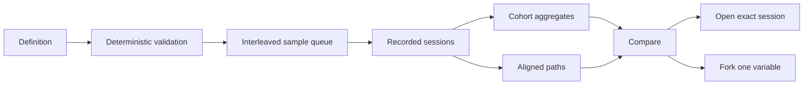

# Observatory · Experiments

## Goal

Experiments is the controlled-comparison workspace. It answers whether a
configuration change altered journey correctness, cost, attention, latency, or
behavior, and preserves the evidence needed to inspect why.

Experiments and Sessions own different questions:

- Experiments defines arms, repetitions, reset, outcome, limits, and spend.
- Each sample is an ordinary recorded session.
- Sessions explains one sample at full evidence depth.
- Experiments aggregates comparable samples and aligns representative paths.

The first screen answers:

- What question did this experiment test?
- Which registered values differed between arms?
- Were the samples comparable?
- How many samples ran, succeeded, failed setup, or were excluded?
- What did each arm cost, and how variable was it?
- Where did representative behavior first diverge?
- Which exact sessions produced every aggregate?



## Visual authority

`experiments_mock.html` in this folder is the binding visual contract for the
initial rebuilt workspace. It uses the current Observatory frame and values
from retained comparison `j1-rendering-n10`.

The older `mockups/experiments.html` remains an idea source. Its fabricated
extractor flags, two-arm result, invented spend, and unsupported verdict do not
belong to the product.

## Evidence available now

The retained J1 comparison provides three reset-verified cohorts with ten
samples each.

| Dimension | Retained source | Available evidence |
| --- | --- | --- |
| Definition | comparison contract | objective, predicate, journey, start, reset, arms, repetitions, stops, maximum spend |
| Feature registry | typed experiment registry | id, group, kind, default, allowed values, bounds, source |
| Samples | attempt ledgers | stable run id, attempt time in identity, outcome, exclusion, cost, turns, calls |
| Correctness | journey predicate and reset receipt | verified success, setup failure, aggregate eligibility |
| Cost | priced attempt usage | per-sample cost, cohort mean, median, deviation, total |
| Attention | attempt usage | fresh input, cache read, cache write, output, result characters, schema tokens |
| Behavior | representative agent traces | ordered semantic milestones and first divergence |
| Counterfactual | recorded results and wire | alternate rendering size and current parser replay without model spend |
| Execution | local job store | queued, running, stopped, completed samples, spend, stop, resume |
| Drill-down | recorded-session contract | agent, gateway, wire, world, cost, and diagnostics for one sample |

The initial retained result is:

| Arm | Success | Mean cost | Cost deviation | Mean calls |
| --- | ---: | ---: | ---: | ---: |
| Raw | 10/10 | $0.030926 | $0.006180 | 13.0 |
| Minimal | 10/10 | $0.039759 | $0.010854 | 19.9 |
| Full | 10/10 | $0.031527 | $0.009455 | 13.8 |

The evidence supports a narrow conclusion: minimal used more calls and cost on
this journey. It does not support declaring one rendering universally best.

## Registered configuration

Controls render from the typed registry. The UI has no feature-specific switch
logic.

| Feature | Source | Kind | Current execution support |
| --- | --- | --- | --- |
| `render.mode` | gateway result-mode contract | enum | raw, minimal, full |
| `tools.profile` | gateway surface registry | enum | named direct and hybrid profiles |
| `model.id` | agent model catalog | text | priced installed model id |
| `context.compaction_threshold` | agent task settings | number | isolated overlay |
| `policy.max_iterations` | agent task limits | integer | isolated overlay |
| `memory.enabled` | agent knowledge contract | boolean | visible, blocked until the runner owns an isolated overlay |

Adding an executable option requires one typed registry entry and one runner
binding. The same entry supplies validation, UI control, effective arm
configuration, immutable definition storage, and command construction. A
defined option without a runner binding remains visible as unavailable instead
of pretending to execute.

## Persistent frame

Experiments shares the current header, typography, color, and context language.

### Header and strip

- `Experiments` is active.
- The context picker selects a retained comparison or execution job.
- `Ask this experiment` scopes queries to the selected evidence.
- Live and Sessions remain direct navigation destinations.
- The strip keeps title, definition version, objective, predicate, journey,
  start identity, arms, samples, observed cost, and comparability visible.
- A run action remains absent until local policy enables execution and
  validation passes.

### Lenses

1. Compare: arm differences, correctness, distributions, cost, and findings
2. Paths: aligned representative behavior and first divergence
3. Samples: every included, excluded, setup-failed, or queued sample
4. Definition: registry-backed arms, reset, repetitions, stops, and spend
5. Replay: deterministic rendering and parser counterfactuals

## Compare

Compare begins with the controlled difference. Shared values collapse into one
line. Changed values stay visible on every arm.

The initial comparison supports:

- verified success count and rate
- mean, median, and standard deviation of per-sample cost
- mean and standard deviation of model calls
- invalid and corrective calls
- fresh input, cache read, cache write, and output tokens
- result characters and schema tokens
- movement share

Each aggregate opens the exact sample set. Variation stays visible beside means
so small differences are not presented as certainty.

### Cost grammar

Experiments reuses the Sessions cost language:

- cohort total and per-sample distribution
- mean, median, and deviation
- token-class composition
- sample outliers linked to Sessions
- observed spend separate from maximum authorized spend
- excluded and unpriced samples absent from aggregates and listed explicitly

The workspace does not divide attempt cost across arbitrary milestones.

### Findings

Findings are retained deterministic statements. The UI does not generate a
winner label from one metric. A conclusion states the journey, predicate,
sample count, observed effect, variability, exclusions, and unknown scope.

## Paths

Paths align representative semantic milestones, not raw event positions.

- Lanes share a milestone index.
- The first differing semantic action is highlighted.
- Each lane names its representative attempt, outcome, cost, and calls.
- Opening a milestone opens its sample in Sessions.
- A representative path explains behavior but never replaces the cohort.

## Samples

Every sample remains visible.

| State | Aggregate treatment |
| --- | --- |
| Success | included when reset and cost evidence are valid |
| Agent failure | included as a journey outcome when setup is valid |
| Setup failure | excluded and named separately |
| Explicit exclusion | excluded with retained reason |
| Queued or running | not yet part of a completed aggregate |
| Stopped without outcome | queued for deterministic resume |

Rows show arm, ordinal, attempt timestamp, state, cost, turns, calls, and the
route to Sessions. Sorting never changes stable sample identity.

## Definition and execution

The definition is immutable once retained. A change creates a new version or a
one-variable fork.

### Preflight

Validation checks:

- objective and independent predicate are present
- starting state and reset identity are versioned
- at least two unique arms exist
- every arm resolves every registered feature
- values satisfy types, options, and bounds
- unsupported runner bindings remain blocked
- repetitions and six stop criteria are valid
- maximum spend equals arms × repetitions × per-sample ceiling
- local policy permits the calculated ceiling

### Queue and paid boundary

Sample identities are deterministic and arms interleave by ordinal. Resume
skips retained outcomes and never renumbers samples.

Execution stays off unless local policy enables it. Starting requires a valid
definition, player profile, explicit confirmation, confirmed calculated
ceiling, and remaining local spend headroom. Stop terminates the active
isolated sample. Resume continues the stable queue. Setup failure stops the job
before another paid sample.

## Replay

Replay contains model-free counterfactuals only:

- render the same typed recorded results as raw, minimal, or full
- replay retained wire through the current parser
- compare bytes, estimated tokens, typed lines, and miss rates

It is labelled deterministic replay and never mixed with a paid cohort result.

## Ask

Ask defaults to the selected experiment and can narrow to one arm, metric,
sample, divergence, registered feature, or replay result.

Common questions include:

- Which arm cost more, and which samples account for the difference?
- Did one arm take more calls despite identical success?
- Where did representative paths first diverge?
- Which samples are outliers?
- Are the cohorts comparable?
- Which configuration fields differed?
- What evidence was excluded or missing?

Answers cite definition, sample, comparison, or session records. Optional model
use remains separate from experiment spend.

## API shape

| Endpoint | Responsibility |
| --- | --- |
| `GET /api/comparisons` | retained comparison catalog |
| `GET /api/comparisons/{id}` | definition, registry, cohorts, samples, paths, replay, findings |
| `GET /api/experiments/jobs` | retained execution jobs and sample states |
| `GET /api/experiments/jobs/{id}` | one current job |
| `POST /api/experiments/validate` | deterministic preflight and stable queue |
| `POST /api/experiments/fork` | immutable one-variable fork |
| `POST /api/experiments/run` | explicit confirmed execution boundary |
| `POST /api/experiments/jobs/{id}/control` | stop or resume |
| `POST /api/ask` | scoped experiment query |

## Stable URL

```text
/experiments?comparison=j1-rendering-n10&lens=compare&arm=minimal
```

The selected comparison, lens, arm, metric, and sample use stable ids. Unknown
optional values fall back safely without losing the comparison.

## Responsive behavior

- Wide: comparison list, main lens, and contextual selection coexist.
- Medium: the list becomes a picker and arm panels wrap.
- Narrow: metrics stack, tables scroll, and definition controls become sheets.
- No action bar covers samples or execution state.

## Delivery sequence

### 1. Contract and binding mock

- audit retained fields and runner bindings
- remove fabricated mock values
- define interaction and measurement ownership

Gate: every visible value in the mock maps to the retained J1 comparison.

### 2. Rebuilt comparison workspace

- add route, header, comparison picker, lenses, and Ask scope
- render registry-driven arm differences and actual cohort evidence
- link samples to recorded Sessions

Gate: the 30 retained samples reconcile to the comparison API.

### 3. Definition and local execution

- render every registry feature generically
- correct runner-binding validation
- expose deterministic queue, stops, spend, stop, and resume
- keep execution disabled by default

Gate: validation and command construction work without starting a paid process.

### 4. Paths, cost, and replay

- align representative paths and first divergence
- add cohort cost distributions and token composition
- expose deterministic counterfactuals

Gate: every aggregate, divergence, and replay value opens its retained source.

## Acceptance

- The workspace begins with the experiment question and changed values.
- Thirty retained samples reconcile to three cohorts of ten.
- Setup failures and exclusions never disappear into outcome rates.
- Cost shows totals, distributions, token classes, and exact contributors.
- Means never hide retained variability.
- Representative paths are labelled as examples.
- Every sample opens the corresponding recorded session.
- Registry values render without feature-specific UI branches.
- Unsupported options are visible and blocked before execution.
- Paid execution remains disabled without local policy and confirmation.
- Stop and resume preserve stable sample identity.
- Ask can query the whole comparison or one selected subject.
- Desktop and narrow layouts are rendered and verified.

## Quality bar

| Requirement | Plan |
| --- | --- |
| Best practice | controlled differences, variation, provenance, and progressive drill-down |
| One responsibility per module | comparison source, validation, execution, route, lenses, and Ask stay separate |
| Typed public interfaces | strict TypeScript and frozen Pydantic contracts |
| No markup concatenation | React components with safe text rendering |
| UI rendered for verification | desktop and narrow browser gates |
| Pinned dependencies | reuse the current stack |
| New Python tests | pytest for validation, registry, execution, and API |
| Observatory tests | Vitest and React Testing Library for lenses and execution states |
| No paid test calls | execution behavior uses constructed commands and hermetic jobs |
| No committed runtime output | jobs, attempts, bundles, and caches remain ignored |

## Workbench rework (on hold)

The built workspace is archive-first: it opens on one retained comparison and
keeps authoring and execution behind secondary controls. `experiments_mock.html`
described that archive-first state and is superseded as visual authority for
this rework. The workbench direction in `../mockups/experiments.html` is the
visual reference: an experiment rail, arms as editable configuration cards,
and run controls in front. The rework is designed and approved, and it waits
until the week 3 capability work lands.

- The section opens on an experiment rail: every retained comparison and
  draft with status, sample count, and cost. New experiment is the primary
  action at the top of the rail.
- With nothing selected, the main area states the section's purpose and
  offers the create action.
- The selected experiment leads with its question, then arms as side-by-side
  configuration cards: every registered feature per arm, differing values
  highlighted, observe-only options marked, and a marker on registry entries
  added after the definition was retained.
- The headline result strip and observed findings stay as built.
- Attention economics, counterfactual, and parser replay move to secondary
  depth with one-line explanations.
- The rail's job area becomes the run flow: enable policy, preflight,
  confirm ceiling, run, progress with stop and resume.
- No new metrics, no verdict generation, no templates. Backend unchanged
  except a possible registry newness marker.
