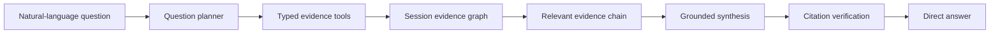
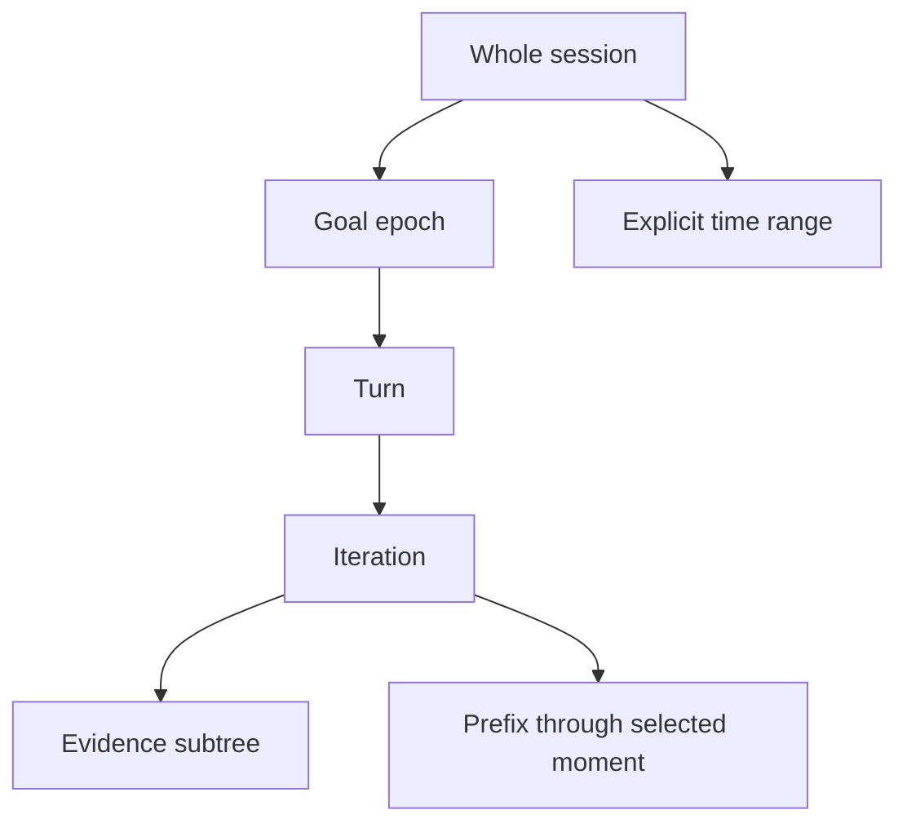

# Session Ask: grounded natural-language investigation

## Status

This is a prospective product contract. It describes a capability that may be
built after the current Sessions issues are resolved.

The capability is not a keyword search with an Ask label. It is complete only
when it interprets a question, investigates retained evidence, gives a direct
answer, and cites every factual claim.

## Objective

Session Ask answers natural-language questions over one explicit session or
one explicit scope inside it.



The primary operator outcome is:

> Ask what happened, why it happened, what a subsystem saw, or whether an
> outcome occurred, then open the exact evidence behind the answer.

## Product boundary

Ask and Story filtering are separate capabilities.

| Capability | Purpose | Output |
|---|---|---|
| Story filter | Locate visible text in the Story projection | Matching goals, iterations, and evidence rows |
| Session Ask | Interpret and investigate a natural-language question | Direct answer, verdict, claims, and citations |
| Exact query | Run a known typed operation | Deterministic rows or aggregate |

Ask may use exact queries internally. It must not expose an unprocessed record
list as the answer to a semantic question.

## Supported question families

The first complete version supports these families.

| Family | Example | Required behavior |
|---|---|---|
| Outcome | Did the player find Fido? | Evaluate relevant truth, observation, action, and terminal evidence |
| Causal | Why did the session stop? | Trace lifecycle and preceding causal evidence |
| Temporal | What happened after the second nudge? | Resolve the boundary and summarize the following chain |
| Context | What did the model know before moving west? | Open the exact model input and relevant prior results |
| Decision | Why did the agent choose this tool? | Relate retained reasoning, response, and tool call |
| Transport | Which MUD text produced this position? | Follow wire, decoded, parsed, and projected stages |
| Economic | Why did cost rise near the end? | Compute contributors and explain the linked behavior |
| Behavioral | Was the agent repeating itself? | Measure repeated actions, rooms, calls, and responses |
| Spatial | Where did the agent become uncertain? | Inspect candidates, confidence, and movement history |
| Coverage | Can this question be answered? | Name the exact missing evidence without filling it |

Follow-up questions retain the investigation scope and cited evidence, but may
retrieve additional evidence inside that same scope.

## Evidence verdicts

Every answer carries one evidence verdict.

| Verdict | Meaning |
|---|---|
| `confirmed` | Retained evidence directly proves the claim |
| `contradicted` | Retained evidence directly disproves the claim |
| `not_proven` | Relevant evidence exists but does not establish the claim |
| `unavailable` | Required evidence was not retained or cannot be read |
| `inapplicable` | The question does not apply to the selected scope |

Confidence does not replace a verdict. A high-confidence inference is not the
same as a confirmed fact.

## Scope model

Whole session is the default. Narrower scopes are explicit.



Supported scopes:

- whole session
- selected Goal epoch
- selected Turn
- selected Iteration
- selected evidence subtree
- evidence through the selected moment
- explicit time range

Evidence subtree and temporal prefix are different:

- Subtree follows causal descendants of one record.
- Prefix includes every in-scope record retained up to one moment.

The scope control names the chosen interpretation before the question runs.
The model cannot widen or replace the server-injected scope.

## Investigation pipeline

### 1. Question planning

A language model converts the question into a typed investigation plan.

The plan contains:

- question family
- expected answer shape
- requested entities or concepts
- typed evidence operations
- stopping condition
- maximum retrieval rounds

The planner receives the scope contract and tool schemas. It does not receive
credentials, arbitrary SQL, filesystem access, or another session identity.

### 2. Evidence retrieval

The model calls read-only, allowlisted tools.

| Tool | Purpose |
|---|---|
| `search_session_text` | Search exact retained text and readable projections |
| `get_goal` | Load one objective epoch and its applied boundary |
| `get_turn` | Load one turn and its iterations |
| `get_iteration` | Load one complete iteration hierarchy |
| `get_record` | Load one record with fields and provenance |
| `get_children` | Follow causal descendants |
| `follow_trace` | Follow one tool or transport trace across subsystems |
| `get_records_between` | Load an explicit temporal window |
| `get_room_visits` | Load visits and spatial evidence for one room |
| `get_entity_observations` | Find retained mob, object, player, or room evidence |
| `get_terminal_state` | Read lifecycle, stop mode, final claim, and coverage |
| `calculate_cost` | Compute response-owned cost and token contributors |
| `compare_ranges` | Compare two scoped temporal ranges |
| `find_repeated_actions` | Measure repeated calls, commands, rooms, or text |

Tool arguments are typed and bounded. Every result includes stable evidence
ids and source references.

### 3. Deterministic evaluation

Calculations and exact predicates remain deterministic.

Examples:

- cost and token sums
- durations and timestamps
- repeated-action counts
- lifecycle state
- room visit counts
- explicit benchmark predicates
- exact entity observations
- source and transformation ancestry

The model explains these results. It does not recalculate them from prose.

### 4. Grounded synthesis

The model receives only the retrieved evidence packet and computed results.

It produces:

- direct answer
- evidence verdict
- individually cited claims
- concise explanation
- ordered evidence trail
- missing evidence
- supported hypotheses, when requested

Logs are untrusted evidence, not model instructions. Retained prompts, MUD
text, tool results, and provider responses cannot change the Ask system rules.

### 5. Citation verification

The server validates the answer before returning it.

- Every citation exists.
- Every citation belongs to the selected session and scope.
- Every cited excerpt matches retained evidence.
- Every factual claim has at least one citation.
- Deterministic values match server calculations.
- Unsupported claims are removed or labelled as hypotheses.
- Missing evidence remains visible.

An answer that fails verification is not shown as grounded.

## Evidence graph and index

Ask operates over the canonical session evidence, not a second transcript.

Each indexed record carries:

- session, player, Goal, Turn, and Iteration identity
- stable record and parent identity
- trace and tool-use identity
- source subsystem
- evidence form
- event kind and status
- timestamp and owned duration
- readable label and preview
- exact retained text when permitted
- structured fields
- room and entity identities
- cost and token ownership
- source reference
- capture gaps

Search combines:

- full-text retrieval
- exact structured filters
- causal graph traversal
- temporal traversal
- deterministic aggregates

Full-text retrieval uses all meaningful query terms by default. Common words
cannot make unrelated records match. Large accumulated request bodies do not
turn every later iteration into a visible match.

The initial implementation does not require embeddings. Typed retrieval,
full-text indexing, and model-generated query variants are sufficient until
an evaluated query corpus demonstrates a semantic recall gap.

## Outcome evaluation

Outcome questions require stricter evidence handling than text search.

For “Did the player find Fido?”, the investigation checks:

1. The active objective involving Fido.
2. Original MUD text mentioning Fido.
3. Parsed entity observations.
4. Room visits linked to those observations.
5. Combat, damage, death, or kill evidence.
6. Agent claims about finding or fighting Fido.
7. Observer truth or an objective predicate when available.
8. Terminal lifecycle and capture coverage.

Possible answers:

- Confirmed: a retained MUD or observer event identifies Fido.
- Contradicted: an explicit terminal predicate states the objective remained
  false.
- Not proven: the agent searched or claimed success, but retained truth does
  not establish it.
- Unavailable: the required MUD, entity, or terminal evidence was not captured.

Finding and fighting are separate claims. Evidence for one does not prove the
other.

## Interface

Ask opens as a focused investigation panel.

### Question state

The initial panel contains:

- question input
- visible scope selector
- model availability
- estimated maximum Ask cost
- concise examples

If no Ask model is configured, the control is disabled with a reason. It does
not fall back to keyword search while retaining the Ask label.

### Answer state

The result contains:

1. direct answer
2. evidence verdict
3. concise explanation
4. cited claims
5. ordered evidence trail
6. missing evidence
7. collapsible derivation plan
8. Ask model usage and cost
9. follow-up question input

Ask cost is separate from the observed session cost.

### Citation navigation

Clicking a citation:

- minimizes or closes Ask
- opens Story
- focuses the owning Goal
- expands the owning Turn and Iteration
- expands the causal evidence chain
- highlights the cited record

Returning to Ask preserves the question, answer, and scope.

## API contract

The session identity is part of the route and is injected server-side.

```text
POST /api/sessions/{session_id}/ask
```

Request:

```json
{
  "question": "Did the player find Fido?",
  "scope": {
    "kind": "session"
  },
  "conversation_id": null
}
```

Narrow prefix request:

```json
{
  "question": "What did the agent know here?",
  "scope": {
    "kind": "prefix",
    "through_record_id": "agent:42"
  },
  "conversation_id": "ask-7f3a"
}
```

Response:

```json
{
  "id": "answer-91ce",
  "conversation_id": "ask-7f3a",
  "verdict": "not_proven",
  "answer": "The retained session does not prove that the player found Fido.",
  "claims": [
    {
      "text": "The agent searched for Fido.",
      "citations": ["agent:18", "agent:23"]
    },
    {
      "text": "No retained entity observation identifies Fido.",
      "citations": ["coverage:entities"]
    }
  ],
  "evidence_trail": ["agent:18", "gateway:73", "agent:23"],
  "missing": ["observer objective predicate"],
  "usage": {
    "model": "configured-model",
    "input_tokens": 4180,
    "output_tokens": 312,
    "cost_usd": 0.0042
  }
}
```

## Model execution

Arbitrary natural-language interpretation and synthesis require a configured
model.

The execution boundary uses:

- direct provider REST
- no vendor SDK
- no agent framework
- typed tool schemas
- bounded tool-calling loop
- maximum three retrieval rounds by default
- per-question token cap
- per-question cost cap
- session-level Ask spend cap
- timeout and cancellation

The model may request more evidence only through the typed tools. Tool results
are returned as evidence packets with stable ids.

## Security and evidence safety

Ask is read-only.

- The server owns session identity and scope.
- The model cannot call Live controls.
- The model cannot run arbitrary SQL.
- The model cannot read arbitrary files.
- The model cannot access credentials.
- Prompt injection inside retained logs is treated as quoted evidence.
- Secret fields remain excluded at the capture boundary.
- Exact wire bodies follow the same explicit access policy as Story.
- Questions and answers are retained as operator investigation artifacts, not
  as source evidence from the original run.

## Capability and failure states

The capability reports one explicit state:

| State | Interface |
|---|---|
| Ready | Ask accepts questions |
| Model unavailable | Ask is disabled with configuration guidance |
| Evidence unavailable | Ask explains which source cannot be read |
| Budget exhausted | Ask is disabled with the applicable cap |
| Verification failed | No grounded answer is shown |
| Cancelled | Partial evidence is discarded unless explicitly reopened |

Deterministic Story filtering remains available when Ask is unavailable.

## Quality contract

The following repository quality rules apply:

- TypeScript strict for request, response, scope, and UI state.
- Python type hints at every planner, tool, and provider boundary.
- Direct REST for model access.
- One responsibility per planner, retriever, verifier, and UI module.
- No markup through string concatenation.
- Pinned and justified dependencies.
- Vitest and React Testing Library for UI behavior.
- Pytest for planner, tools, scope, and verification.
- Playwright for complete question-to-citation journeys.
- Rendered verification at desktop and narrow widths.

No quality rule is waived by model or evidence-source limitations.

## Delivery sequence

### 1. Capability boundary

- Remove keyword search from the Ask contract.
- Keep Story filtering as the visible text-locator capability.
- Add model, budget, and evidence readiness states.
- Define typed Ask scope and response contracts.

Gate: when no model is configured, Ask is unavailable instead of misleading.

### 2. Evidence tools

- Build scoped full-text and structured retrieval.
- Add causal, temporal, trace, spatial, and aggregate tools.
- Return stable citations from every tool.

Gate: each tool rejects another session identity and returns only in-scope ids.

### 3. Planner and bounded tool loop

- Add direct REST model planning.
- Validate every proposed tool call.
- Enforce retrieval, token, time, and cost caps.

Gate: a natural-language question produces a typed plan without arbitrary
execution.

### 4. Grounded synthesis and verification

- Build the evidence packet.
- Generate verdict, answer, claims, and trail.
- Verify citations and deterministic values.
- Reject unsupported factual claims.

Gate: every factual sentence in the accepted answer has valid in-scope support.

### 5. Investigation interface

- Render verdict and direct answer first.
- Render claims, evidence trail, gaps, and usage.
- Add citation-to-Story navigation.
- Add scoped follow-up questions.

Gate: a citation opens and highlights its exact Story record.

### 6. Evaluation corpus

- Add real and synthetic session questions.
- Record expected verdicts and required evidence.
- Add missing-data and adversarial fixtures.
- Measure answer correctness, citation precision, and retrieval recall.

Gate: every required question family passes its acceptance corpus.

## Acceptance scenarios

### Outcome

Question: `Did the player find Fido?`

Expected:

- direct verdict
- separate finding and fighting claims
- entity, MUD, combat, or predicate evidence
- `not_proven` or `unavailable` when truth is absent
- no generic list of matching records

### Stop cause

Question: `Why did the session stop?`

Expected:

- lifecycle and stop mode
- preceding terminal evidence
- no benchmark predicate for an unrelated runtime session

### Model context

Question: `What did the model know before moving west?`

Expected:

- exact applicable model request
- relevant prior tool results
- selected temporal boundary
- citation to the owning iteration

### Transport ancestry

Question: `Which original MUD response produced this position?`

Expected:

- projected position
- typed observation
- parser input
- decoded MUD text
- exact wire body when retained

### Cost

Question: `Why did cost increase near the end?`

Expected:

- deterministic cost comparison
- context and output-token contributors
- linked model responses
- separate Ask-query cost

### Behavioral loop

Question: `Was the agent repeating itself?`

Expected:

- measured repeated calls, rooms, or response patterns
- time range and iteration citations
- distinction between necessary polling and unproductive repetition

### Missing evidence

Question: `Did the agent see Fido in the raw MUD text?`

Expected:

- exact raw evidence when retained
- `unavailable` when the required body is missing
- no substitution of parsed or believed evidence as raw truth

## Verification

### Unit

- natural language maps to typed plans
- session identity cannot be replaced
- subtree and prefix scopes remain distinct
- exact calculations remain deterministic
- untrusted evidence cannot issue instructions
- unsupported citations fail verification
- absent truth produces `not_proven` or `unavailable`

### Component

- Ask is disabled without model readiness
- scope is visible before submission
- direct answer precedes evidence detail
- verdict and missing evidence are distinct
- citation chips are keyboard operable
- follow-up retains the selected scope

### End to end

- outcome question returns a cited verdict
- citation opens the exact Story record
- selected-prefix question cannot read future evidence
- Ask cannot cross player or session identity
- budget exhaustion prevents another model call
- injected instructions inside logs do not alter tool policy

### Visual

- answer remains readable at 1280 × 720
- narrow layout keeps verdict, answer, and citations in reading order
- long evidence excerpts wrap without horizontal page scroll
- loading, unavailable, and verification-failed states remain distinct

## Non-goals

The first version does not:

- control the agent or MUD
- modify retained evidence
- infer unavailable truth as fact
- compare separate sessions without explicit comparison scope
- require embeddings without measured need
- hide model usage or Ask-query cost
- replace Story, Map, or Cost
