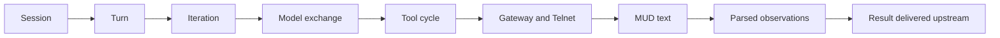
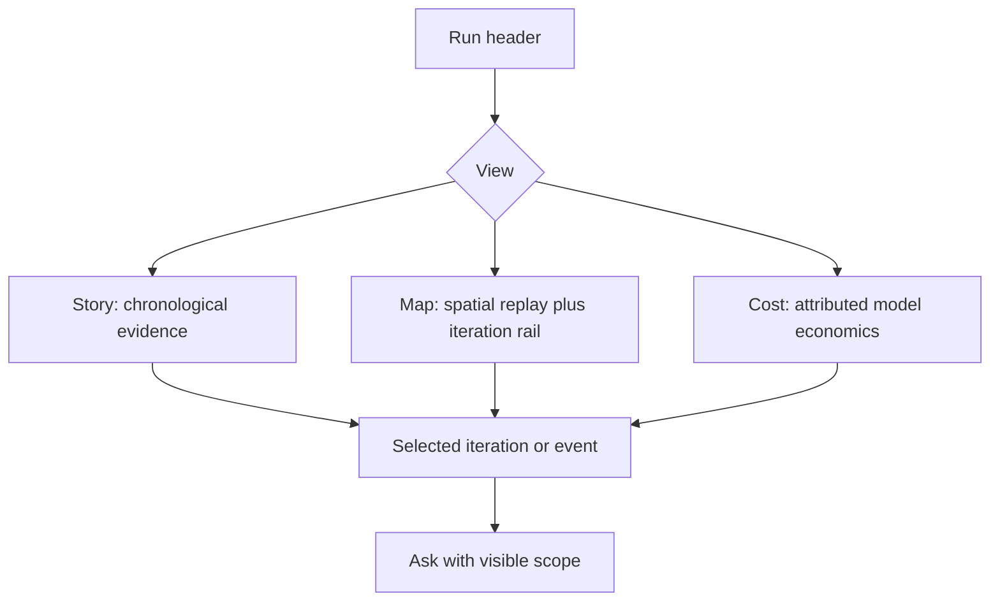
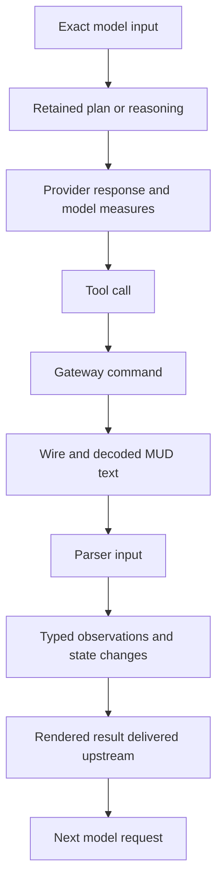
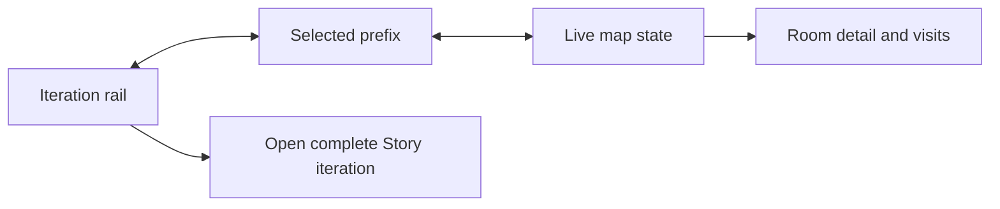
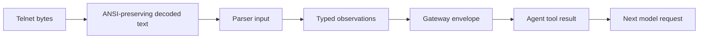

# Sessions: the run story

## Objective

Sessions explains one agent run from its first retained input to its terminal
state.

The default experience answers one question:

> What happened, in the order it happened, and what did each system see?

A session is independent of Experiments. Launcher, REPL, TUI, Live, benchmark,
and experiment runs all create sessions through the same capture boundary.
Experiments may reference session ids, but do not define the session contract.

## Product rule

One selection owns the page.



- Story is the canonical reading order.
- Map projects the selected iteration into space.
- Cost projects the selected model response into economics.
- Ask defaults to the whole session. A selected evidence prefix is opt-in.
- Every projection returns to the exact place in Story.
- Detail opens inline from the event that owns it.
- No separate inspector competes with the selected event.
- No filter changes the meaning of an existing row.

## Operator questions

The design begins with questions, not dashboards.

| Question | Entry | Answer |
|---|---|---|
| What happened in this run? | Open a session | Read the Story from session start through turns and iterations |
| What did the agent know here? | Expand an iteration | Read the exact model input, retained context, and prior tool results |
| What did it decide? | Continue in the same iteration | Read retained plan or reasoning, model response, and tool choices |
| What happened after a tool call? | Expand the call | Follow gateway command, wire, MUD text, parsing, state change, and upstream result |
| What did the MUD originally send? | Open original MUD response | Read decoded text before parsing and open byte-exact frames when retained |
| What did the model receive? | Open delivered result or next request | Read the exact transformed content sent upstream |
| Where was the agent? | Open Map | See the Live map state at the selected iteration with the iteration rail beside it |
| Why was the run expensive or slow? | Open Cost | Select a response and return to its exact iteration |
| Is a value unavailable? | Read its evidence state | See a named capture gap, never an empty or misleading field |
| Why did this happen? | Ask from the session or selection | Receive a cited answer bounded by retained evidence |

## Experience architecture

Sessions has three views with one shared selection.



The run header remains stable:

- latest applied objective
- player and short session id
- lifecycle and capture state
- start and end timestamps
- duration
- iteration count
- total attributed cost
- Ask about this session

The header does not contain source counts that require interpretation before
the run can be read.

### Story

Story is the default route and the complete session transcript.

The page reads top to bottom:

1. Session start and initial goal.
2. Collapsible Goal chapters in applied order.
3. Collapsible Nudge subchapters at their actual iteration boundaries.
4. Turn boundaries.
5. Iteration summaries.
6. The causal chain inside an expanded iteration.
7. Terminal lifecycle and capture state.

### Goals and nudges

A runtime session remains one continuous recording when the operator changes
direction.

- An applied Goal starts a new objective epoch.
- An applied Nudge belongs to the current epoch and does not replace its goal.
- Accepted but not yet applied input remains pending and does not rewrite history.
- The session title uses the focused goal and identifies its position in history.
- Goal chapters keep every prior objective, timestamp, nudge count, and iteration.
- Nudge subchapters contain the iterations influenced by that guidance.
- Goal and Nudge chapters start collapsed and open independently.
- Clicking a Goal row focuses it, updates the title, selects its first
  iteration, and toggles the chapter.
- Clicking a Map Goal row performs the same toggle and replay jump.

Turn-local iteration numbers may restart. The stable selection identity is
`turn + iteration`, never the iteration number alone.

An iteration summary answers:

- when it started
- how long it took
- where the agent was when known
- what the agent tried to do
- which tools it used
- what changed
- how much model cost it owned

The summary is derived from retained children. It does not invent a success,
failure, or intention that the evidence does not support.

### Inline progressive disclosure

Each iteration expands in causal order.



The default expanded iteration shows:

- model-facing input summary
- full retained plan or reasoning text
- model response text or tool choices
- tool call arguments
- original decoded MUD response
- parsed result summary
- exact result delivered upstream
- timestamp, duration, tokens, and cost where owned

Deeper disclosure opens from the owning item:

- exact system prompt and message array
- complete tool schemas
- provider response body
- capability projection and gateway envelope
- command timing
- Telnet direction and frame sequence
- byte-exact body
- ANSI-preserving decoded text
- parser input
- typed observations
- knowledge and position changes
- render or transform stages
- source reference and integrity digest

Repeated unchanged content may collapse visually, but its presence and
relationship remain explicit. “Unchanged context, open exact body” is valid.
Silently omitting it is not.

### Event anatomy

Every visible event uses the same anatomy:

| Region | Content |
|---|---|
| Identity | human label, source boundary, evidence form |
| Time | millisecond timestamp and owned duration |
| Meaning | full text or structured summary |
| Measures | native tokens, cost, bytes, reads, writes, or parse coverage |
| Provenance | source file, row, sequence, trace, tool-use id, and parent |
| Disclosure | only deeper evidence caused by this event |
| Availability | captured, derived, unavailable, or redacted with reason |

Cost is shown only on the model response that owns it. Iteration, turn, and
session totals sum unique response ids. Tool, gateway, wire, and parsed rows
say `no native cost`.

Duration follows the same rule:

- model response owns provider duration
- command or trace owns measured gateway duration
- iteration owns boundary duration
- parent totals do not pretend that child duration is native

### Selection behavior

Selection is simple and deterministic:

- Opening a session selects the session.
- Expanding an iteration selects that iteration.
- Expanding an event selects that event without hiding its iteration.
- Opening Map preserves the selected iteration.
- Opening Cost preserves the selected response or its containing iteration.
- Returning to Story scrolls the selected iteration into view and opens it.
- Story filtering searches readable labels and previews, reports its matches,
  and keeps the enclosing turn and iteration visible.
- URL state restores view, turn, iteration, event, and replay prefix.
- Goal and Nudge selections resolve to the iteration where they became active.

There is no independent outline selection, transcript selection, inspector
selection, or replay selection.

## Map

Map answers where the run happened.

It reuses the Live map component, layout, room size, camera behavior, pan,
zoom, fit, room selection, current-room treatment, and room detail.



The Map layout contains:

- full spatial canvas
- iteration rail beside the canvas
- one selected iteration
- traveled path up to the selected prefix
- current room at the selected prefix
- replay transport at the bottom
- room detail opened from the room
- “Open complete iteration story” from the rail

Multiple goals do not reset the learned world. The map remains one continuous
spatial history for the runtime session.

- Goal headers divide the iteration rail into objective epochs.
- The selected prefix shows the goal active at that time.
- Applied nudges appear with the active goal after their boundary.
- Moving between goals changes the temporal prefix, current room, and traveled
  path without replacing the map.
- Repeated iteration numbers remain distinct because the replay key includes
  the turn.

Replay controls are:

- first iteration
- previous iteration
- play or pause
- next iteration
- last iteration
- scrub by iteration
- playback speed

Controls are enabled by state:

| Control | Enabled when |
|---|---|
| First and Previous | selected iteration is after the first |
| Play | recording has a later iteration and replay is paused |
| Pause | replay is running |
| Next and Last | selected iteration is before the last |
| Scrub | two or more iterations exist |

Room behavior:

- Click selects the room and opens its retained detail.
- Room detail lists visits up to the selected prefix.
- Selecting a visit changes the iteration.
- Selecting an iteration changes current room and traveled path.
- A room never changes the Story selection without naming the chosen visit.
- Unknown position is displayed as unknown, not assigned to a nearby room.

No miniature map appears inside Story.

## Cost

Cost answers how model spend and context accumulated.

It contains:

- total reconciled model cost
- cost by response over time
- fresh input, cache read, cache write, and output token composition
- context size over time
- highest-cost responses
- longest responses
- cost by turn and iteration
- pricing source and completeness statement

Every chart point and table row opens the owning response in Story. The selected
response is highlighted after navigation.

Cost never ranks rooms or tools unless exact retained correlation exists.

## Diagnostics

Diagnostics is not a separate view.

Signals appear where they matter:

- retry beside the model exchange that retried
- limit beside the turn or iteration that reached it
- parse residual beside the parse result
- unresolved position beside the map update
- missing correlation beside the affected tool cycle
- capture gap beside the unavailable evidence form
- lifecycle problem at the end of the Story

A session-level coverage summary may appear near the terminal lifecycle:

- complete capture
- partial capture with named gaps
- unavailable source with reason

It never claims the run itself failed because instrumentation is incomplete.

## Ask

Grounded natural-language Ask is a prospective capability. Its complete
product, evidence, model, safety, interface, and acceptance contract is in
[Session Ask](session_ask.md).

Until that contract is implemented, deterministic evidence lookup is not
considered a compliant replacement for Ask.

## Evidence semantics

The UI preserves five forms:

| Form | Meaning | Example |
|---|---|---|
| truth | event emitted by the owning subsystem | session open, tool call, knowledge change |
| believed | agent interpretation or plan | retained plan text |
| rendered | content produced for another boundary | prompt, model response, tool result |
| wire | bytes or decoded Telnet evidence | inbound frame, outbound command |
| parsed | structured interpretation of lower-level evidence | room, exits, vitals, position |

The form is visible in provenance and deep detail. It is not used as a filter
that makes the chronology disappear.

## Data backbone

The runtime investigation endpoint already returns the session identity,
record graph, world history, model economics, correlation, diagnostics, and
capture gaps.

The sampled runtime session contains:

| Evidence | Count |
|---|---:|
| Total records | 2,359 |
| Agent records | 770 |
| Gateway records | 1,589 |
| Records with iteration | 1,922 |
| Records with parent | 1,946 |
| Records with trace | 1,179 |
| Model responses | 126 |
| Tool calls | 264 |
| Parsed observations | 481 |
| Wire records | 279 |
| Position observations | 102 |

The hierarchy is sufficient to build the Story without asking the browser to
infer relationships.

### Canonical projection

The frontend consumes a session story projection rather than rebuilding the
graph in components.

```text
SessionStory
  header
  start
  goal_epochs[]
    turns[]
      iterations[]
        input
        model_exchanges[]
        tool_cycles[]
          agent_call
          gateway_call
          command
          wire_frames[]
          decoded_text[]
          parser_inputs[]
          observations[]
          state_changes[]
          rendered_result
  terminal
  coverage
```

Each node carries:

- stable id
- parent id
- timestamp
- iteration and turn
- evidence form
- source reference
- trace and tool-use correlation
- native measures
- capture gaps

This projection belongs in a typed adapter module. React components render the
projection and do not search the flat record list for causal neighbors.

## Capture contract

Everything available at a runtime boundary is retained before and after
transformation.



Required retained bodies:

- exact model request after final assembly
- exact provider response body
- parsed plan, reasoning, text, and tool-use projections
- agent tool call and arguments
- gateway request and response envelopes
- Telnet bytes in both directions
- decoded MUD text before normalization
- normalized parser input
- typed parser observations and residual
- knowledge and position changes
- exact rendered result returned to the agent
- exact next model request containing that result

Secret handling is narrow:

- login credentials are redacted at capture
- the record states which field was redacted and why
- ordinary MUD text, prompts, tool results, traces, and identifiers are not
  redacted by default
- integrity digest remains available for a redacted body

The provider may not emit private chain-of-thought. The UI shows every reasoning
or plan field actually returned or produced by the agent and labels
non-emitted provider reasoning as unavailable. It never fabricates hidden
reasoning.

### Historical capture gaps

The sampled session predates parts of the complete capture contract and reports:

- model request body not retained
- provider response body not retained
- tool result transformation stages not retained
- MUD text transformation stages not retained
- zone not observed

Historical gaps remain visible. New sessions must not repeat them after the
capture changes land.

## Routes

The canonical route is:

```text
/sessions
  ?player=poucet
  &session=2f44f016-d826-415c-a5c1-562e07e23363
  &view=story
  &turn=1
  &iteration=4
  &event=agent:26
```

Rules:

- `session` identifies any registered runtime session.
- `run` remains an experiment sample reference and is not overloaded.
- `view` is `story`, `map`, or `cost`.
- event selection implies its turn and iteration.
- Map replay prefix is the selected iteration.
- Invalid optional state falls back to the nearest valid ancestor.
- A missing session shows a recovery action and never silently opens another
  session.

### Discovery and freshness

The header context chip is the shared Observatory switcher, showing player,
lifecycle, and short session id for the current view.

- The chip popover lists the current session with its actions and the five most
  recently updated other sessions for the player.
- Every row shows lifecycle, short id, latest applied goal when retained, and
  update time.
- A recorded current session offers View map recording. Live-only lifecycle
  actions never appear in Sessions.
- View all opens the session finder, a searchable dialog over the complete
  player history, shared with Live.
- Finder search matches goal, lifecycle as displayed, date in both displayed
  and ISO form, and short or full session id.
- Choosing a recorded session switches the view in place. A live session opens
  Live.
- An experiment sample renders through the same chip with its run identity.
- Opening Sessions fetches the catalog and investigation with no browser cache.
- Focus, page restoration, and visible-tab return refresh the selected session.
- A selected live session refreshes every two seconds without replacing the
  current view or selection.

## Component boundaries

```text
shell/
  AppHeader.tsx
  ContextSwitcher.tsx
  SessionFinderDialog.tsx
sessions/
  SessionRoute.tsx
  SessionStory.tsx
  StoryTurn.tsx
  StoryIteration.tsx
  StoryEvent.tsx
  ToolCycle.tsx
  SessionMap.tsx
  IterationRail.tsx
  ReplayControls.tsx
  SessionCost.tsx
  SessionAsk.tsx
  storyProjection.ts
  sessionSelection.ts
  sessionFormatting.ts
```

Responsibilities:

- Route loads identities and owns URL state.
- Projection converts typed evidence into the canonical Story.
- Selection is one typed value shared by all views.
- Story renders chronology and inline disclosure.
- Map wraps the shared Live map.
- Cost renders only reconciled model economics.
- Ask receives the same selection object.

`SessionWorkspace.tsx` is split before the rebuild. A single large component
does not own routing, selection, five views, projection, replay, inspector, and
formatting.

## Delivery sequence

### 1. Projection and capture gate

- Add the typed `SessionStory` projection.
- Add fixtures from a real runtime session.
- Retain all before and after transformation bodies for new runs.
- State historical gaps without synthesizing replacements.

Gate: one iteration fixture reconstructs the full causal chain in exact order.

### 2. Story

- Make Story the default session route.
- Render session start, goal epochs, turns, and iterations.
- Add inline disclosure for model exchange and tool cycles.
- Remove Overview, Flow, Diagnostics, outline, and inspector.

Gate: a reader follows iteration 1 from goal to next model input without
changing view or reconciling separate panes.

### 3. Map

- Reuse the Live map without a session-specific map renderer.
- Add the iteration rail and replay transport.
- Synchronize iteration, prefix, current room, path, and room detail.

Gate: selecting iteration 4 updates the same map state, room treatment, and
camera behavior as Live, and “Open complete iteration story” returns to
iteration 4.

### 4. Cost

- Render cost and context evolution from reconciled response points.
- Add token composition and expensive-response tables.
- Navigate every contributor to its exact Story response.

Gate: the sum of unique response points equals the session total with zero
reconciliation delta for the sampled run.

### 5. Ask and coverage

- Implement the separate [Session Ask](session_ask.md) contract.
- Bind its explicit scope to the shared selection.
- Display named evidence gaps at the affected boundary.

Gate: an answer gives a direct verified verdict, cites its supporting evidence,
and opens every citation at its exact Story record.

## Acceptance journeys

### Read the run

1. Open the sampled session.
2. See its objective, lifecycle, duration, iterations, and total cost.
3. Begin at session start without choosing a dashboard card.
4. Expand iteration 1.
5. Read the goal, plan, response, tools, MUD result, parsing, and upstream result
   in order.

Expected: no other pane must be consulted.

### Inspect one tool cycle

1. Expand `tbamud__look`.
2. Read its arguments.
3. Open gateway and Telnet detail.
4. Read original decoded MUD text.
5. Read parser input and typed observations.
6. Read the exact result delivered to the agent.

Expected: every boundary is visibly connected and timestamps remain ordered.

### Replay space

1. Open Map from iteration 4.
2. See iteration 4 selected in the rail.
3. See the route prefix and current room on the shared Live map.
4. Step backward and forward.
5. Click a room and choose one of its visits.
6. Open the complete Story iteration.

Expected: selection remains iteration 4 or changes only through an explicit
visit choice.

### Trace cost

1. Open Cost.
2. Select the highest-cost response.
3. Return to Story.

Expected: the owning iteration is open and the exact model response is
highlighted with duration, tokens, context, and cost.

### Handle missing evidence

1. Open a historical model request body.
2. Read the named capture gap.
3. Continue reading retained plan, response projection, and tool cycle.

Expected: the UI is useful without pretending the missing body exists.

## Verification

### Unit

- story projection preserves chronological and parent order
- turn and iteration form one composite replay identity
- goal revisions start epochs and nudges remain attached to their active goal
- cost totals deduplicate response ids
- evidence forms and capture gaps survive projection
- selection maps event to turn and iteration
- replay enablement follows boundary state
- unknown position never becomes a room

### Component

- Story begins at session start
- objective history exposes every applied goal and nudge boundary
- one iteration expands inline
- deep detail remains owned by its event
- Map uses the shared Live map
- iteration rail and replay stay synchronized
- Cost contributor returns to Story
- Ask displays its scope

### End to end

- launcher opens any registered session by session id
- direct URL restores Story selection
- direct URL restores Map prefix
- direct URL restores Cost contributor
- browser back and forward restore selection
- search preserves ancestry
- returning from Live refreshes the latest applied goal and retained evidence
- recent sessions show five entries and Show all searches the complete history

### Visual

- 1280 × 720 keeps replay transport visible
- 1440 × 900 shows readable Story text without a side inspector
- no primary body text is below 13px
- expanded MUD and model text wraps without horizontal page scroll
- Map room size and camera match Live
- mobile stacks Story and places iteration rail below Map

## Visual contract

`sessions_mock.html` in this folder illustrates Story, Map, and Cost using the
sampled runtime session. It is a product contract, not an implementation
shortcut. The typed projection and acceptance journeys define behavior when
the mock cannot show every state.

## Reference principles

- The instructor transcript establishes the minimum: a session must be useful
  by reading it from top to bottom.
- OpenTelemetry trace views establish parent and child causality.
- Honeycomb and Datadog establish contributor-to-trace navigation.
- Grafana establishes linked temporal projections.
- The Observatory extends those patterns with MUD text, parsed state, spatial
  replay, model economics, and exact before and after transformation evidence.
