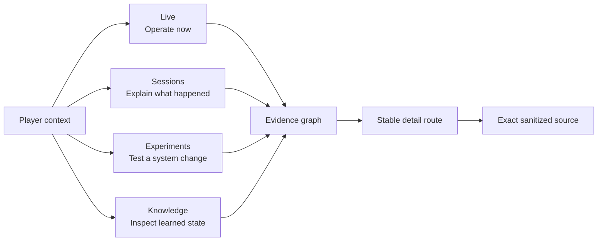
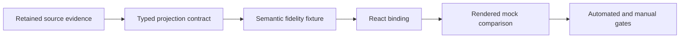
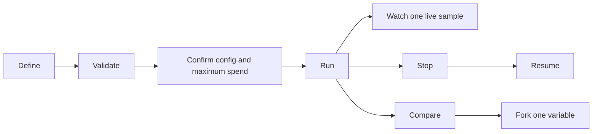

# Observatory product specification

This document is the interaction contract for the Observatory. The architecture,
evidence model, and build order remain in `observatory.md`. The HTML mockups
remain the visual references.

An implementation is in scope only when it satisfies a contract below.

## Shared context and navigation

Goal: preserve orientation while avoiding a crowded universal toolbar.

| Concern | Contract |
| --- | --- |
| Header | Full brand, four spaces, player selector, theme, and only the controls relevant to the active space |
| Player | Always explicit, switching invalidates incompatible session, selection, and control state |
| Session | Present in Live and Sessions, absent where session context does not apply |
| Selection | Player, session, time, subject, and lens are encoded in the URL when meaningful |
| Theme | Dark and light preserve hierarchy, semantics, contrast, and terminal legibility |
| Narrow screens | One focused pane, stable routes, sheets, and explicit internal scroll owners |
| Loading | Empty, loading, stale, reconnecting, unavailable, and incomplete remain different states |

Visual references:

- `design_system.html`
- `sessions_unified.html`

Acceptance:

- A destination does not introduce a competing shell.
- A control is absent when its action has no valid target.
- Switching context cannot leak evidence or drafts between players.
- The root page scrolls when content exceeds the viewport.

## Live journey cockpit

Goal: understand what an active agent is doing and intervene safely.

Primary questions:

- Where is the agent now?
- What is it trying to accomplish?
- What changed on the last turn?
- Is it progressing, looping, fighting, waiting, or disconnected?
- What is the current cost and remaining spend?

Information hierarchy:

1. connection, lifecycle, freshness, and objective
2. living world with current position and active event
3. causal activity and live economics
4. self-raising attention and instrumentation issues
5. contextual evidence and safe agent control

Interactions:

- select an authenticated live session
- pause visual following without pausing the agent
- scrub the observed prefix and return to live
- select a room, event, cost point, tool call, or diagnostic
- open evidence without losing the live selection
- guide, revise, pause, resume, or stop the selected agent

Evidence:

- gateway connection and session lifecycle
- agent goal revisions and control acknowledgements
- model requests, responses, usage, tools, wire, parse, and rendered state
- combat, vitals, progression, inventory, and room observations
- causal sequence and source freshness

Visible-value provenance:

| Surface slot | Typed source | Meaning and derivation | Unavailable state |
| --- | --- | --- | --- |
| Selected player and session | `player_id`, `character`, `session_id`, `gateway_session_id` | Identity of the selected runtime session | Disable Live and explain that no authenticated session is selected |
| Lifecycle and control state | `lifecycle`, `control_state`, `following_live`, sequence fields | Runtime state and whether the view follows the latest retained gateway prefix | Show the explicit unknown or unavailable state |
| Turn | `turn` | Count of retained agent response events through the selected prefix | `not observed` |
| Agent iteration | `iteration` | Latest retained agent iteration number through the selected prefix | `not observed` |
| Zone | Dedicated retained zone identity and label, not yet captured | Zone containing the observed current room | `Zone unknown` |
| Learned world | Full `world.nodes` and `world.frontier` collections | Counts of learned rooms and unresolved frontier exits through the selected prefix | Show zero only for an observed empty graph, otherwise `not observed` |
| Map rooms and exits | `world.nodes`, `world.edges`, `world.frontier`, and edge evidence | Evidence-backed graph with direction-aware deterministic layout | Preserve unknown exits and conflicting constraints explicitly |
| Current position | `current_room`, `position_confidence`, `position_method` | Latest retained gateway position or room observation | Unknown position with its capture gap |
| Recent path | Latest ordered edge evidence in `world.edges` | Most recent retained room transitions, never room insertion order | Omit the highlight |
| Map mode | Operator selection with a documented graph-size default | Grow, Focus, or Lantern presentation over the same full learned graph | Use the documented default without changing graph evidence |
| Level-up notice | `milestones` where `kind` is `level_up` | Retained player-state level transition at or before the selected sequence | No notice |
| Agent thought | `agent_thought` from retained reasoning or plan evidence | Latest non-redacted long-form agent reasoning excerpt | `not observed` |
| Agent belief | `agent_belief` from retained tool-call evidence | Concise agent-intended action, such as moving east | `not observed` |
| Objective | `objective_initial` from the first valid structured session objective | Initial operator or benchmark objective given to the agent | Fall back to the compatibility `objective`, then `not observed` |
| Current goal | Latest `objective_context` after retained operator revisions | Active objective the agent is currently pursuing | Fall back to the compatibility `objective`, then `not observed` |
| Objective location hint | Dedicated evidence-backed objective location, not yet captured | Known location of the objective, distinct from current position | Omit the hint |
| Combat state | `combat` from retained gateway combat observations | Whether combat was observed in the selected prefix | `not observed` when combat capture is incomplete |
| Combat opponent, exchange, and start | Dedicated retained combat episode fields, not yet captured | Observed opponent, first observed agent turn, retained lines, and outcome | Omit each unsupported detail, never infer it from agent intent |
| Vitals and progression | `player_status.fields` and `vitals` with field provenance | Latest observed values and maxima for health, mana, movement, level, and progression | Per-field `not observed` |
| Spend and current turn cost | `cost_usd`, `current_turn_cost_usd`, `spend_cap_usd`, `spend_cap_scope` | Reconciled retained response cost and the applicable configured cap | Mark incomplete totals or omit an absent cap |
| Token economics | `usage`, `economics`, `context_limit` | Retained usage, per-response context tokens, and model context window | Per-value `not observed` |
| Activity and timeline | `timeline` with evidence references | Retained chronological gateway and agent events through the selected prefix | Explicit empty or incomplete state |
| Direct-agent controls | Selected authenticated session plus control capability and expected sequence | Mutation of the selected agent with an auditable acknowledgement | Disable with the exact reason |
| Suggested action chips | Dedicated route or suggestion evidence, not yet captured | Evidence-backed actionable suggestion for the selected objective | Omit the chip |

Missing-value resolution:

| Gap | Why it is missing | Required data correction | UI contract |
| --- | --- | --- | --- |
| Current zone | Mortal position uses a session-local place identity. The atlas has zone identity and names, but the verified reset room number is not retained in the gateway receipt. | Retain the reset-verified room number as observer-truth evidence. Correlate it to the atlas and propagate the correlation only across directionally consistent observed moves. Parse zone names from the configured `.zon` source. | Show `Zone <label>` or `Zone unknown`. Keep form, confidence, and source in the evidence detail rather than the cockpit label. Never substitute the current room or objective area. |
| Combat episode | Gateway combat frames are retained as text, while Live currently reduces them to a recent-event boolean. Week 0 already proved a useful command-plus-response episode model. | Port the Week 0 behavior onto retained gateway evidence. Start from a combat command confirmed by combat lines, use its target as the foe, keep the episode lines, and end on victory, player death, flee, or a later non-combat action. Project first observed agent turn, outcome, and supporting sequences. | Show the foe, `since turn`, retained lines, and outcome when supported. Use `In combat` without a foe when only combat lines exist. Do not show a game round unless the game supplies one. |
| Objective clue | Benchmark journey identity and location guidance are collapsed into one user prompt. Direct operator guidance also has no structured hint field. | Retain structured objective title, optional clue, source kind, and revision in the agent log or runtime metadata. | Label the subtitle as an objective clue, not current-world truth. Collapse the row when no clue was supplied. |
| Objective-directed action | No retained route plan currently supports a destination-specific control label. | Derive a suggestion from a retained objective beacon and a traversable learned-world route. Otherwise derive a continue-plan action from the current agent plan or belief. | Keep generic controls available. Show a destination-specific chip only with route evidence and preview the instruction before delivery. |
| Recent path | The graph has transition evidence, but the presentation has no explicit path field. | Select the latest contiguous transition evidence through the chosen prefix and retain its source sequences. | Highlight only the derived transition chain. Stop at ambiguity or discontinuity. |

These gaps are acceptance blockers for the corresponding mock capability. An
explicit unavailable state prevents false data while the correction is being
built, but it does not close the gap or authorize removing the capability.

Required projection shapes:

| Shape | Fields | Evidence rule |
| --- | --- | --- |
| `LiveZoneContext` | zone identity, label, room vnum, form, confidence, reset sequence, movement sequences, atlas digest | Starts from a reset-verified room number and survives only verified or tracked moves whose destination matches the atlas |
| `LiveCombatEpisode` | active, optional opponent, first observed turn, observed exchanges, optional outcome, combat lines, gateway sequences, command trace | Opponent comes from the target of a retained combat command whose response contains combat evidence. Outcome comes from retained victory, player-death, flee, later action, or capture-end evidence |
| `LiveObjectiveContext` | title, optional clue, source kind, revision, evidence | `objective_initial` retains the first valid structured session objective. `objective_context` advances through retained operator revisions. Title and clue never come from position or free-text inference |
| `LiveSuggestedAction` | kind, label, instruction, reason, evidence, expected sequence | A route action requires an objective beacon and learned-world route. A continue-plan action requires retained plan or tool-intent evidence |
| `LiveRecentPath` | ordered edge identities and gateway sequences | The chain is contiguous, prefix-bounded, and stops before ambiguity |

The combat subtitle uses `since turn`. The UI cannot relabel a gateway-frame
count as a game round.

### Live data repair landing plan

Each repair lands through the same contract-first sequence:

Order:

1. Combat episode
   - Port the Week 0 command-plus-response behavior.
   - Support command-initiated and mob-initiated starts.
   - End on matched opponent death, player defeat, either party fleeing, an
     opponent switch, a later non-combat action, or capture end.
   - Use `since turn`, never an invented game round.
   - Gate with active, completed, switched-opponent, mob-initiated, unmatched
     death, and missing-detail cases.
2. Objective metadata
   - Retain title, optional clue, source kind, revision, and evidence from the
     benchmark or operator input.
   - The retained log is append-only, with one sanctioned exception:
     completing `session_start.objective` on a solitary start record before
     turn one. Any other rewrite is a defect.
   - Nudge does not create an objective.
   - Preserve the first valid structured session objective as
     `objective_initial`.
   - Advance only `objective_context` when retained operator revisions arrive.
   - Preserve the existing prompt as an exact derived compatibility view.
   - Gate benchmark, operator revision, missing clue, compatibility fallback,
     and replay-prefix cases.
3. Zone context
   - Retain the reset-verified room number.
   - Correlate it with the configured atlas and `.zon` label.
   - Continue the correlation only through directionally consistent movement.
   - Render only `Zone <label>` or `Zone unknown`.
   - Gate observed reset, valid movement, broken movement, and absent atlas.
4. Objective-directed action
   - Require a retained objective beacon and traversable learned route.
   - Keep the control absent when either requirement is missing.
   - Gate present, missing-beacon, missing-route, and stale-sequence cases.
5. Recent path
   - Walk the latest contiguous transition chain backward from the current room.
   - Stop at ambiguity or discontinuity.
   - Gate linear, branching, ambiguous, and historical-prefix cases.
6. Live fidelity
   - Bind the typed values in React components.
   - Compare the rendered Live screen against `live_cockpit.html`.
   - Exercise Grow, Focus, and Lantern inside Live against `map_modes.html`.
   - Check every mock element, typography rule, color, state, and interaction.

Landing boundaries:

- No repair substitutes data from a different semantic source.
- No missing source closes a capability or removes a mock element.
- A repair stops before React binding if its typed source is not proven.
- A repair stops before landing if automated evidence tests fail.
- The Live surface stops before acceptance if the rendered comparison differs
  without an explicitly agreed reason.
- The monitor must approve this sequence or name exact corrections before
  implementation continues.

States:

- active, waiting, paused, idle, replaying, disconnected, ended, stale, and ambiguous
- combat is an explicit live state with its own activity and vitals treatment
- position confidence distinguishes observed, inferred, candidate, and unknown

Safety:

- control targets only the selected authenticated mortal session
- every mutation previews target, insertion point, tools, model, and maximum spend
- idempotency and expected sequence prevent stale control
- operator guidance never appears as agent reasoning or game truth

Responsive behavior:

- the world remains the main pane
- the attention rail becomes a bottom sheet or stable detail route
- all live metrics and controls remain reachable

Visual references:

- `live_cockpit.html`
- `map_modes.html`
- `map_detail.html`
- `player_status.html`

Acceptance:

- A deterministic replay produces the same visible prefix as live delivery.
- A real agent action updates the world, activity, cost, tokens, and status.
- A fight is visible as combat, not merely as another text event.
- An invalid control action explains why it cannot be sent.
- Every dynamic slot has one documented source, meaning, derivation, and
  unavailable state.
- A value cannot fill a slot with a different meaning.
- Derived values have deterministic tests over retained evidence prefixes.
- Synthetic fidelity fixtures use the production typed contract and contain
  semantically valid examples, not visual filler.
- Missing evidence renders `not observed`, an explicit capture gap, or an
  omitted optional control.
- Every visible value can open or name its retained evidence source.
- A mock capability with a missing source remains an open implementation gate
  until the source lands or an alternative UI treatment is explicitly agreed.

## Sessions investigation

Goal: explain a recorded journey from outcome down to exact source bytes.

Primary questions:

- Why did the agent take this action?
- Why did it stop?
- Where did time and money go?
- Which evidence supports or contradicts the conclusion?

Information hierarchy:

1. selected run, outcome, objective, totals, and completeness
2. coordinated spatial and temporal lenses
3. sequence, cost, diagnostics, and evidence lenses
4. stable detail route for a selected span or record
5. exact sanitized source and hierarchy navigation

Interactions:

- discover, filter, and select a run
- load sanitized offline evidence
- select by room, turn, trace, event, cost point, or diagnostic
- synchronize map, sequence, cost, and evidence
- expand iterations, model calls, tools, hooks, and gateway operations
- move up to the containing turn and session or sideways to related evidence
- annotate, bookmark, export, and reopen an incident capsule

Evidence dimensions:

- causal, chronological, spatial, model, tool, gateway, cost, quality,
  configuration, and source

Visual references:

- `sessions_unified.html`
- `sessions_replay.html`
- `session_sequence.html`
- `session_detail.html`
- `cost.html`

Acceptance:

- Every captured record, field, and retained value has a meaningful renderer or
  schema-aware fallback.
- No drill-down route ends without source, ancestry, or an explicit capture gap.
- Unrelated benchmark evidence never appears in a normal session explanation.
- Direct URLs restore the same player, session, selection, time, and lens.

## Evidence inspector

Goal: preserve the distinction between bytes, interpretation, presentation,
belief, and privileged truth.

Forms:

| Form | Meaning |
| --- | --- |
| Wire | Sanitized protocol bytes and framing |
| Parsed | Typed fields derived from wire or local events |
| Rendered | What the agent or operator was shown |
| Believed | Agent memory, inference, or final claim |
| Truth | Explicitly configured observer truth, quarantined from agent input |

Interactions:

- switch forms without changing the selected evidence identity
- open derivation method, parser version, confidence, residual, and source
- pivot to containing hierarchy and correlated records
- see missing forms as missing rather than empty

Acceptance:

- Every displayed value identifies its form and source.
- Truth cannot enter agent context or mortal control.
- Unknown event kinds remain inspectable through the fallback renderer.

## Cost and context intelligence

Goal: connect spend and attention to useful progress.

Measures:

- reconciled total and cumulative cost
- marginal cost by response and since the last milestone
- fresh input, cache read, cache write, and output tokens
- cached versus uncached economics
- context composition by token class
- cost per room, objective step, successful action, and resolved ambiguity
- cost spent in loops, corrections, and stalled work
- information gain and progress per turn

Interactions:

- select a cost spike and open the billed response
- pivot to prompt, action, observed outcome, milestone, and usage record
- filter by model, tool, category, room, objective, and time range
- compare alternative configurations with identical accounting

Visual reference:

- `cost.html`

Acceptance:

- Incomplete usage cannot render as an authoritative total or curve.
- Rates and usage remain separate retained evidence.
- Every aggregate opens its contributing responses and exclusions.

## Diagnostics

Goal: turn suspicious behavior into an evidence-backed investigation.

Required diagnostics:

- false completion
- belief divergence
- position ambiguity
- confusion loop
- progress stall
- parse degradation
- corrective-call cluster
- stale action
- context churn
- instrumentation gap

Each diagnostic contains:

- plain-language issue and consequence
- severity, state, version, and threshold
- exact evidence and competing explanations
- affected conclusions
- resolution state and related occurrences

Acceptance:

- A diagnostic never invents a benchmark relationship.
- Session diagnosis uses only the selected session unless the user explicitly
  asks for comparison.
- Missing correlation appears as a capture gap.

## Experiments workbench

Goal: define, validate, run, watch, stop, resume, and compare controlled tests.

Workflow:

Definition:

- plain-language objective and verified predicate
- starting state and reset strategy
- two or more arms
- model, tools, prompt, memory, context, policy, and registered feature flags
- repetitions and six stop criteria
- spend cap and maximum-spend preview

Execution:

- validate before paid work
- reset and verify digest before every sample
- keep setup failures separate from agent outcomes
- watch one sample without losing queue control
- stop and resume deterministically

Comparison:

- success, distribution, outliers, exclusions, cost, progress, turns, and failures
- first semantic divergence
- alignment by room, tool, objective milestone, and verified state
- every sample links to its Sessions run

Visual reference:

- `experiments.html`

Acceptance:

- A registered typed feature appears without hand-built form code.
- Effective configuration and maximum spend appear before confirmation.
- Fork changes one variable and preserves provenance.
- A fixed benchmark result is evidence, not a substitute for the workbench.

## Knowledge

Goal: inspect what each player learned without confusing belief with truth.

Lenses:

- overview
- map
- entities
- progression
- snapshots
- history

Content:

- learned facts, truth, and diff
- assertions, supporting observations, and contradictions
- frontier, candidate duplicates, and unverified edges
- player progression, vitals, inventory, and entity sightings
- snapshots, append-only reset, restore, and parser rebuild history

Interactions:

- search rooms, zones, entities, assertions, and observations
- move from a fact to every support and contradiction
- use semantic zoom from atlas to zone to room
- keep mobile or respawning sightings distinct
- create a verified snapshot before reset
- restore by appending history rather than rewriting it

Visual references:

- `knowledge.html`
- `knowledge_entities.html`
- `knowledge_map_dense.html`
- `map_modes.html`
- `map_detail.html`
- `player_status.html`

Acceptance:

- Knowledge is isolated per player.
- Duplicate titles remain separate until evidence resolves them.
- Reset and restore link to verified snapshot content.
- Large maps avoid one DOM node per room and meet the measured render budget.

## Ask and structured search

Goal: answer natural-language and exact queries with visible evidence.

Placement:

- Live: ask about the selected live run
- Sessions: ask or search the selected recorded run
- Experiments: search definitions, jobs, samples, and comparisons
- Knowledge: search learned entities, places, facts, and history

Behavior:

- deterministic typed queries work without a model
- the visible plan names operations and scope
- answers cite exact evidence and disclose missing data
- saved questions keep stable URLs
- optional model translation produces only validated typed queries
- model spend is reported separately

Acceptance:

- The active player, session, time, subject, and lens define the query scope.
- A random live-session question cannot silently use unrelated benchmark evidence.
- Model translation cannot bypass validation or evidence citations.

## Instrumentation health

Goal: show whether a conclusion can be trusted, not merely whether a service is
running.

Placement:

- beside affected values and conclusions
- self-raising Live or Sessions status when abnormal
- experiment validation when required evidence is unavailable
- Knowledge freshness and history where retained state is incomplete

States:

- ready, disabled by policy, unavailable, reconnecting, stale, incomplete, and
  sequence gap

Acceptance:

- Healthy instrumentation does not consume permanent attention.
- An abnormal state names its source, age, affected evidence, and recovery.
- Capability discovery never pretends a disabled feature was not built.

## Incident capsules, annotations, and bookmarks

Goal: preserve and share an investigation without credentials or mutable
runtime dependencies.

Capsule content:

- selected range and causal subgraph
- versions, revisions, diagnostics, and annotations
- sanitized source references
- optional comparison
- renewed redaction validation

Acceptance:

- Offline reopen requires no credentials, provider, MUD, or hidden local state.
- Notes never alter original evidence.
- Bookmarks survive replay and retain stable evidence identity.

## Universal quality gates

Every feature passes:

- strict TypeScript or typed Python boundaries
- unit, component, and relevant end-to-end tests
- rendered desktop and narrow comparison against its mockup
- keyboard operation and focus restoration
- 200 percent zoom with explicit scroll ownership
- forced colors and reduced motion
- screen-reader names and non-color state semantics
- honest empty, stale, incomplete, unavailable, and failure states
- no credentials or unredacted secrets
- no invented evidence or silent cross-player correlation
