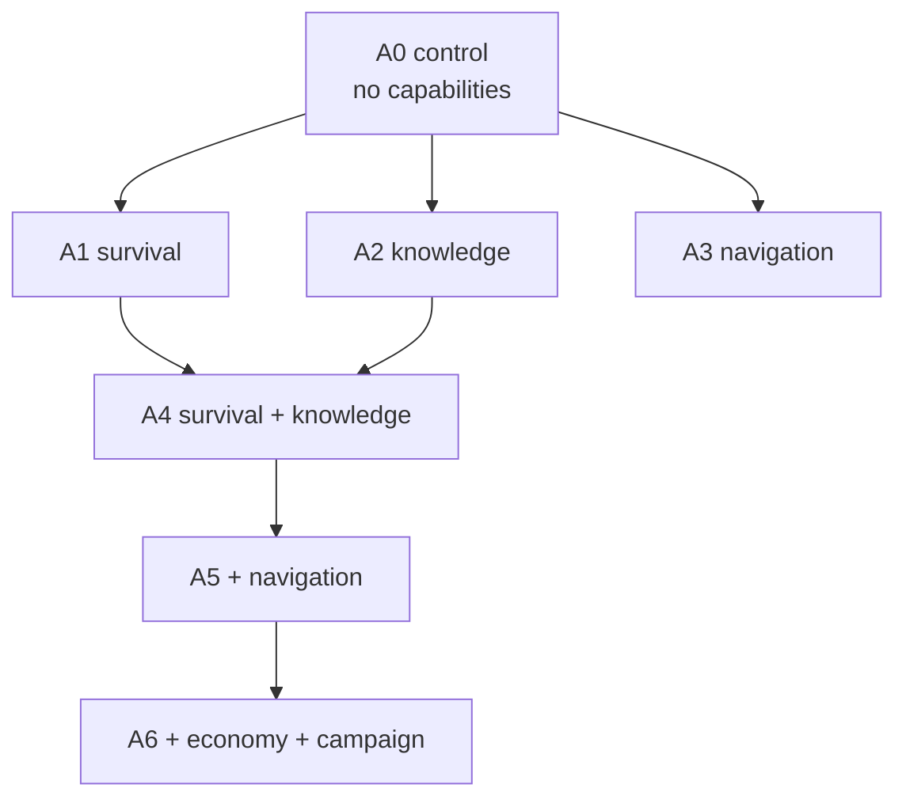

# Capability experiments

Decide which of the five capabilities become the new baseline, from measured
runs rather than from argument.

Each capability is a flag today and off by default, so the agent can be run
as any subset. This plan fixes the missions, the arms, the bounds, and the
decision rule in advance, so the answer is read off the results instead of
chosen after seeing them.

## What is being decided

- Which capabilities improve the mission enough to be turned on permanently.
- Which only pay off in combination, and with what.
- Which cost more than they return and stay off.
- Whether the result is good enough to stop, or names the next thing to build.

## Shape of the matrix

Single-capability arms answer "does this help on its own". Stacked arms
answer "does it still help next to the others", which is the only question
that decides a default.

## The missions

Every arm runs the same mission, judged from gateway evidence and never from
the agent's own claim.

| Mission | Objective | Why it is here |
| --- | --- | --- |
| J1 | Find the bakery and read the menu | Achievable, so success rate can actually move between arms |
| J2 | Travel north from the Temple and find the Massive Minotaur | The locate problem, with the area named |
| J3 | Find the minotaur and kill it | The real goal, kept out of the matrix |

J1 is the primary. A metric that is zero in every arm ranks nothing, and the
recorded baseline is thirteen attempts with zero sightings of the target. J3
would produce a zero in every arm and no information.

J2 runs only for the arms that lead on J1, as the harder second question.

## The stages

One matrix cannot answer for all five capabilities, because two of them do
nothing on the mission the other three are measured on.

| Stage | Mission | Arms |
| --- | --- | --- |
| Core | J1 | A0 control, A1 survival, A2 knowledge, A3 navigation, A4 survival with knowledge, A5 those two with navigation |
| Campaign | J2 | The leading core arm, with and without campaign, `target: minotaur` set |
| Economy | deferred | Needs a mission that earns enough gold to be worth banking |

`boukensha-e1` takes `--capability`, repeatable, and writes it into the
attempt's own settings overlay, so an arm is a command line.

Campaign and economy get their own stage rather than riding an all-on arm.

- An arm that turns on two capabilities at once cannot attribute a change to
  either, so a combined arm answers neither question.
- Campaign produces nothing at all without `capabilities.campaign.target`.
  Its line source returns nothing when the target is unset, so an arm that
  enables the flag and sets no target measures an inert capability and
  reports it as no effect.
- Campaign's target is a hunt, so J2 is the mission where it can act. It has
  nothing to say about finding a bakery.
- Economy banks gold above a ceiling. J1 earns almost none, so the arm would
  exercise nothing. It waits for a mission built for it.

## What we expect, and what would refute it

Written before the runs, so a surprise stays visible as a surprise.

| Arm | Expectation | Refuted by |
| --- | --- | --- |
| A1 | Deaths and hazard events fall. Calls fall slightly, because a kill no longer costs a looting decision | Deaths unchanged, or toggles reported unknown in the journal |
| A2 | Calls per attempt fall sharply and the action mix widens beyond movement | Calls unchanged, or the same command repeated with no progress |
| A3 | New rooms per call rises. Cost per attempt may rise, since a sweep is a long call | Rooms per call flat, or attempts ending on the call ceiling |
| A4 | The largest single improvement in the matrix | A4 no better than the better of A1 and A2, meaning they overlap |
| A5 | Navigation still adds on top, or is shown to be redundant once informed | A5 equal to A4, which would make navigation optional |
| Campaign | The hunt phase reduces wandering on J2 | No change, which would mean the phase says nothing the agent was not already doing |

The honest prior: one earlier cohort with every capability on reached 28.5
model calls per attempt against the control's 86.3. That cohort predates the
state-block corrections, so it sets an expectation and not a result.

## What is measured

Split by where each number comes from, because two of these do not exist yet
and a plan that implies otherwise would be read as a promise.

Written into every attempt's ledger row:

| Metric | Why |
| --- | --- |
| Success, evidence-judged | The only outcome that counts |
| Model calls per attempt | The measure the control loses on |
| Cost per attempt, and the cost curve | A cheaper failure is not an improvement |
| Stop reason | Separates finishing from hitting a bound |
| Tool mix, invalid calls, corrective calls | How the attention was spent |
| Cache read and write tokens | The share is computed from these two |
| Enabled capabilities | Which arm the row belongs to, read from its own overlay |

Produced by the separate autopsy pass over a finished ledger:

| Metric | Why |
| --- | --- |
| Deaths | A capability that trades survival for speed is not an improvement |
| Darkness, attacks, exhaustion refusals | The control's signature, and what survival should erase |

Not produced by anything today:

- New rooms discovered, and rooms per model call.
- Repeated no-progress commands, the same command failing three times or
  more, which is what one recorded run spent forty percent of its calls on.

These two are read from transcripts by hand, for the leading arm only, or a
small analysis pass is written first. They are not reported as automatic.

## Bounds

Every attempt is bounded twice, and every batch a third time.

- `--max-sample-cost` caps spend per attempt.
- `--max-iterations` caps decisions per attempt.
- `--cap` caps cumulative spend for the batch and stops it.

Proposed: $0.30 and 120 iterations per attempt, three attempts per arm.

Cost is the binding bound, deliberately, and the iteration ceiling sits above
where any arm is expected to reach.

- The control averaged $0.22 and 86.3 calls, so $0.30 buys it roughly 117
  calls and it finishes on money rather than on a call count.
- A 40-call ceiling would have bound the control first. Every control attempt
  would report exactly 40 calls, the spread would vanish, and the comparison
  would silently become "did it finish inside 40" while still being read as
  calls. Same money, worse measurement.
- Equal money per attempt makes the question the one actually being decided:
  what does each arm achieve for the same thirty cents.
- An attempt that still hits the iteration ceiling is reported as censored
  and its call count is a lower bound, not a measurement.

Budget:

- Core stage: six arms at three attempts is 18 attempts, $5.40 at the cap.
- Campaign stage: two arms at three attempts is 6 attempts, $1.80.
- Total $7.20 at the cap, before any rerun.
- Each arm gets its own `--cap` as well, so one runaway arm cannot spend the
  whole budget. The total is checked outside the runner, which enforces no
  cross-arm ceiling.
- Three attempts screens the large differences in calls and cost this matrix
  looks for. It cannot establish a success rate, which needs ten or more per
  arm and does not fit. Any success rate from three attempts is an
  observation, and any baseline chosen from it is provisional.

## Reading the results

Each arm writes its own `--output-dir` under `.boukensha/benchmarks/`, and
each writes its own report covering only itself. The comparison the
experiment exists to make has no artifact until the arms are read together.

- Cross-arm results come from the capability matrix report, which reads the
  selected ledgers, refuses one that mixes journeys or capability sets,
  groups by the recorded capability tuple, and reports attempts, successes,
  mean calls, mean cost, deaths and censored attempts as one table.
- Mean calls covers only the attempts that reached the mission. One stopped
  by a bound gives a floor rather than a measurement and is counted as
  censored. One that failed early is not averaged in either, because a short
  failure is not a cheap success and would rank the arm that quit fastest as
  the most efficient.
- An attempt whose setup or process failed never reached the mission, so it
  counts under excluded and enters no other column. A broken configuration
  must not read as a weak arm.
- A ledger that recorded no capability set is refused rather than compared,
  because two ledgers that both say nothing can be two different
  configurations.
- Every attempt in the report carries the identifier the Observatory knows
  it by, as a `/sessions?run=` link, so a number that looks wrong is opened
  and read as a transcript rather than argued about.
- An attempt recorded before the capability field existed reads as unknown,
  never as a control. Absence is not evidence of a capability-free run.
- The Experiments comparison does not import this matrix. It builds one
  hardcoded comparison over three rendering cohorts, its cohort identifiers
  accept only those three names, and nothing ties a set of arm directories
  together as one experiment. Nor does the web application list recorded
  attempts, so an attempt is opened by its run identifier and not browsed to.
- The arms are launched from the command line. The Observatory can explain
  the five capabilities but cannot yet start a run with them, and closing
  that gap is not needed for this matrix.

## Contamination, and the character that avoids it

The reset restores the character, not the account. It sets room, level,
experience, gold, bank, alignment, hunger, thirst and drunkenness. It does not
touch the game's own switches, the auto-flee threshold, inventory or
equipment, and those persist between sessions.

Survival turns those switches on, and autoloot fills the pack. Once a survival
arm has run, every later arm inherits both, whether or not it enables
survival. A control that runs afterwards is not a control.

Normalizing that state is a blacklist. It works only if every carrier is
enumerated and reversed, and the carriers are not only the obvious three:
practised skills, spells, standing affects, quest flags, aliases, title and
followers all persist too. A list that misses one fails silently.

Each attempt therefore runs as a character the game has never seen.

- The benchmark takes `--fresh-character`, which names a character per attempt
  and marks that attempt's player profile as one to make. The gateway answers
  the confirmation, the password twice, the sex and the class, then enters the
  game. Sex and class are fixed in the gateway, so every made character is the
  same subject.
- A made name is letters only, checked before the game sees it, because the
  game refuses a bad name by re-prompting and that reads as a hung connection.
- Isolation is by construction rather than by reversal, so no list has to be
  complete and the arms can run in any order.
- A rerun of one arm mid-matrix no longer invalidates the arms before it.

The cost is that the game rolls a made character's stats. Six made warriors
came out with 20, 20, 21, 23, 23 and 25 maximum hit points, a spread of a
quarter. Making one per attempt keeps that as noise, because each arm draws
three times and the draws are independent of the arm. Making one per arm would
be worse: the draw would be constant inside an arm and different between arms,
which is the stat confounded with the capability. Starting hit points are
therefore recorded per attempt, and a difference between arms smaller than the
stat spread is not read as an effect at three attempts each.

Making a character does not replace the reset, it precedes it. The reset sets
experience, gold, bank, alignment, hunger, thirst and drunkenness, so a made
character that is then reset is both clean and at the baseline. Maximum hit
points are the one baseline field the reset does not set, which is why the
roll is recorded per attempt.

A made name is used once. The game knows it afterwards, so reusing it would
hand back the character the previous attempt left behind, which is the
contamination the whole approach removes. A name already taken therefore fails
the attempt rather than entering the game.

## Before the first arm runs

None of the results mean anything until these are true.

- The behaviour-changing fixes have landed as commits, so every arm runs the
  same code and differs only by configuration. Item validation and the
  state-block corrections change what the agent does, so no earlier ledger is
  comparable and A0 is rerun as part of this matrix.
- A `survival` block exists in the settings with `game_toggles` that exclude
  `brief`. The flag alone cannot express this: `--capability` only sets
  `enabled`, and the default toggle list includes `brief`, which suppresses
  the room description on arrival. The look that compensates lives in the
  navigation executor, so `brief` would starve room identity in every arm
  except A5.
- A `campaign` block exists with `target` set, before the campaign stage. The
  flag alone produces nothing.
- The game's `toggle` output has been seen once and the parser matches it. If
  the switch names are not read, survival turns nothing on, A1 measures an
  inactive capability, and the journal records every switch as unknown.
- The surface proof is generated per attempt, from that attempt's own
  configuration. It is currently generated once per batch from the base
  profile alone, and enabling a capability changes the advertised tools:
  knowledge adds four, navigation two, economy and campaign one each. Until
  this is fixed the recorded schema size, tool list and surface digest
  describe a surface no arm actually ran, and occupancy is not comparable
  across arms.
- Each arm and each journey writes to its own output directory. The runner
  refuses to mix profiles and result modes in one ledger, and does not refuse
  to mix journeys or capability sets.
- The made characters share one password, held the way every other secret is,
  never in a command argument.
- Every command passes `--count-attempts` and omits `--warm`.

## The decision rule

Fixed now, so the cherry-picking is a reading and not an argument.

A capability enters the provisional baseline when all three hold.

1. It improves the primary metric against A0, on success or on calls.
2. It does not increase deaths or cost per success.
3. Its improvement survives in the stacked arm that contains it. A gain that
   disappears next to the others was a gain against a weakness the others
   already fix.

A capability stays off when it fails any of the three. A capability whose arm
never activated is not judged, it is rerun once the activation is fixed.

Two limits are read with every comparison.

- A censored attempt, one that stopped on a bound rather than on the mission,
  gives a lower bound on calls and not a call count. An arm whose attempts are
  all censored is ranked on what it achieved for the money, never on calls.
- Three attempts per arm cannot separate a real success-rate difference from
  chance. The chosen baseline is provisional until a larger sample runs.

The stages answer one further question by their shape. If a core arm reaches
the mission and campaign adds nothing on J2, the remaining features are not
worth building. If no arm reaches it, the metrics name what to build next:
repeated no-progress commands point at a repetition guard, rooms per call at
routing, deaths at survival.

## Order of work

1. Commit the pending behaviour changes, one effect per commit, so the runs
   are reproducible against a named state of the tree.
2. Add the `survival` block without `brief`, and the `campaign` block with its
   target.
3. Verify the `toggle` output once against the game, on a made character that
   the matrix then discards.
4. Fix the per-attempt surface proof, or record that occupancy is not
   comparable across arms and drop it from the comparison.
5. Core stage on J1. Three attempts each, one output directory per arm, and
   a character made for every attempt. Order no longer matters.
6. Read the leading arm's transcripts before believing its result.
7. Campaign stage on J2, leading arm with and without campaign.
8. Run the capability matrix report over every arm ledger, and read its
   table against the decision rule before recording the outcome.

Steps 1 to 6 are the minimum that answers the core question. Step 7 is the
stretch and is dropped first if the deadline arrives.

## Quality bar

- Best practice is the default: arms differ by one flag set and nothing else,
  and every attempt is reset to the same starting state.
- Verification is at transcript level: the judge reads gateway evidence, and
  a leading arm's transcripts are read before its result is believed.
- No result is reported from aggregates alone. A batch that ends on a cap or
  a reset failure is reported as such and never folded into a mean.
- A metric that no tool produces is measured by hand and labelled as such, or
  it is not reported.
- Assumptions are written before the runs, and a refuted one is recorded as
  refuted rather than rewritten.

## Out of scope

- Changing any capability's behaviour during the matrix. A fix mid-batch
  invalidates every arm before it.
- Model or profile changes. The controlled runner pins both.
- J3 as a matrix mission. It returns when an arm can reach the minotaur.
- An all-capabilities arm. It cannot attribute a change to any one flag, and
  each stage above answers a question it would leave open.
