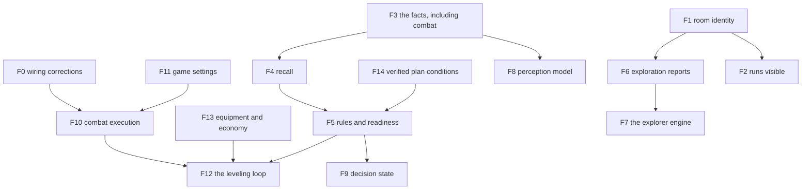

# Week 3 · The features, one at a time

Every feature that stands between the agent and the mission, as a
separate step. Each one is switchable on its own, testable on its own,
and measured on its own against the mission that matters: find the
minotaur and kill it.

Ordering is proposed here, not decided, and nothing is cut for time.
Each feature lands in its own commit with its tests, its README, and its
journal observation.



The agent has issued 994 moves, 388 sweeps, and zero attacks across 31
recorded missions, while `attack`, `consider`, `shop`, `equip_item`,
`get_item` and `practice` have existed and been reachable the whole
time. Features F10 to F14 exist because the plan previously described
knowing about play without ever executing it.

## How every feature is judged

The same measurement applies to each, so features can be compared
against each other rather than described:

| Measure | Why |
| --- | --- |
| target sighted, target killed | the mission, and nothing substitutes for it |
| levels gained, gold held and banked, kills, equipment worn | did it play the game at all |
| distinct rooms reached, share of entries onto known ground | did exploration work |
| model calls and dollars per attempt | what it cost |
| deaths and hazard events | did it survive |

Measurement is per configuration unit, not per code change. A unit is
what one switch turns on, so features that only work together are
measured together and named as one unit.

Every unit is measured the same way, and no unit is finished before it
is:

- a baseline batch with the unit off, and a batch with it on, everything
  else equal, same journey, same caps, same model
- the difference reported per measure above, with the attempt count and
  the spread, since a single run proves nothing
- the verdict stated plainly, including no effect and worse. A feature
  that improves cost while leaving mission progress unchanged is
  reported as exactly that, never as success
- a unit that cannot be measured yet says so and names what it waits
  for, rather than being called done

The order of work is therefore: implement, review until approved, then
measure against baseline, then the next unit.

## Isolation rules that apply to every feature

- One switch per feature in settings, defaulting off. Numbers are
  settings under the feature, never new switches.
- Off means unchanged: a recorded baseline mission replays identically.
- One integration point per feature where possible, named in its step.
- Tests that run without a MUD and without a model: the decision logic
  is pure functions over inputs, and the wiring is tested with fixtures.
- No feature is declared done from aggregates. One full transcript is
  read, and the Observatory is used as a person uses it.

## F1. Room identity

The blocker. Rooms have no identity across runs, so the map never joins,
coverage is undefined, and travelling to a place by name is guesswork.

- A room is its number, read by an observer, as the next part sets out.
  Nothing is inferred and nothing is merged afterwards.
- Judged by: replaying a mission twice giving the same rooms, the joined
  map being one connected piece rather than many, and travel to a room
  remembered from an earlier run arriving.

An earlier rule inferred identity instead, from a candidate key of
title, exits and description, decided by the graph and iterated until
stable. It was built and measured, making no wrong match over 502 merged
pairs while joining 43 percent of the pairs that are truly one room. It
is superseded because the game answers the question outright, and no
amount of precision on a guess is worth more than the answer.

### The room number, read by an observer the agent cannot see

Every room has a unique number. Identifying rooms by anything else is
work, and all of that work is infrastructure: it changes nothing about
what the agent decides, only whether the machinery under it knows one
room from another. So the simplest thing that gives an exact answer is
the right thing, and inference is not it.

What inference costs: a candidate key of title, sorted exits and a
description digest, a union-find over places, a relation that iterates
until stable, a difference oracle, landmark handling, per neighbourhood
agreement components. Five hundred and five lines, and rooms still
duplicate, readings still strand, and the map still does not join across
runs.

A second connection, logged in as an immortal, joins each session as an
invisible observer and is asked where the character is. That answer is
the room's number, exact, on every move.

```
 the agent's session                  the observer's session
 ───────────────────                  ──────────────────────
 walks, looks, fights                 invisible, does nothing
        │                                      │
        │                             asked "where is the character"
        │                                      │
        └──── what the agent sees ◄── 3041 ────┘
              carries no number            recorded beside it
```

What the game does, from its own source and its own replies:

- A mortal has no route to the number. `roomvnum` is not a command at
  all, `vnum` and `stat` are immortal only, and the interpreter answers
  a mortal "Huh!?!" for all three because it skips commands above the
  caller's level. Mortal `where` prints the zone and other players by
  room name, never a number.
- The observer answers exactly. Asking `where` with no argument returns
  a table of everyone with a bracketed room number, and 3041 is Inside
  The East Gate Of Midgaard, which is what the character's own text
  said.
- Invisibility persists on the character. The immortal's saved file
  carries its invisibility level, and it is applied before the arrival
  is announced, so nothing is announced. A bare `invis` command toggles,
  so sending one to an already invisible observer makes it visible in
  the room. The level is set once and no command is sent at session
  start.
- A level 1 character cannot see a level 34 invisible one, in the room,
  in `where`, or as something to attack.
- The protocol route cannot work here. The room number is declared in
  the server's variable table and assigned by no code path anywhere, so
  it is advertised as reportable and is permanently zero.

What has to be true before this is built:

- The observer shares the one immortal character, and reconnects when it
  loses it. The game drops any earlier connection holding the same
  character, so a reset takes the observer's socket with it. That is
  recorded, the question goes unanswered, and the next one reopens the
  connection. No second character is needed.
- The observer needs to see the character to answer. It should carry the
  flags that let an immortal see through invisibility and be ignored by
  creatures, or a hidden character returns nothing and a lost
  invisibility turns the observer into a combatant.
- The number must not reach the model, and today it would. Two paths
  already serialise the place key straight into a tool result: the state
  note writer returns the place it recorded, and the readiness report
  lists the places where the target was sighted. Two more generic dumps
  sit beside them, the whole command observation and the economy report.
  Keying rooms by the number puts the number through all four without a
  line of code changing.
- So the test that proves no agent-facing payload carries the number is
  part of this feature, not a consequence of it. It comes first.
- The immortal surface must not be able to grant the number either.
  Setting the room-number display flag on the character would print it
  in every `look`, and that flag is currently settable.

The rule that keeps the agent out of immortal reach needs restating with
this. It currently tests which modules import which, as a stand-in for
what the agent can reach. An in-process observer breaks the stand-in
without breaking the property. Stated directly, it is two invariants: no
immortal capability appears in any agent-facing tool surface, and no
immortal-sourced value appears in any tool result or state block. The
first is already asserted. The second is not, and it is the one that
matters here.

What changes:

- The observer opens with the session and closes with it, one connection
  for the run rather than one for each question. The alternative, the
  existing one-shot child, pays a full login per question and cannot be
  used per move.
- Rooms are keyed by the number. `identity.py` and the live identity on
  the world graph are deleted rather than left unwired.
- A run without an observer still plays. A missing immortal password
  disables the observer, and an unanswered question leaves the number
  absent, with nothing else behaving differently.
- Judged by: the store holds a room number for the places visited, no
  agent-facing payload contains one, and the same room walked twice in
  two runs is one room.

## F2. Runs visible and watchable

Every experiment writes ordinary sessions with ordinary journals. They
are invisible only because each run writes into its own private root
that the Observatory never reads.

- Decided by what works: the Observatory reads the roots measured runs
  write into, and a run keeps its own tree. Confirmed in the app, with a
  running benchmark showing live and its record readable.
- The cost of that choice, stated so it is not forgotten: the Observatory
  carries one piece of knowledge about how measured runs are laid out.
  The alternative, a run writing where every session writes and
  overriding only the knowledge store, keeps the viewer ignorant of
  benchmarks entirely. It is the cleaner shape and it is not worth a
  refactor while the current one works.
- Live watching needs nothing beyond whichever choice is made, since
  the Live view already follows a running session's journal.
- The runner records the mission verdict beside cost, so a list of
  sixteen failed minotaur attempts reads as sixteen failures.
- Judged by: opening a running batch in Live and watching it play, and
  finding any past attempt by suite and goal.

## F3. The facts the agent lacks

### The reading that is paid for and thrown away

A room's own text is read on arrival and never needs reading again, and
it was being read on nearly every arrival: 89 looks for 96 moves in the
recorded attempt. Those 89 divide three ways:

| Look, in the recorded attempt | Count |
| --- | ---: |
| a place already read, read again | 42 |
| taken under an uncertain position, filed onto a sighting | 35 |
| first reading of a place | 12 |

The 42 are the description overwrite, since 16 of that run's 17 stored
room descriptions end holding nothing at all. Keeping a room's text when
a brief arrival says nothing repairs those. The 35 are this item.

A later probe on a fresh store looks cheaper by the move and is not.
Counted against moves that actually moved, the two runs read at the same
rate, 0.98 a move in the attempt and 0.93 in the probe. The apparent
improvement is a denominator: twelve of the probe's twenty seven moves
were refused by a way that would not open, and a refused move costs a
command without arriving anywhere.

What did change is where the looks go. In the attempt, 42 readings fell
on a place already read, which is the overwrite. In the probe not one
does: every place is read once and only once.

What has not changed is this item. The probe still files three of its
readings onto sightings, where nothing can use them, exactly as the
attempt filed 35.

The two runs are otherwise unalike, the attempt revisiting on 74 of its
91 real moves against the probe's 5 of 15, so none of this measures the
size of the repair. It shows the overwrite has stopped and this defect
has not.

Every one of the probe's 14 looks accounted for:

| Look | Count |
| --- | ---: |
| first reading of a place never seen before | 10 |
| the sweep's own recovery look, after no frontier was found | 3 |
| issued by the probe script before the sweep began | 1 |

So the arrival read fires once per place and never twice, and it asks
the right question when it asks it: whether the text is known is already
asked of the whole room, against identity recomputed live on every map
build, so a place first seen this run can join and answer for its
room within the same run.

One of the ten was a room already read, the Temple, read as place 1 and
again as place 7. That look was not avoidable. The tracker had just
reported that it could not separate two places sharing this title, and
the text is the evidence that separates them. Nothing can answer
"already read" before the evidence proving sameness exists, so the first
reading of a re-minted place is what joining costs.

Three of the fourteen are a different look entirely, in the sweep's own
loop, taken when the map offers no frontier and a fresh reading might
reveal one. Two of those followed a way that refused to open, so the
character had not moved at all. That look is deliberate and is not part
of this item, but any measure of reading has to count it separately or
it reads as waste.

So in the probe there is almost no look to save. Its fourteen are ten
first readings, three recovery looks, and one the probe script issued
itself, and only the joining read is arguably spare. There is no
look-saving item left to build. What there is, is a reading paid for and
then thrown away.

A reading taken while the position is uncertain is not stored against a
place at all. It is stored against a sighting, and both things that
could use it refuse that namespace: the map skips every subject that is
not a place, and so does the fold that decides which places are one
room. The text therefore never becomes evidence of anything.

```
 arrive, position uncertain
        │
        ├── look, and pay for it
        │
        └── text stored on room-sighting:...
                     │
                     ├── the map skips it, so it is on no room
                     └── identity skips it, so it proves nothing

 result: place 7 holds no text, nothing can ever prove it is place 1,
         and the Temple ends the run as four subjects
```

That is measured, not argued. The probe's store holds twelve room
descriptions, three of them stranded on sightings. Place 7 has none of
its own, and neither has place 10, the second Main Street, for the same
reason. The Temple was read three times and finishes as four separate
subjects that no later run can join: the arrival that minted place 7
with only a title and its exits, and three readings, one on place 1 and
two filed onto sightings.

This is the register's identity defect, the one that made the recorded
sweep circle, reproduced on a fresh store in ten rooms.

There is also a guard that cannot ever fire. It asks a room for a
`description`, and a room has never had that field, so the expression is
always empty and the check below it does all the work.

What changes:

- A reading taken under an uncertain position counts for identity,
  rather than being filed where nothing can use it. Three ways are open,
  and choosing between them is the design's work: store it against the
  place the character was standing on when the look was sent, let the
  fold that decides which places are one room read sightings, or move
  the text onto a place once one is established.
- The probe rules the third one out on its own. It never became certain
  of the Temple at all: the position stayed ambiguous through both
  readings and next confirmed a room later, after the character had gone
  down into Temple Square. Waiting for confirmation would file the
  Temple's text onto the room below it.
- The probe also points at the first. When the look was sent, a place id
  was in hand and being tracked, place 7, minted from the arrival a
  moment earlier. The reading was thrown onto a sighting anyway, and the
  ambiguity only appeared when the look's own reply was read back and
  found two places of that title. Attributing a reading to the place
  standing at the time it was sent needs no retroactivity and no later
  evidence.
- The dead guard goes. A check that cannot fire is worse than no check,
  because it reads as though the case were handled.
- Reading is counted per place and per joined room, never by title. Two
  rooms in this game can carry one title, and the probe holds a pair of
  them: consecutive rooms both called Main Street, each read once, which
  a title-based count reports as a room read twice.
- The cost of the check comes down with it. It currently walks every
  learned fact in the store and builds a second map, once per arrival.
- A look records which of the three reasons sent it: a room not yet
  read, the sweep looking for a frontier it has lost, or the harness
  starting up. Without that, no measure of reading can tell waste from
  work, and this section had to reconstruct it by hand from the order of
  commands.
- Judged by: no learned description ends a run on a subject the map
  cannot attribute to a room, and a reading taken under an uncertain
  position joins its room inside the same run. The Temple finishes the
  probe as one room rather than four subjects. Recovery looks are
  counted from their own recorded reason and are not held against
  either.

What does not change, and why: a look is not skipped because some room
of that title already has text. Two rooms sharing a title are told apart
by what they say about themselves, so never reading the second one would
remove the only evidence that separates them. The probe holds one such
pair, the two Main Streets, and the identity work found a forest maze of
seven rooms alike in title, exits and description, separable only by
where their ways lead. A cheap look is worth more than a map that cannot
come apart correctly.

### What the store does not hold

The store holds room titles, exits, and sightings. Everything that
decides play is missing: darkness, shop stock, monster appraisals, door
states, hunger, aggression, area names.

What the character has to show for playing is read from the numbers the
game reports, never from prose: experience, level and gold each keep
their history in the store, so a gain is the step between two readings
and the pace of gains says whether the current hunting ground has been
outgrown. A kill itself is prose and waits for the perception model,
which is what that feature is for.

What a room holds is sorted into creatures and objects by colour, which
this game prints on every such line. It was being read wrongly: the
colour is closed after the line break, so each line opened with the
previous line's reset and the reset was read instead of the colour. One
sighting in seven was filed as the wrong kind, and asking what creatures
were about answered with furniture. Reading the colour in force where
the text begins fixes it for every run from here. What is already
recorded keeps the wrong kind until the store is rebuilt from the
journals, which is its own step.

One recorded fact is also wrong rather than missing. A room's stored
description sometimes carries what was happening in the room, a combat
line, loot on the ground, a mob standing there, so the same room reads
differently on different visits. Measured cost: it falsely proves 27
pairs of places to be different rooms and holds apart 188 pairs that
observer truth says are the same, which is most of the identity recall
currently lost. The description fact becomes the static room text, and
what was happening becomes its own observations.

- Each fact type has a source, a shape, and a provenance, per the
  knowledge contract.
- Judged by: after a mission, the store answers what a player would
  remember, and each answer traces to its evidence.

## F4. Recall, so the agent can read what it knows

Today the model sees a four-line count summary. Storing without reading
is the defect the audit found.

- One tool with a small set of typed questions: this room, creatures,
  services, a named target, unexplored ground, myself.
- Judged by: a transcript showing the model asking and then acting on
  the answer, and mission measures against recall being off.

## F5. Rules and readiness, the feature that plays the game

### The rules reached the model in no run

Knowledge does not kill anything. This is the layer that turns facts
into play, and it was the week 0 agent's whole advantage. It has never
run. Not once, in any measured attempt.

The rules live in a file beside the configuration, and a measured
attempt builds its own configuration directory from the shipped one. It
copies the model settings and the prompt folder. It does not copy the
rules. The attempt of 7 August has `settings.yaml`, `prompts`, and no
`rules.yaml` at all.

The loader that would read them treats a missing file the same way it
treats a file full of nothing. It returns an empty string, writes no
record, and the run continues with a system prompt that never mentions
how to play.

```
 shipped .boukensha/rules.yaml   the rules, authored and present
            │
            ╳  never copied into the attempt
            │
 attempt dir/rules.yaml          absent
            │
            └── loader finds no file, returns "", says nothing
                        │
                        └── system prompt carries no rules
                            and the run reports success normally
```

The capability flag is a second way to reach the same silence, and it
is not what happened here. That run had knowledge switched on. The file
was simply not there. Both paths return the same empty string, so
neither is distinguishable from rules that are present and say nothing.

What this costs: the attempt that was meant to show what the rules do
measured a run without them, and nothing in its record says so. Every
comparison drawn from it is a comparison between two runs with no rules.

What changes:

- A measured attempt carries the rules, the same way it carries the
  prompts and the model settings.
- Rules asked for and not found is a fault, not an empty string. The run
  says which file it wanted and stops, rather than playing on without
  the thing it was configured to use.
- Rules that are present are recorded as delivered: how many, and their
  ids, in the run's own record, so a reader can tell a run with rules
  from a run without them without reading a prompt.
- Judged by: the recorded system prompt of a measured attempt contains
  the rule text, and an attempt with the file removed fails rather than
  running.

### What the rules have to be

- Rules are configuration, one file, each rule with an id, a text, an
  on switch, and the settings carrying its numbers. Editing a rule
  never touches code, and any rule can be turned off to measure it.
- Each rule names the action it is about. Advice the agent cannot act
  on is not advice: telling it to search what it kills, without naming
  the tool that searches, leaves it exactly where it was. The week 0
  agent was told the command every time, and it played better.
- The rules belong in the standing instructions, not in the per-turn
  situation. They never change during a run, so repeating them every
  turn costs on every call and teaches the model to skim them. What
  changes each turn is the situation and what that situation suggests.
- The mission target is read from the objective the run is given, never
  set in configuration. A capability that can only hunt one named thing
  is not a capability.
- Gates advise from typed facts and never act: no weapon or armour, a
  level below the floor, gold below the floor, a forbidden appraisal.
  The model may override with a stated reason, and both the advice and
  the override are journaled with the rule id.
- Two mechanical exceptions, both safe by nature: the game's own
  auto-flee threshold, and standing up before walking.
- Judged by: engagements preceded by an appraisal, preparation before
  hunting, gold banked, and above all whether the agent fights anything
  at all. Rules-off versus rules-on is the headline comparison of the
  week.

## F6. Exploration that reports experience

### First, a routine has to report at all

A routine is bounded in steps and the call that carries it is bounded in
seconds, and the two bounds were never reconciled. The step bound is
larger than the time bound allows, so a sweep with real ground to cover
is cut off before it can finish, and a cut-off sweep says nothing.

Measured on the newbie-zone attempt of 7 August, 281 commands over 19
model calls:

| Sweep | Commands | Ended | Stop record | Result to the model |
| --- | ---: | --- | --- | --- |
| 1 | 23 | 4.4s, setback limit | yes | yes |
| 2 | 149 | cut at 29.85s | none | none |
| 3 | 88 | cut at 29.85s | none | none |

The arithmetic behind it, from the same run:

- a command costs 0.20s at the wire, averaged over all 281
- a sweep step is two commands, or three while a room's text is still
  being read, so 0.4s to 0.6s
- the measured sweeps ran at 2.98 and 3.03 commands a step, because
  reading the text was happening on every arrival, so the measured need
  for a full sweep was about 36s
- the step bound is 60, so a sweep needs 24s at two commands a step and
  36s at three
- the call ceiling is 30s, set in the agent's transport

So the step bound spans the ceiling rather than sitting under it, and at
the rate actually measured it cannot be honoured at all. Two sweeps in
three walked 237 commands, a little over four fifths of the run's game
traffic, and reported nothing to anybody.

One step is not even bounded in itself. When movement runs low a step
rests the character, and resting polls in sleeps of about six seconds. A
deadline consulted between steps cannot see that coming.

The third sweep shows where it ends. The rest began 17.2s into the call
and the call was cut 12.6s later, between the command that sits the
character down and the one that stands it up again:

```
 +0.2s   rest      14 of 84 movement, resting until 67
 +6.4s   score     14, nothing back yet
 +12.6s  score     14, nothing back yet
         ── the call is cut here, and nothing stands the character up ──
 +14.6s  east      refused, because it is still sitting
 +16.2s  rest      answered "You are already resting."
 +24.4s  quit      the run ends seated
```

```
 model asks for a sweep
   │
   ├─ 0s ─────────────── the routine walks, step after step
   │                     each step writes what it saw to the store
   │
   ├─ 30s ── the agent gives up waiting and cancels the call
   │         the routine's task is cancelled where it stands
   │         no stop record, no result, no room count
   │
   └─ the model is told the tool failed, and it has no way to learn
      that a hundred and forty-nine commands were spent, that the map
      grew, or where the character is now standing
```

Cancellation itself works and is not the defect. The agent sends
`notifications/cancelled` on timeout and the server library honours it,
which is why both sweeps stop dead at the same instant. The defect is
that the routine has no opinion about time, so being stopped is the
normal case rather than the exception, and being stopped is silent.

What changes:

- A routine is bounded by time as well as by steps. It checks its
  deadline before each step and stops with a typed reason, reporting the
  same way as any other stop.
- Nothing inside a step sleeps. Resting was the only such thing, and a
  routine no longer does it: a step that finds movement too low stops
  and says so, and the model rests between calls with the command it
  already has for it.
- Resting inside a call could never have worked at these numbers. A full
  rest is up to twenty polls of six seconds, so 120s of sleeping against
  a 30s ceiling, and movement comes back on the game's own tick rather
  than on ours: the one rest in the record recovered nothing at all in
  12.6s. A rest shortened to fit would sit the character down, gain
  nothing, and hand back a character that cannot walk.
- The gateway reads the ceiling from the same file it already reads and
  derives its deadline as the ceiling less one margin setting. The
  relationship is then mechanical rather than two authored numbers kept
  in step by hand.
- The ceiling becomes a real key in the shipped settings file rather
  than the commented-out line it is today, so the derivation always has
  a number to read. A measured attempt regenerates its settings from
  that file with the run's own overrides and its secrets stripped, and
  the ceiling is not among the overrides, so every attempt inherits it
  without anything being copied by hand.
- A missing ceiling stops the routines and says why. The gateway never
  invents a second thirty, because a number authored in no file is the
  defect this register already lists, and a fallback that drifts from
  the agent's would drift in silence.
- Cancellation is recorded rather than swallowed. A cancelled routine
  writes its stop record with the ground it covered, then lets the
  cancellation continue. Nothing catches it and carries on. The result
  cannot reach the model on that path, so the record exists for the
  person reading the run.
- Nothing may leave the character in a posture it cannot walk from. A
  routine achieves that by never sitting it down, which is the only
  honest way: once a call is cut, every wait inside it fails at once, so
  a routine cannot reach the game to stand the character back up.
- Judged by: every `routine_start` in a run has a matching
  `routine_stop`, every routine call has a result, and no run ends with
  the character resting under a model that thinks it is standing.

Travel walks the same steps as a sweep, so all of this covers travel
without being written twice.

### Then, reports worth reading

A sweep's whole report is a routine name, a stop reason, and five counts.
It names no room, no creature, no object, and no refusal, so the model
cannot steer by it, cannot notice anything in it, and cannot judge
whether the ground was worth covering.

- Reports name the rooms walked, the creatures and objects seen and
  where, area changes, and refusals.
- A sighting of the mission target stops the sweep immediately and says
  where.
- The model can bias direction or area. Posture is checked before
  stepping.
- Judged by: the model changing course because of a report, and the
  share of entries onto known ground falling.

## F7. The explorer engine

Coverage is a guarantee, so it belongs in code. Judgement stays with the
model.

- Areas are taken in order, each explored to a budget, then the agent
  moves on. Ordering prefers cheap and promising ground, and no area is
  starved.
- Evidence defers an area: deaths, flees, forbidden appraisals, danger
  warnings. Deferral records the level at which it hurt, and lifts when
  the character outgrows it.
- The agent aborts the plan when the target appears or danger demands.
- Whether the scout is a second agent with a disposable context or a
  routine with small local calls is settled by measurement, not by
  argument. Both are described, one is built first.
- Judged by: rooms per model call, share of entries onto known ground,
  steps to reach a target, and contacts with deferred areas.

## F8. The perception model in the loop

A trained classifier reads a reply block and reports typed flags, so
behaviour never depends on matching phrases.

- Three states: off, shadow, and acting. Shadow predicts and journals
  and changes nothing, which is how an honest accuracy number is earned
  on text the training never saw.
- Only labels that hold up are consumed, chosen one by one.
- The runtime is optional. Absent runtime with the feature off changes
  nothing, and with the feature on it fails loudly at startup.
- Judged by: reviewed per-label agreement on fresh text first, then the
  mission measures with it acting.

## F9. Decision state

Each decision is taken from an assembled state of roughly fixed size
rather than from the whole conversation.

- The state carries where I am, what I am, what I already tried, what I
  am in the middle of, how long I have been trying, and what I know
  that matters here.
- How much recent conversation is kept is a setting, so the full
  transcript, a short window, and none are one mechanism at three
  values.
- Judged by: tokens per decision against mission progress, plus
  oscillation and repetition, which are the failure this risks.

## F10. Combat execution

Fighting is a loop, not a command. The game sends the first round in
reply and the rest unsolicited, so something must own the exchange.

- Engage after an appraisal, poll rounds until an outcome, and return a
  typed result: killed, fled, died, interrupted, target gone.
- The outcome carries what happened: rounds, damage taken, experience
  awarded, what the corpse holds.
- Flee is bounded by the survival thresholds already built, and the
  model decides re-engagement.
- Judged by: a fight completed end to end in a transcript, and the
  first non-zero kill count in this project's benchmark history.

## F11. Game settings the agent sets for itself

The game can do work the agent would otherwise pay a model call for.

- At session start, the agent sets the game's own conveniences: loot and
  gold collected automatically on a kill, exits shown with each room,
  the auto-flee threshold already built.
- Every setting is configurable and every one is measured, since each is
  a small experiment in moving work out of the model.
- Judged by: a kill leaving nothing valuable on the floor, and the model
  calls per fight falling.

## F12. The leveling loop

Nothing in the system ever makes a fight happen. This does.

- Choose prey from appraisals and level, fight, loot, rest, repeat, with
  a stopping condition expressed as a goal (a level, an amount of gold,
  a number of kills).
- Grinding ground is remembered as a service like any other place, and
  experience per kill falling moves the agent on.
- Judged by: levels gained per attempt and per dollar, and deaths.

## F13. Equipment and economy execution

Advice about buying is not buying.

- Collect obvious free equipment, buy what the rules recommend when gold
  allows, wear and wield it, and bank the surplus above the carried
  ceiling.
- Every threshold is a setting.
- Judged by: equipment worn, gold banked, and gold surviving a death.

## F14. Verified plan conditions

Week 0's one text-layer mechanism that provably changed behaviour: a
plan step carries a condition that code checks, so the agent cannot
believe it is ready when it is not.

- The agent writes steps with machine-checkable conditions (an item
  held, a level reached, an amount of gold, a place known).
- Conditions are evaluated by code and their state is shown in the
  standing context, so a plan cannot drift from the facts.
- Judged by: a transcript where a false condition stops the agent from
  proceeding, which is the week 0 behaviour this restores.

## Benchmarks that can produce a non-zero number

Every mission attempt so far scores zero, so no feature can be ranked
against another. Intermediate missions fix that.

- Reach a level, from a fresh character.
- Kill a number of creatures and bank the proceeds.
- Equip a weapon and armour from nothing.
- Find a named place already known to exist.

Each is a benchmark journey with an evidence-based verdict, run the same
way as the mission, so a feature's worth is visible before the full
mission is solvable.

## What each feature needs before it can start

| Feature | Needs |
| --- | --- |
| F0 | nothing, it repairs what is broken |
| F1 | nothing |
| F2 | a decision on isolation versus tagging |
| F3 | nothing |
| F4 | F3 |
| F5 | F3 for the gates, F14 for conditions |
| F6 | F1 for honest coverage numbers |
| F7 | F1 and F6, and F3 for hazard evidence |
| F8 | a decision on where the switch lives |
| F9 | F3, F4, and F5, since state replaces what the transcript carried |
| F10 | F0, since a fight cannot be judged through broken wiring |
| F11 | nothing |
| F12 | F10 and F11, and F5 to choose prey sanely |
| F13 | F3 for shop and equipment facts |
| F14 | nothing |

## F0. Wiring corrections

Known defects that make every measurement noise. Not new scope, repair.

- The agent unwraps the gateway result envelope, so the mission line and
  the state block stop arriving as JSON noise and "None rooms".
- The per-response state line is withdrawn, since a required text line
  conflicts with tool use and was ignored on 27 of 27 iterations. Its
  fields move to the note tool.
- Routines check posture before stepping, so a sweep never walks a
  resting character into three refusals and a setback limit.
- Judged by: a transcript where the mission line renders real values,
  and a sweep from a resting start that stands and walks.

## Decisions waiting

- F8: whether perception is a sixth capability, a setting group under
  knowledge, or a gateway device outside capabilities.
- The order of work.
