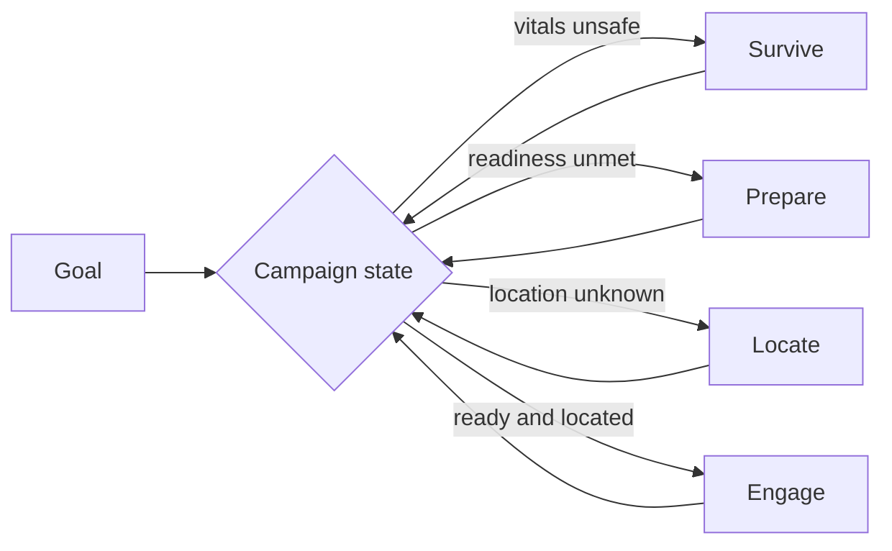
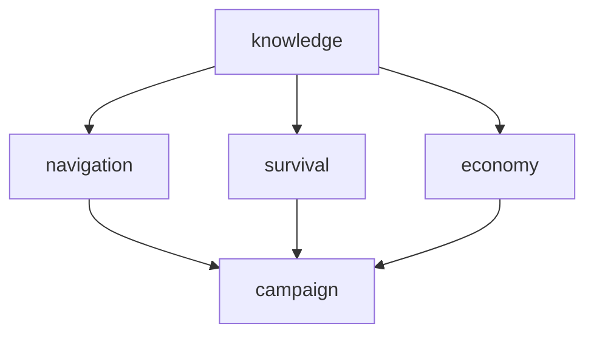

# Week 3 · Knowledge and goal capability

## Goal

Given a hard goal, the agent survives, prepares, then executes, within a
budget of moves, money, deaths, and model spend. The reference mission is
"find and kill the minotaur" driven by a small model.

The premise: the goal as given is a failure before the mission starts. A
fresh model cannot know the game's survival mechanics, and it should not
rediscover them by dying. Capability comes from knowledge the agent earns or
is taught, exploited by deterministic machinery, with the model consulted
only at genuine decision points.

Knowledge means exactly two things:

- what the agent earned from its own play, in the per-player store
- generic rules we author and feed it, versioned and visible

Authored rules carry genre common sense only, defensible for any game of
this kind: darkness needs light, do not fight far above your level, banks
protect money from death. Anything specific to this world is earned by
play, never authored. Any number a rule needs is a setting, not part of
the rule.

The agent never reads the bundled world data. A guard test asserts no agent
or gateway module opens the world files.

## Failure inventory

Derived by walking the mission as a weak model would live it. Each failure
names the evidence that reveals it and the capability that prevents it.

| # | Failure | Evidence signature | Prevented by |
| --- | --- | --- | --- |
| 1 | Target location unknown | wandering, cost cap hit, no progress | locate phase: systematic sweep, searched regions remembered |
| 2 | Movement exhaustion | moves rejected, command retried | vitals in state, rest reflex before depletion |
| 3 | Darkness | pitch black output, map corrupts | light prerequisite, dark rooms as hazard facts |
| 4 | Aggressive mobs | unsolicited combat mid-route | room hazard facts, interrupt switches mode |
| 5 | No flee discipline | hp falls across turns to death | harness-enforced flee threshold |
| 6 | Death incoherence | respawn at temple, agent continues as before | death detection, re-orientation routine, death site fact |
| 7 | Hunger and thirst | regen slows, endless resting | eat and drink reflex, food and fountain facts |
| 8 | Engaging unready | attacks far above its level, dies, repeats | readiness gate before engagement |
| 9 | Fighting bare-handed | no wear, no wield, donation room unvisited | opportunity facts, equip behavior |
| 10 | No gold, locked doors | purchases fail, routes blocked | loot reflex, key and door association |
| 11 | Skills unpracticed | levels rise, fights stay unwinnable | guild fact, practice step in preparation |
| 12 | Goal fixation or amnesia | beelines through hazards, or drifts and forgets | campaign state owns the current phase |

The inventory is validated empirically: the mission runs as-is first, and the
recorded session decides which failures actually fire and in what order.

## Knowledge products

Three views over the same store, all earned or taught:

- Hazard map: dark rooms, aggro rooms, death sites, locked doors, each with
  the level at which it was learned.
- Opportunity map: donation room, fountains, food sources, shops with
  observed inventory and prices, guild, corpse loot yields, and grinding
  grounds: places where fights come fast (the sewers are one), valuable
  for quick leveling while health is actively watched.
- Readiness model: own level, skills, equipment, and gold against what the
  target has demonstrated through consider verdicts and combat outcomes.

The game's own appraisal command grades a fight before it starts, and the
verdict ladder becomes policy:

- an even or easy verdict is engageable
- the "Are you mad?" tier marks a stretch fight: risky, but often the
  fastest way to level, allowed only with healthy vitals and a known
  escape route
- the "You are mad!" tier is never engaged

Fighting slightly above one's level in a monitored grinding ground is the
preparation planner's leveling step, not an accident.

Purchases and gold follow the same division of labor:

- What to buy is a typed gap in the readiness model: no light before dark
  regions, no weapon before a stretch fight, no food while regen is
  slowed. The planner derives the need list deterministically.
- Which candidate to buy is the model's judgment over observed shop
  inventories and prices, allowed only in the prepare phase and inside
  the gold policy.
- Death drops carried gold, so custody is an authored rule: surplus above
  a configurable carry ceiling (default 20) is deposited at an observed
  bank, deposits piggyback on routes that pass near one, and a planned
  purchase larger than carried gold inserts a withdrawal first. All
  thresholds live in settings.

Facts carry confidence and age. Stale or conflicting beliefs trigger cheap
verification before expensive commitment: re-consider a threat learned
levels ago, re-survey a room whose assertions conflict.

## Campaign loop

The active phase is chosen deterministically from the knowledge products.
The model decides within a phase, never which phase. Preparation is
precondition planning in the game-AI tradition: each action (train, buy,
loot, equip, rest) has known preconditions and effects over the readiness
model, and the planner picks the cheapest unmet precondition. No model call
decomposes the goal.

## Reading the game: protocol for structure, the model for prose

Pattern-matching prose to drive behavior is ruled out. It is fragile
infrastructure, and it defeats the reason an agent exists: the model is
the component that understands text. The boundary is drawn by what the
text is:

- Protocol-shaped output is parsed as protocol: the configured vitals
  prompt, exit lists, and menus are machine-formatted data in a fixed
  shape. Decoding them is wire handling, not language understanding.
- Prose is understood only by the model, which already reads every line.
  Each turn the model fills required structured fields: whether it can
  perceive the room, what threat it faces, what it learned. A legal
  "nothing new" value keeps the fields honest, and a required field
  cannot be skipped the way an optional tool call can.
- The harness acts deterministically on those typed fields, and the store
  records them as facts with model-asserted provenance and confidence.
  A wrong assessment is a visible, inspectable fact, not a silent miss.

Structural signals still count as structure: a successful move followed
by no perceivable room is evidence of blindness regardless of any words,
and the correlation between carrying a light and seeing the room confirms
the need for light from outcomes alone. The existing deterministic parser
keeps its current duties and does not grow into semantic territory.

## Reflex layer

Standing behaviors enforced by the harness, not suggested in the prompt,
each triggered by typed state from the section above:

- rest before movement depletes, eat and drink on the hunger signal
- auto-flee through the game's own wimpy command: the harness sets and
  maintains the threshold (absolute hit points, recomputed on level-up),
  and keeps only a backstop for the case where flight fails, detected as
  health falling below threshold without a room change
- never enter a known-dark room without a light
- loot after kills
- re-orient after death

Every reflex firing is retained as ordinary session evidence with the rule
id and version that caused it.

## Routing

The learned map is a weighted graph. Best path is computed in code, for zero
tokens, with weights composed from knowledge and current state:

| Weight source | Effect on an edge |
| --- | --- |
| terrain | base movement cost |
| known aggro room | heavy penalty, impassable when consider said deadly |
| known dark room | impassable without a light in inventory |
| locked door | impassable without its key |
| own vitals | low hp or moves favors safe or restful routes |

Best is therefore a function of map, hazards, vitals, inventory, and level,
not a property of the map. The same pair of rooms can have three different
best routes for a fresh character, a wounded one, and an equipped one.

- Unknown destination routes to the frontier instead: the unexplored exit
  whose region best advances the locate phase, with searched and empty
  regions excluded.
- Every executed step is checked against the arriving room's fingerprint.
  A mismatch marks the edge unreliable, triggers a free re-plan, and the
  unreliability becomes a fact. This is what survives mazes and teleports.
- After death or displacement, position is recovered by candidate-set
  relocalization: the rooms matching the current observation, narrowed by
  each subsequent move.
- Walked routes retain their observed cost in moves, fights, and
  interruptions. Repeat journeys prefer routes proven cheap over routes
  computed cheap.

## Techniques: chosen and rejected

Chosen, each the simplest tool that fits:

- Dijkstra over the learned graph for routing. The graph is small, weights
  are composed per query, recomputation per step costs microseconds.
- Precondition planning for preparation, in the goal-oriented action
  planning style games use. Deterministic, explainable, zero tokens.
- Candidate-set relocalization from room fingerprints.
- Outcome-preference for route and strategy choice: prefer what recorded
  evidence shows worked, a greedy policy over retained statistics.
- Protocol parsing for protocol-shaped output only. New understanding of
  prose (combat, hunger, darkness, consider verdicts) comes from the
  model's required structured fields, never from new pattern rules.

Rejected, with reasons:

- Reinforcement learning. Episodes cost real money and real minutes, the
  reward is one kill at the end, and the world is static. Remembering facts
  beats learning a policy in every account: sample efficiency, cost,
  explainability. The only uncertainty left after memory is route and
  strategy choice, and greedy outcome-preference covers it.
- A-star and incremental replanners. Unjustified over Dijkstra at a few
  thousand nodes with no reliable geometric heuristic.
- Embedding retrieval over facts. The store is small, typed, and tagged.
  Lexical and structural lookup is exact and free.
- An ML parser in the loop. The MUD's output is regular. If the unparsed
  residual proves material in the autopsy runs, a small local pinned
  classifier for the residual only is the documented escape hatch.
- LLM goal decomposition. The campaign state plus precondition planning
  makes the decomposition deterministic. The model spends its tokens on
  what only it can do: judgment inside a phase.

## Delivery to the model

One compact state block, re-rendered from the store before every model call
and appended as the final user message, never accumulated, never compacted:

- current place, exits with frontier marks, vitals, campaign phase, active
  sub-goal
- nearby entities from the live parse only, never from stored sightings
- at most three relevant facts, ranked entity first, then place, then rule,
  each with confidence and age when stale
- movement results are replaced in the model's copy by one line when the
  parser confidently recognized the move, and pass through verbatim
  otherwise. Retained logs always keep the full text.

## Observatory knowledge space

Deferred behind the agent capabilities, deliberately: the week 3 fact
layers are exactly the data that space will display, so building it after
them means it renders threat tiers, readiness, hazards, and authored rules
with provenance instead of only place facts. When built, it shows the
store as inspectable state: facts with confidence, age, and evidence links
back to sessions, the authored rule set with versions, and the change
feed. The generic subject and predicate rendering means new fact layers
appear without UI changes. If the capabilities land early, this is the
first stretch item after the learning curve.

## Backlog experiments

Not first priority. Documented so they are run if time allows, using the
existing experiment machinery.

- Tool surface: the same mission with the minimal advertised tool set
  against the full one. The registry already exposes the surface as a
  typed feature, so this is a two-arm comparison measuring whether a
  smaller surface changes journey behavior and cost on a hard goal, as
  result rendering was measured on an easy one.
- Distilled text understanding: train one small local model to detect at
  once every property we extract from game text (darkness, threat tier,
  hunger, combat state), using our own retained evidence as labels: the
  typed observations and the model's recorded state fields form a
  labeled corpus for free. Exploratory. If it reaches useful precision
  it replaces per-turn field-filling with a millisecond local call, and
  its verdicts remain facts with provenance like any other assertion.

## Measurement

- Run the mission before building anything, and after each landed
  capability, on the same reset baseline. The recorded failure chooses the
  next capability to build.
- Journey gates: maximum model calls, maximum cost, no-progress call count,
  deaths, rooms outside the campaign scope.
- The learning-curve claim: run the same mission repeatedly with retained
  knowledge. Later runs must be measurably cheaper and shorter than run
  one, with the curve and its sessions in the retained evidence.

## Architecture: five capabilities

The whole build is five capabilities. Each is one coherent idea, one
module home per affected layer, and one master flag with its numbers as
settings underneath. Nothing is toggled at a finer grain, and with every
capability off the tool surface and prompt are byte-identical to the
measured baseline.

| Capability | One idea | Contents | Home |
| --- | --- | --- | --- |
| knowledge | understanding becomes durable | required state fields, state block, fact layers | agent response contract, gateway store |
| navigation | purposeful movement | weighted routing, sweep with search ledger, travel to a known room, fingerprint checks | one gateway package |
| survival | stay alive and functional | rest, eat and drink, darkness back-out, wimpy management, death re-orientation | one reflex engine in the gateway |
| economy | resources | loot after kills, gold custody, need-driven purchasing | reflex engine and planner hooks |
| campaign | the mission spine | phases, readiness gate, preparation planner | one agent-side controller |

- Route computation is internal to navigation: a pure function from the
  learned map and composed weights to an ordered path. With knowledge on,
  weights consult hazard facts. With knowledge off, the same function
  runs on plain hop counts. The machinery never changes, only the costs.
- Travel to a named destination is isolated behind its own setting inside
  navigation and can stay off while the sweep runs. It is an adopted
  technique, kept because its effect is proven, and its use remains a
  configuration decision.
- Integration happens at four enumerated seams only: gateway tool
  registration, one hook pair in the routine executor, one context
  assembly slot in the agent, one response-contract extension. A disabled
  capability leaves its seam inert.
- Every threshold and bound (rest percentage, wimpy level, carry ceiling,
  sweep bounds) is a setting under its capability, never a flag.
- The experiment registry exposes the five capabilities and selected
  settings, so an arm reads like a sentence: navigation on, survival off.
- Routines journal every step as ordinary wire evidence, so the
  Observatory explains a sweep exactly like a hand-played turn.

## Build order

Ranked by the autopsy batch (13 cold attempts, zero sightings, darkness
the dominant hazard, 3 deaths), walking whole capabilities:

1. Capability flags and registry entries, everything off, no behavior
   change.
2. navigation: routing, sweep, search ledger, the isolated travel
   setting, and the interrupt suspend and resume contract. Every
   baseline attempt spent its whole budget wandering.
3. knowledge: state fields, state block, fact layers. Darkness detection
   lands here structurally and feeds navigation's weights.
4. survival: the reflex engine with rest, sustenance, darkness back-out,
   wimpy, and death re-orientation.
5. economy: loot, custody, purchasing.
6. campaign: phases, readiness gate, preparation planner with the
   consider ladder, stretch fights, and grinding grounds.
7. Batch re-run with capabilities on against the retained cold baseline.
8. Warm-run mode in the benchmark and the learning curve across repeated
   missions.

Each step is verified on the reference mission before the next begins.
