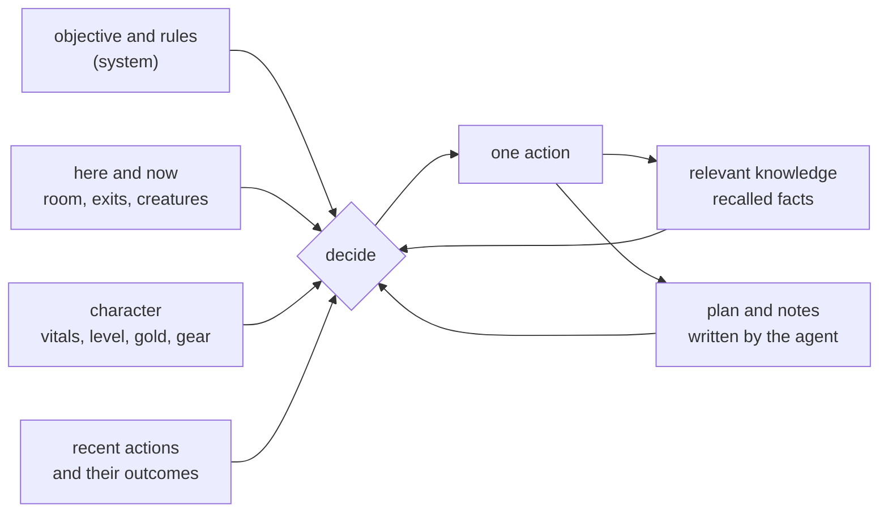
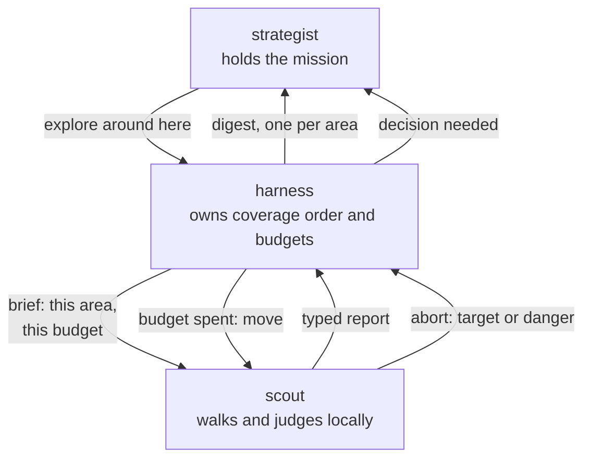

# Week 3 · Knowledge rework

This plan corrects the knowledge design against the audited failures in
[the capability audit](../../reports/week3_capability_audit.md). It
states, in full detail, what each part must become. The parent
[knowledge plan](knowledge.md) still governs the architecture (five
capabilities, four seams, no prose pattern-matching in agent behavior);
this plan revises the knowledge contract, the exploration contract, the
strategy carrier, and the knowledge surface.

## 1. The knowledge contract: the store is the agent's memory

Principle: anything the game shows that a playing human would remember
must become a typed fact. The session log is evidence for auditing; it
is never the agent's memory. A fact that exists only in the log does not
exist for the agent.

What the store holds today: room titles, descriptions, exit lists, exit
links, sighted creature and object names, own vitals and score numbers.

What it must additionally hold, each with its source:

| Fact | Subject and predicate shape | Source |
| --- | --- | --- |
| Room is dark or perception failed there | place · quality.dark | structural signal only: movement points were spent and no room parsed, which also separates dark from a refused move (a refusal costs nothing); corroborated by the model's perception note and the carried-light correlation. The week 2 pitch-black phrase rule stays journal-only: no behavior and no fact may depend on it, and the position tracker's current use of it moves to the movement-cost signal |
| Sign and board text | place · sign.text | the model reads the prose and records it through its note tool |
| Shop stock and prices | place · stock.[item, price] rows | the shop list command's output when visited |
| Monster appraisal | entity · consider_at_level_N · verdict tier | the consider command, read by the model, recorded as a typed tier |
| Door state per exit | place · door.[direction] · open, closed, locked | movement refusals and open and unlock attempts |
| Item taken or seen in detail | entity facts from examine and inventory | the examine and inventory commands when used |
| Area membership hints | place · area · free text | the model's note when it recognizes a district (a sewer, a shop street, a temple quarter) |
| Aggression | entity · attacks_on_sight · true | an unprovoked combat start in that entity's presence |
| Body conditions (hungry, thirsty, drunk, poisoned) | player · state.[condition] · true or false | the parser already produces these on player state observations and nothing consumes them: they are journaled and then lost. They become facts, they appear in the state block, and hunger and thirst gate the rest reflex, since neither health nor movement regenerates while the character is starving |

Provenance rules stay as built: parser-derived facts are learned or
parsed; model-derived facts are beliefs with low confidence; every fact
carries its session evidence.

## 2. Model access: the agent can read what it knows

The model needs a query tool, not a bigger summary. One tool, `recall`,
with a small closed set of typed queries:

| Query | Returns |
| --- | --- |
| room, by title or here | everything known about one room: exits and where they lead, creatures and objects seen there with last-seen time, qualities, signs, notes |
| creatures | every sighted creature, its rooms, any appraisal tiers |
| services | recorded shops, banks, guilds, fountains, healers, grinding spots, each with its room |
| target, by name | sightings of the named target with rooms and times |
| unexplored | the nearest rooms that still have unexplored exits, with distance |
| self | the character sheet: level, vitals against maxima, gold, known skills, equipment |

Results are compact prose lines (readable, not JSON), each derived from
facts, capped in length, ordered by relevance. The week 0 rule carries
over as behavior: the standing instruction tells the model to recall
before deciding, and the state block's last line names the tool.

## 3. The exploration contract: sweeps return experience, not geometry

The sweep report must let the model steer and notice. Its report gains:

- rooms visited, by title, in walk order, with area transitions marked
- creatures seen during the walk, each with the room it stood in
- objects seen, each with its room
- anything that interrupted or refused movement, in typed form
- the current standing summary it already has: steps, new rooms,
  frontier remaining, stop reason

Sweep behavior changes:

- an optional target argument: when a sighting matching the target name
  is recorded during the sweep, the sweep stops immediately with the
  typed stop `target_sighted` and the room named
- an optional direction or area preference, so the model can steer
  ("sweep toward the exits leading out of the city", "prefer down")
  expressed as a starting frontier choice, never prose parsing
- posture is checked before every step; a resting or sitting character
  stands first
- a refused step records the refusing direction as untraversable for
  this sweep, so the same closed door is never retried within one run

## 4. The strategy carrier: the week 0 rules get a home

The authored rules layer from the parent plan is built, with the week 0
play skill as its source text, generalized to genre common sense:

- consider before every deliberate fight; the appraisal tiers gate
  engagement, and the worst acceptable tier is a setting
- an unbeatable target means leveling or better equipment first, never
  a retry
- carried gold is lost on death: bank surplus above the ceiling
- rest before exploring when movement is low; eat and drink when hungry
- collect obvious free equipment before hunting (a donation room is the
  canonical example)
- loot after kills: corpses carry gold, keys, and gear
- experience per kill falling means the targets are outleveled: move up

The rules are configuration, not code. They live in an authored rules
file beside the settings (one entry per rule: id, text, enabled flag,
and references to the settings that carry its numbers), validated at
load. Editing or disabling a rule never touches code, so a run can
measure one rule's impact the same way a capability flag does.

The model is the only decision-maker. The backend never initiates an
action on its own, and a rule is never executed by code without the
model's context. Delivery is dual within that authority:

- the model sees every enabled rule: they ride the state block as one
  standing compact section (they are short), rendered from the file
  with the configured numbers filled in
- the typed gates advise, never act: they evaluate facts and place
  their verdict in the readiness line the model reads ("no weapon
  equipped, rule R2 advises prepare before locate"), and the model
  decides. Overriding advice is allowed and requires a stated reason,
  recorded in the journal beside the cited rule id, so transcripts
  show advice given, decision taken, and why.

Exactly two mechanisms stay mechanical, both context-safe by nature:
wimpy, the game's own safety net set once from a setting, and posture
and rest handling inside a routine the model itself invoked.

Each rule has an id, and gate verdicts and reflex firings cite the
rule id in their journal events, so transcripts show which rule fired
and why.

The readiness gate becomes real as an advisor: the campaign phase
function recommends prepare before locate for an unready character,
where unready is typed: no weapon or armor equipped, level below the
target floor setting, gold below a basics floor, or a target appraisal
at the forbidden tier. Each check reads facts (equipment from the
equipment check, level and gold from score, appraisals from recorded
considers). The engage recommendation asks for a fresh appraisal at an
acceptable tier before attack, and the model may proceed against it
only with a stated reason.

## 5. The knowledge surface: a knowledge base, not a table

The page scrolls like any document page. The route restores normal page
scrolling exactly as Sessions does.

The space is organized by meaning, with lenses:

- World: one card per known room, titled by room name, showing its exits
  and where each leads (or that it is unexplored), the creatures and
  objects seen there with last-seen times, its qualities (dark, area),
  signs, and any notes or beliefs attached, each with its evidence link.
  Cards group by area when area facts exist, and a search filters by any
  of it. Room identity strings never appear as primary labels; titles
  do, with the identity available in a detail view.
- Character: one sheet assembled from facts: level, vitals against
  maxima, gold, skills, equipment, with the session evidence for each
  value and its history where retained.
- Beliefs: the agent's own assertions and appraisals as readable
  statements ("the sewer entrance is dark", "the cityguard at the gate
  is deadly at level 3"), each with confidence, age, evidence, and any
  conflicting observation shown beside it.
- Services: the recorded map of where to buy, bank, train, drink, and
  grind, each entry naming its room and the evidence.

Every value on every lens links to the session evidence that produced
it, reusing the existing evidence-link pattern from Sessions.

## 6. Wiring corrections

- The agent-side fetchers unwrap the gateway result envelope and consume
  the inner text for both the state block and the readiness report.
- The per-response STATE line is withdrawn. Its three fields move into
  the existing note tool as arguments the model supplies when something
  changed, and the state block reminds the model of the duty. A required
  text line on tool-calling responses conflicts with tool use and does
  not return.
- Routines check posture before stepping.
- The knowledge page scroll defect is fixed with the surface rework.

## 7. Verification standard for this rework

- Every landed step is verified against at least one full session
  transcript, read message by message, not from ledger aggregates.
- The mission metrics that matter are game progress: levels gained,
  gold held and banked, kills, equipment worn, target sighted, target
  killed. Call counts and cost remain reported but never stand alone.
- The knowledge surface is verified by using it as a person: scrolled,
  searched, read, in both themes, against the real store.

## 8. The decision state: an agent that thinks from state, not history

Today every model call carries the whole conversation, and the context
compacts once it fills: old tool results become stubs, the oldest turns
are dropped, and what was shed becomes one distilled note. Growth is
unbounded until that cliff, and what survives it is not chosen by
relevance.

The alternative, built as a flag-gated experiment: each decision is
taken from an assembled state of roughly fixed size, not from the
record of how the agent got there. The path is disposable. What the
agent knows and what it is doing are not.

### What the transcript silently provided, and what replaces it

| Lost with the transcript | Replacement | Risk if missing |
| --- | --- | --- |
| Where I have already been | the map: visited rooms and unexplored exits are facts, so re-treading is answerable by arithmetic | re-walking known ground |
| What already failed here | door and refusal facts per exit, recorded on the refusal | retrying a locked door forever |
| What I am in the middle of | a current plan field the agent writes and that persists between turns | oscillation: each fresh turn re-decides, and the agent alternates between two intentions without advancing either |
| How long I have been trying | progress counters in the state: rooms known, steps spent, attempts on the current goal | never escalating strategy, because effort spent is invisible |
| A hint I read once in prose | a notes field the agent writes through its tool, stored as beliefs | an insight the design never modeled is lost the moment it scrolls |

Measured before designing: across five recorded missions the agent
re-entered known rooms in 30 to 63 percent of its room entries while
carrying its full history, with immediate return-to-previous-room
sequences 6 to 8 times per run. Some of that is unavoidable, since
reaching new frontier means walking back through corridors. The
conclusion it supports is narrow and sufficient: carrying the history
is not what prevents re-treading, so removing it does not remove that
protection. The map does that work.

### The shape of the experiment

- A setting, not a binary: the number of recent exchanges kept verbatim.
  The full transcript, a short rolling window, and nothing are the same
  mechanism at three values.
- Resets happen at decision boundaries. A tool call and its result stay
  together, so no cycle is ever cut in half.
- The assembled state is one rendering with a fixed section order, so
  what the model sees is designed and diffable rather than accumulated.

### The risk that decides it

The assembled state becomes the ceiling on what the agent can consider.
Anything without a field does not exist for the model, and unlike a
transcript it cannot be noticed later. Two guards, both testable:

- the agent writes its own plan and notes, so it can carry an
  intuition the design never anticipated
- the notes and plan are shown in the knowledge surface, so a reader
  can see whether the agent actually uses the affordance or ignores it

### How it is judged

Against the same mission, with the setting as the only difference:
tokens per decision, re-tread rate, oscillation count, and above all
game progress. A cheaper agent that reaches less is a failure, and the
comparison reports both or neither.

Open questions, to be answered by the runs rather than argued:

- does a written plan stay stable across turns, or does the agent
  rewrite it every turn and thrash
- how many recent exchanges are needed, if any
- does the agent use the notes affordance at all when nothing forces it

## 9. Exploration as an engine: coverage is infrastructure, judgment is the agent

The premise: when nothing is known about where a target is, no amount
of reasoning locates it. A person who has never seen the maze cannot
deduce its entrance. Only coverage finds the unknown, and coverage is a
guarantee, which belongs in code rather than in a model's discretion.

The evidence that the model cannot be trusted with it: 27 near-identical
resolutions to keep sweeping in one mission, and 30 to 63 percent of
room entries landing on already-known ground.

The system runs as two roles with a harness between them.

### The three parts

- The strategist holds the mission and the character. It reads one
  digest per area, decides what to do about what was found, and says
  where to look next in its own terms ("further from the temple",
  "toward wherever the sewers were"). It never sees raw game text and
  never learns the traversal order.
- The harness owns the guarantee. It maintains the queue of areas, plans
  the route to the next one over the known map, sets the budget for an
  excursion, and pulls the scout out when that budget is spent. Nothing
  it does costs a model call.
- The scout walks. It holds one short brief, judges locally which
  frontier exit to take and what deserves flagging, and returns a typed
  report. Its context is disposable: every excursion starts fresh and
  ends at the report, so nothing accumulates and nothing is compacted.

The value of the split is where the tokens go. The strategist's context
stays small because it only ever sees digests. The scout's context stays
small because it is thrown away. Neither ever holds a session's worth of
prose, which is what makes the fixed-size decision state of section 8
structural rather than a discipline to maintain.

### What wakes a model at all

Walking every room through a model is what made exploration cost a call
per step. Instead the perception classifier scores each room as it is
entered, and only a salient room escalates: the target, a creature worth
appraising, an item or corpse, a merchant or service, a danger warning.
Everything else is walked silently and recorded as facts.

The cost model becomes one call per interesting thing, plus one per
excursion for the scout's judgment and one per area for the strategist.

### Semi-breadth-first, not strict

Strict breadth-first order visits every room at one distance before any
room further out, and those rooms are scattered, so the agent pays for
constant walking between them. The harness instead takes an area to a
useful depth, then moves on: breadth-first between areas, exhaustive
within one. The strategist experiences this as being asked to look
around here, then somewhere else.

### Areas without world data

An area is never read from the game's own zone tables. It is derived
from what has been walked, a contiguous excursion or the subgraph behind
a bottleneck, proposed by the harness and named by the strategist when
it recognizes what it is. The name is a belief with evidence like any
other.

### Ordering the queue

Coverage is ordered, not blind, and ordering never becomes starvation:

- distance and walking cost first, so cheap ground is taken first
- evidence adjusts priority: a danger warning defers an area until the
  character is stronger, a promising hint promotes one
- a fairness rule guarantees every reachable area is eventually taken,
  so a heuristic can be wrong without being fatal

### The risks this design carries

- Disorientation: the scout is placed somewhere by something other than
  itself, so its brief must say where it is, what is already known here,
  and what its budget is.
- Handoff loss: anything the scout noticed but did not put in its typed
  report is gone, because its context is discarded. The report carries
  the rooms walked with their titles, so the strategist can ask for a
  second look at one.
- Hazard: systematic coverage walks into lethal ground a cautious model
  would have avoided. Danger evidence gates the queue, and the survival
  reflexes remain the last line.
- Coordination cost: two roles can spend more on talking than they save.
  The digest is one per excursion, and the strategist is not called
  between them.

### How it is judged

- new rooms per model call, and per dollar
- fraction of room entries landing on already-known ground
- whether the target is found, at what coverage, and at what cost
- against the same mission with the explorer off, so the guarantee is
  shown to be worth its constraint
