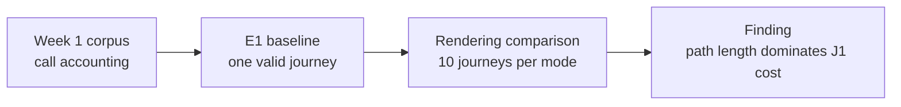

# Week 2 experiments and findings

This report separates reproducible measurements from conclusions. Runtime
JSONL and SQLite evidence stays under `.boukensha/benchmarks/` and is excluded
from Git.

## Week 1 corpus accounting

Question: can the working 448-call baseline be reproduced from the retained
sessions?

Method: tool-use identifiers were deduplicated in two views. Executed calls
were emitted by the agent. Context-confirmed calls appeared again in a later
model prompt.

| View | Calls | Moves | Boundary |
|---|---:|---:|---|
| Executed | 451 | 316 | emitted tool calls |
| Context-confirmed | 447 | 314 | calls visible in a later prompt |
| Legacy working figure | 448 | 314 | previous comparison value |

Finding: the retained corpus supports 451 executed calls and 447
context-confirmed calls. Four terminal calls never reached a later prompt. The
448 figure cannot be reproduced because the corpus has no twentieth `look`.
It remains labelled as legacy instead of being manufactured.

Caveat: these counts describe the retained Week 1 sessions, not every possible
agent run.

## E1 gateway baseline

Question: can the unchanged agent complete a real game journey through the
instrumented gateway with traceable cost and game evidence?

Method: J1 asked the agent to find the bakery and read its menu. The run used
the session-static `direct-full` profile. Success required a bakery observation,
a menu row, and a bakery good in the gateway journal.

| Result | Stop | Cost | Model calls | Tool calls | Fresh | Cache read | Cache write | Output |
|---|---|---:|---:|---:|---:|---:|---:|---:|
| PASS | journey-complete | $0.02587725 | 8 | 7 | 14,554 | 13,645 | 5,031 | 734 |

Tool distribution: four `move`, one `look`, one `examine`, and one `shop`.
There were no invalid or corrective calls.

Finding: the gateway preserved enough game behavior for the Week 1 agent to
complete J1 while producing priced model evidence and wire-linked game
evidence.

Caveat: one run proves integration, not a performance distribution.

## Model-facing result rendering

Question: does removing gateway metadata from model-facing tool results reduce
the total cost of a correct journey?

Method:

- The gateway journal retained the full typed envelope in every mode.
- The model received `raw`, `minimal`, or `full` results for an entire run.
- `raw` contained game text.
- `minimal` contained game text and completion state.
- `full` contained the complete typed envelope.
- Each mode ran 10 reset-verified J1 samples with the same model and
  `direct-full` tool surface.
- Each mode had an independent `$1` cumulative cap.

### Deterministic payload size

The same observations were rendered through every mode. This removes journey
path variance.

| Observation set | Raw | Minimal | Full |
|---|---:|---:|---:|
| First observation, bytes | 730 | 771 | 925 |
| First observation, estimated tokens | 183 | 193 | 232 |
| Same 29 observations, bytes | 9,105 | 10,093 | 14,550 |
| Same 29 observations, estimated tokens | 2,277 | 2,524 | 3,638 |

Finding: the full envelope carries 59.8% more result bytes than raw text over
the same 29 observations. This is the direct, path-independent cost of the
metadata.

### Journey outcomes

| Mode | Success | Cost total | Cost mean | Cost median | Cost stdev | Calls mean | Calls stdev |
|---|---:|---:|---:|---:|---:|---:|---:|
| Raw | 10/10 | $0.30926250 | $0.03092625 | $0.02973203 | $0.00617984 | 13.0 | 5.5 |
| Minimal | 10/10 | $0.39758620 | $0.03975862 | $0.03780880 | $0.01085440 | 19.9 | 8.6 |
| Full | 10/10 | $0.31527075 | $0.03152708 | $0.02804907 | $0.00945472 | 13.8 | 6.7 |

Every mode had zero setup failures, invalid calls, and corrective calls.

Mean token counts:

| Mode | Fresh | Cache read | Cache write | Output |
|---|---:|---:|---:|---:|
| Raw | 14,594.1 | 40,804.0 | 5,621.4 | 1,045.0 |
| Minimal | 14,321.2 | 90,419.2 | 7,132.8 | 1,495.9 |
| Full | 11,640.0 | 57,932.0 | 6,701.1 | 1,143.5 |

Aggregate tool distribution:

| Mode | Look | Check | Move | Examine | Shop |
|---|---:|---:|---:|---:|---:|
| Raw | 10 | 10 | 90 | 10 | 10 |
| Minimal | 10 | 11 | 157 | 11 | 10 |
| Full | 10 | 11 | 96 | 11 | 10 |

Findings:

- Completion did not differ on J1. Every mode succeeded 10 times.
- Raw and full had nearly equal mean journey cost. Their cost distributions
  overlap, so this experiment does not establish a winner between them.
- Per-result envelope overhead did not propagate directly to journey cost.
  Path length dominated the net result.
- Minimal used 53.1% more calls and cost 28.6% more per run than raw in this
  sample. Its 157 moves explain most of the gap.
- Minimal's extra path length is worth testing on a harder journey before
  treating it as a general effect.

### Corrected dead end

The first one-sample comparison suggested that full metadata helped because
full succeeded while raw and minimal failed. The 10-run result corrected that
impression as sampling noise.

One earlier raw attempt was also invalid. It began in the bakery because the
same character was connected through the TUI and reset verification did not
prove the persisted room. That attempt cost `$0.016085` and is excluded from
the comparison. Reset now rejects concurrent sessions, saves the character,
reconnects, and verifies the fresh-login room before model spend.

Caveats:

- J1 is a short navigation task. A harder journey may expose a different
  structure-versus-cost tradeoff.
- Ten runs reveal the failure of the one-sample conclusion, but small
  raw-versus-full differences remain below this experiment's resolution.
- Minimal's longer paths are suggestive. They need confirmation on J2 or
  another task before becoming a default-policy claim.

## J2 long navigation probe

Question: what does a long, unsuccessful run reveal that the short J1
benchmark hides?

Method: J2 asked the agent to travel north from the Temple into the newbie
zone and find the Massive Minotaur. Only a gateway observation naming the
Massive Minotaur counted as success. One full-envelope run used the
`direct-full` surface and a `$2` cap.

| Result | Stop | Iterations | Cost | Tool calls | Invalid | Corrective | Final position |
|---|---|---:|---:|---:|---:|---:|---|
| FAIL | completed | 90 | $0.21086010 | 90 | 1 | 1 | The Entrance To The Newbie Zone, ambiguous |

Tool distribution: 80 `move`, six `look`, two `examine`, one `check`, and one
`track`. The agent visited 17 distinct positions.

Most repeated positions:

| Position | Observations |
|---|---:|
| A White Square | 15 |
| A Black Square | 13 |
| A Nexus | 8 |
| The Great Field Of Midgaard | 7 |
| The Dirty Hallway | 5 |
| More Of The Hallway | 5 |
| The End Of The Passage | 5 |

Cumulative cost checkpoints:

| Model call | 9 | 18 | 27 | 36 | 45 | 54 | 63 | 72 | 81 | 90 |
|---|---:|---:|---:|---:|---:|---:|---:|---:|---:|---:|
| Cost | $0.0244 | $0.0369 | $0.0514 | $0.0673 | $0.0851 | $0.1043 | $0.1266 | $0.1510 | $0.1799 | $0.2109 |

Finding: the hard journey used about 6.5 times as many calls and 6.7 times the
cost of the full-envelope J1 mean, then failed.

The agent did not hit an iteration or cost limit. It self-terminated with
`completed` while the evidence predicate remained false. Its belief that the
turn was done diverged from game-grounded success.

The position tracker ended with `ambiguous` confidence and
`duplicate-title-not-separated` as its method. It preserved uncertainty at the
duplicate Newbie Zone entrance instead of collapsing two rooms into one.

Repeated junctions suggest missing route state as one explanation, but this
single run does not establish the cause.

The cost curve steepened as the prompt grew. Calls 1 through 9 cost `$0.0244`
in total. Calls 82 through 90 added `$0.0310`. Long-run path inefficiency
therefore increases both the number of calls and the cost of later calls.

Measurement correction: individual response cost fields omitted cache-read
charges and summed to `$0.0499`, while the authoritative turn total was
`$0.21086010`. The benchmark now reprices each response from its usage classes
and the model catalog. The rebuilt curve ends exactly at the turn total.

Caveats:

- This is one deliberately difficult probe, not a success-rate estimate.
- The model stopped voluntarily after 90 calls. It did not reach the configured
  iteration or cost ceiling.
- A replicate batch or feature comparison needs a separate cap. Ten comparable
  runs would cost about `$2.10`.
- A route memory or navigator comparison is required to test the loop
  hypothesis.

## Grounded investigation translation

Question: can open-ended investigation language reach typed read-only
operations without giving a model evidence or database access?

Method:

- Six questions covered stop diagnosis, position candidates, rendering
  comparison, and one unsupported request.
- The deterministic planner handled its supported phrases at zero model cost.
- The optional translator received only the question and four allowed
  operation names.
- Evidence execution and the final answer remained deterministic.

| Result | Questions | Correct | Final corpus cost | Total with preflight |
|---|---:|---:|---:|---:|
| PASS | 6 | 6 | $0.001375 | $0.004683 |

Finding: a small model can make the typed query surface more forgiving without
becoming a second source of truth. The model chose an operation. It did not see
or summarize the evidence.

Caveat: six questions prove the boundary and integration, not broad language
coverage. The corpus should grow from real investigator questions.

## Spend

| Evidence | Cost |
|---|---:|
| Valid E1 baseline | $0.02587725 |
| Invalid pre-fix raw attempt | $0.01608500 |
| Valid one-sample rendering probes | $0.12501980 |
| N=10 rendering batches | $1.02211945 |
| J2 long navigation probe | $0.21086010 |
| Copilot translation evaluation | $0.00468300 |
| Cumulative measured spend | $1.40464460 |

The cumulative spend remains below the standing `$10` cap.
