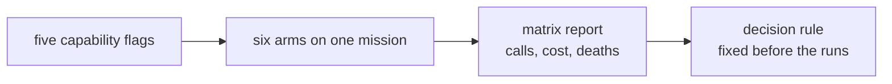

# Week 3 capability matrix

This report separates measurements from conclusions. Runtime JSONL and SQLite
evidence stays under `.boukensha/benchmarks/` and is excluded from Git.

## Question

Which of the five capabilities improve the mission enough to be turned on by
default, measured rather than argued?

## Method

Six arms, each three attempts, all on J1: find the bakery and read the menu,
judged from gateway evidence and never from the agent's own claim.

- Every attempt plays a character the game has never seen, made at login, so
  no switch, threshold, item or skill carries over from the attempt before.
  The reset then sets the baseline fields on that new character.
- Bounds per attempt: $0.30 and 120 iterations. Cost binds first, so the
  question is what each arm achieves for the same money.
- Arms differ by capability flags and nothing else. The flags reach the
  attempt through its own settings overlay, and the enabled set is recorded
  in every ledger row, so which arm a row belongs to is evidence rather than
  a directory name.
- The decision rule was fixed before the runs: a capability enters the
  baseline only if it improves the primary metric, does not increase deaths
  or cost per success, and keeps its improvement in the stacked arm.

## Results

| Arm | Capabilities | Attempts | Successes | Mean calls | Mean cost | Censored |
|---|---|---:|---:|---:|---:|---:|
| A1 | survival | 3 | 3 | 15.3 | $0.032 | 0 |
| A0 | none | 3 | 3 | 16.7 | $0.035 | 0 |
| A3 | navigation | 3 | 3 | 18.0 | $0.036 | 0 |
| A4 | survival, knowledge | 3 | 3 | 23.7 | $0.049 | 0 |
| A2 | knowledge | 3 | 2 | 38.5 | $0.165 | 1 |
| A5 | survival, knowledge, navigation | 3 | 3 | 51.3 | $0.115 | 0 |

Zero deaths in every arm. Mean calls covers attempts that reached the mission.

Per-attempt calls, which the means hide:

| Arm | Calls | Starting hit points |
|---|---|---|
| A0 | 8, 14, 28 | 26, 21, 23 |
| A1 | 18, 8, 20 | 24, 21, 20 |
| A2 | 49, 28, 103 | 23, 25, 24 |
| A3 | 12, 30, 12 | 22, 21, 21 |
| A4 | 24, 39, 8 | 24, 22, 21 |
| A5 | 31, 55, 68 | 20, 25, 22 |

Total spend for the matrix was about $1.30 against a $5.40 ceiling.

## Findings

Finding: no capability earns a default from this mission, and two of the three
were never exercised by it.

- Knowledge alone costs 2.3 times the control's calls and 4.7 times its cost,
  and is the only arm that failed an attempt, running to the cost ceiling at
  103 calls. Knowledge is not confined to that arm: A2, A4 and A5 all carry
  it, and A4 finished every attempt, one of them in eight calls. So the block
  does not by itself make a run expensive.
- Navigation was not tested by its own arm. A3 called `sweep` zero times and
  `travel_to` zero times across all three attempts. It measured whether the
  model would take up the extra tools, and it did not. Only A5 exercised the
  executor at all, with seven sweeps and one travel.
- Survival was not exercised either. No combat, no death, no exhaustion and
  no darkness decision arose. The 15.3 against 16.7 calls is route variance,
  not a demonstrated benefit.

Finding: the mission is too easy to separate the arms. The control solves it
in 16.7 calls, where the recorded J3 baseline burned 86.3 calls per attempt
wandering. Knowledge and navigation were built for that harder problem, and on
a short errand inside the city the extra state text is overhead with nothing
to pay for it.

## Why the knowledge arms lost

The aggregate says knowledge costs more. The transcripts say what it spent
the money on.

| Arm | Calls | Moves | Rooms found | Rooms per call | Revisits |
|---|---:|---:|---:|---:|---:|
| A0 control | 50 | 38 | 23 | 0.46 | 29 |
| A1 survival | 46 | 34 | 22 | 0.48 | 27 |
| A3 navigation | 54 | 42 | 24 | 0.44 | 33 |
| A4 survival, knowledge | 71 | 58 | 38 | 0.54 | 32 |
| A2 knowledge | 180 | 167 | 66 | 0.37 | 107 |
| A5 all three | 154 | 123 | 116 | 0.75 | 124 |

The knowledge arm spent 167 of its 180 calls moving, 93% of everything it
did, against the control's 38 of 50. It also has the worst discovery rate and
by far the most revisits.

The state block's map line grows for the whole run. Sampled across the
103-call attempt it reads 1 room and 1 unwalked way, then 10 and 8, 23 and
17, 40 and 32, and finishes at 55 rooms with 34 unwalked ways. Every room
entered opened more doors than it closed, so the one line reporting progress
never approached zero and always asked for more walking.

The agent answered it. Its own words, once per turn: "Thank you for the state
update. I'm on Elm Street with 56 movement points and 28 unexplored exits
across 34 rooms." Then the next room, then 29 across 35, then 33 across 54.
The mission became covering the map.

The control solved the mission in eight calls by reading the game's prose:
"Good, I can see there's a market square to the south. The bakery might be
there", and two rooms later, "The description says the bakery is to the north.
Let me go there."

That prose was never taken away from the knowledge arm. It is still 36% of
its history, and A4 shows an agent carrying the block finishing in eight calls
like the control. What the block adds is a second, competing instruction, and
in the failed attempt the competition was won by the coverage line: the run's
plans used the word "unexplored" 77 times and "systematic" 34 times.

The forensic reading of that attempt separates two things that the aggregate
merges. It reached Market Square on the fourth iteration. The bakery lay
west and it went east, which is ordinary model variance and nothing to do
with the block. What followed is the block's contribution: instead of coming
back to the city route, it expanded the map for another ninety calls, and it
issued no `examine` and no `shop` at all, so it never even reached for the
evidence the mission is judged on.

Finding: the state block does not cause the first wrong turn, and it does not
remove the game's own signposting. It turns one wrong turn into prolonged
wandering, because the only line reporting progress rewards coverage and never
approaches completion. Navigation does not correct the framing, it makes the
wrong objective efficient: A5 has the best discovery rate in the matrix at
0.75 rooms per call and found 116 rooms, five times the control, while taking
three times as many calls to run the same errand. Its sweeps commonly walked
24 steps and stopped on a setback limit, and one `travel_to` for a square it
had already visited returned unreachable with zero steps.

## What the request is made of, call after call

Every call resends the whole conversation, so what accumulates in it is what
the run pays for repeatedly. Measured on the largest attempt of each arm.

| Arm | Calls | History chars | Game output | Result envelope | Agent prose |
|---|---:|---:|---:|---:|---:|
| A1 survival | 20 | 12,486 | 62% | 30% | 8% |
| A0 control | 28 | 17,071 | 56% | 31% | 13% |
| A3 navigation | 30 | 18,157 | 60% | 31% | 8% |
| A4 survival, knowledge | 39 | 25,826 | 54% | 29% | 17% |
| A5 all three | 68 | 45,850 | 47% | 29% | 24% |
| A2 knowledge | 103 | 78,872 | 36% | 27% | 37% |

Almost none of it is duplication in the literal sense. Across the knowledge
arm's 217 final blocks, exactly one was a verbatim repeat.

- The envelope around every result is 27% to 31% in every arm. It is not a
  knowledge problem, it is the shape of a result: the full typed record, with
  tool, capability, family, command, sequence and trace identifier wrapped
  around the game's text. The agent already supports sending only the text,
  and the matrix did not use it.
- The agent's own prose rises with knowledge, from 8% in the arms without it
  to 37% in the arm carrying the most, and much of that is a per-turn
  acknowledgement of the state block rather than reasoning.
- The state block itself never accumulates. It is rewritten for each call and
  dropped afterwards, so its length is paid once and never again.
- Places are described again on every return, and the failed attempt returned
  often. Counting how often needs room numbers rather than titles, so the
  size of that repetition is not quoted here.

Finding: the knowledge arm's bill is not the block's own length. It is that
the arm walked four times as much, and every step added a room description
and its envelope to a history resent by every later call. Wandering compounds.

Caching softens that without removing it. The failed attempt read 1.82 million
cached tokens for about $0.182, more than half its $0.344.

## Caveats

- Three attempts per arm screens large differences and cannot establish a
  success rate. The knowledge result is large enough to believe. The survival
  result is not, and is reported as an observation.
- Starting hit points are rolled per character and ranged 20 to 26 across the
  matrix. A difference between arms smaller than that spread is not an effect.
- Schema size, tool lists and occupancy are excluded from every comparison.
  The surface proof is generated once per batch from the base profile, and
  enabling a capability changes the advertised tools, so those numbers
  describe a surface no arm ran.
- The result is about J1. It says nothing yet about the hunt.
- Two arms measured adoption rather than machinery. A3's result is that the
  model did not reach for the navigation tools, not that the tools are weak.
- Route variance dominates this mission. Both the control and A4 produced an
  eight-call run and a run three times longer, from the same configuration.

## What follows

- Do not turn on the current state block by default on this evidence.
- Do not conclude navigation is ineffective. Its own arm never invoked it, and
  the question of whether a model will adopt a tool is separate from whether
  the tool works.
- Do not conclude anything about survival. The mission never asked it a
  question.
- Do not rerun J1. It is short enough that which exit is chosen at Market
  Square decides the result, and that is variance rather than capability.
- A coverage mission is the one that would rank these capabilities. Scoring
  the bakery runs by Midgaard rooms reached within a hundred steps, which is
  not what they were trying to do, already separates them: A5 reached 16, 31
  and 32, where the control reached 5, 8 and 15.
- Send results as text rather than as the full typed record, and treat that
  as its own condition. It changes what the model sees, so a run under it is
  not comparable with this matrix.
- Two failure shapes are worth carrying forward as real: a frontier-heavy
  summary can turn one wrong turn into prolonged wandering, and an
  unconstrained sweep can optimise map coverage instead of the mission.

## A defect the matrix found

The arm with all three capabilities failed at setup with `character
'Bkxffqvxdqfb' already exists`, before any model call.

The agent's tool host replaces a gateway that starts slowly. The replacement
opened the character the first process had just made, and read it as somebody
else's, because a made character was remembered only in memory. Creation was
not idempotent across a restart inside one attempt, which would have struck
any arm intermittently rather than only this one.

The character a run makes is now recorded beside that attempt's own
configuration, so a replacement enters its own character and still refuses one
it did not make. The arm ran clean afterwards, and that run is the A5 row
above.
