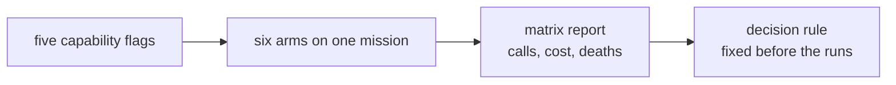

# Week 3 capability matrix

This report separates measurements from conclusions. Runtime JSONL and SQLite
evidence stays under `.boukensha/benchmarks/` and is excluded from Git.

## Question

Which of the five capabilities improve the mission enough to be turned on by
default, measured rather than argued?

## Method

Six arms, each three attempts, all on J1: find the bakery and read the menu,
judged from gateway evidence and never from the agent's own claim.

- Every attempt plays a character the game has never seen, made at login, so
  no switch, threshold, item or skill carries over from the attempt before.
  The reset then sets the baseline fields on that new character.
- Bounds per attempt: $0.30 and 120 iterations. Cost binds first, so the
  question is what each arm achieves for the same money.
- Arms differ by capability flags and nothing else. The flags reach the
  attempt through its own settings overlay, and the enabled set is recorded
  in every ledger row, so which arm a row belongs to is evidence rather than
  a directory name.
- The decision rule was fixed before the runs: a capability enters the
  baseline only if it improves the primary metric, does not increase deaths
  or cost per success, and keeps its improvement in the stacked arm.

## Results

| Arm | Capabilities | Attempts | Successes | Mean calls | Mean cost | Censored |
|---|---|---:|---:|---:|---:|---:|
| A1 | survival | 3 | 3 | 15.3 | $0.032 | 0 |
| A0 | none | 3 | 3 | 16.7 | $0.035 | 0 |
| A3 | navigation | 3 | 3 | 18.0 | $0.036 | 0 |
| A4 | survival, knowledge | 3 | 3 | 23.7 | $0.049 | 0 |
| A2 | knowledge | 3 | 2 | 38.5 | $0.165 | 1 |
| A5 | survival, knowledge, navigation | 3 | 3 | 51.3 | $0.115 | 0 |

Zero deaths in every arm. Mean calls covers attempts that reached the mission.

Per-attempt calls, which the means hide:

| Arm | Calls | Starting hit points |
|---|---|---|
| A0 | 8, 14, 28 | 26, 21, 23 |
| A1 | 18, 8, 20 | 24, 21, 20 |
| A2 | 49, 28, 103 | 23, 25, 24 |
| A3 | 12, 30, 12 | 22, 21, 21 |
| A4 | 24, 39, 8 | 24, 22, 21 |
| A5 | 31, 55, 68 | 20, 25, 22 |

Total spend for the matrix was about $1.30 against a $5.40 ceiling.

## Findings

Finding: no capability meets the decision rule on this mission, and knowledge
fails it clearly.

- Knowledge costs 2.3 times the control's calls and 4.7 times its cost. It is
  the only arm that failed to finish an attempt, running to the cost ceiling
  at 103 calls. The two arms carrying knowledge are the two worst arms.
- Survival is nominally the best arm at 15.3 calls against 16.7, but the
  per-attempt spread overlaps the control entirely. At three attempts this is
  not a difference.
- Navigation is indistinguishable from the control.
- Zero deaths anywhere means survival never exercised what it exists for, so
  the mission cannot rank it on the thing it was built to prevent.

Finding: the mission is too easy to separate the arms. The control solves it
in 16.7 calls, where the recorded J3 baseline burned 86.3 calls per attempt
wandering. Knowledge and navigation were built for that harder problem, and on
a short errand inside the city the extra state text is overhead with nothing
to pay for it.

## Why the knowledge arms lost

The aggregate says knowledge costs more. The transcripts say what it spent
the money on.

| Arm | Calls | Moves | Rooms found | Rooms per call | Revisits |
|---|---:|---:|---:|---:|---:|
| A0 control | 50 | 38 | 23 | 0.46 | 29 |
| A1 survival | 46 | 34 | 22 | 0.48 | 27 |
| A3 navigation | 54 | 42 | 24 | 0.44 | 33 |
| A4 survival, knowledge | 71 | 58 | 38 | 0.54 | 32 |
| A2 knowledge | 180 | 167 | 66 | 0.37 | 107 |
| A5 all three | 154 | 123 | 116 | 0.75 | 124 |

The knowledge arm spent 167 of its 180 calls moving, 93% of everything it
did, against the control's 38 of 50. It also has the worst discovery rate and
by far the most revisits.

The state block's map line grows for the whole run. Sampled across the
103-call attempt it reads 1 room and 1 unwalked way, then 10 and 8, 23 and
17, 40 and 32, and finishes at 55 rooms with 34 unwalked ways. Every room
entered opened more doors than it closed, so the one line reporting progress
never approached zero and always asked for more walking.

The agent answered it. Its own words, once per turn: "Thank you for the state
update. I'm on Elm Street with 56 movement points and 28 unexplored exits
across 34 rooms." Then the next room, then 29 across 35, then 33 across 54.
The mission became covering the map.

The control never had that line, and solved the mission in eight calls by
reading the game's prose: "Good, I can see there's a market square to the
south. The bakery might be there", and two rooms later, "The description says
the bakery is to the north. Let me go there." The game signposts its own
world, and the summary we substituted lists exits as walked or unwalked
without carrying what the room actually said.

Finding: the state block displaced the game's own signposting with a coverage
metric, and the agent optimized the metric it was given. Adding navigation on
top does not fix the framing, it makes the wrong thing efficient: A5 has the
best discovery rate in the matrix at 0.75 rooms per call and found 116 rooms,
five times the control, while taking three times as many calls to do the same
errand.

## Caveats

- Three attempts per arm screens large differences and cannot establish a
  success rate. The knowledge result is large enough to believe. The survival
  result is not, and is reported as an observation.
- Starting hit points are rolled per character and ranged 20 to 26 across the
  matrix. A difference between arms smaller than that spread is not an effect.
- Schema size, tool lists and occupancy are excluded from every comparison.
  The surface proof is generated once per batch from the base profile, and
  enabling a capability changes the advertised tools, so those numbers
  describe a surface no arm ran.
- The result is about J1. It says nothing yet about the hunt.

## A defect the matrix found

The arm with all three capabilities failed at setup with `character
'Bkxffqvxdqfb' already exists`, before any model call.

The agent's tool host replaces a gateway that starts slowly. The replacement
opened the character the first process had just made, and read it as somebody
else's, because a made character was remembered only in memory. Creation was
not idempotent across a restart inside one attempt, which would have struck
any arm intermittently rather than only this one.

The character a run makes is now recorded beside that attempt's own
configuration, so a replacement enters its own character and still refuses one
it did not make. The arm ran clean afterwards, and that run is the A5 row
above.
