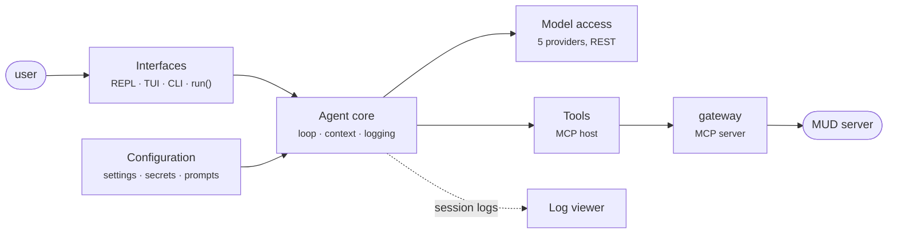

# boukensha · the MUD journey agent

boukensha is a Python agent that plays a MUD game server under
natural-language instruction. This package is the week 1 baseline carried
forward: the complete agent loop with multi-provider model access, MCP-hosted
tools, context management, cost accounting and session logging.



## Running

```bash
../bin/agent                              # configured default player
../bin/agent --player-profile tester      # one configured player
uv run boukensha --player-profile tester  # the same, from this folder
```

The command is a supervisor. It creates the player and session identity,
acquires the character lock, writes the manifest, starts the agent and its
gateway, then records the final lifecycle state. The REPL and TUI show the
selected player and session.

Automation can run one task through the same supervisor and request a verified
baseline before any model call:

```bash
printf '%s\n' 'Find the bakery and read the menu.' | \
  uv run boukensha --task-stdin --reset-baseline level1-temple@1 \
  --player-profile tester
```

The task and passwords never enter command arguments. Reset targets the
gateway session created by this launch. It pauses that authenticated connection
instead of opening another mortal login.

An external session host can seed turn one and retain the same plain REPL for
later instructions:

```bash
uv run boukensha --initial-task-stdin --no-tui \
  --player-profile tester
```

`--task-stdin` remains the one-turn automation mode. The persistent mode reads
only its first input line as the initial task and leaves stdin open for later
turns.

Inspect registered sessions or import an old flat recording:

```bash
uv run boukensha-sessions list
uv run boukensha-sessions list --player-profile tester
uv run boukensha-sessions import-legacy old.jsonl \
  --player-profile tester --character tester
```

Legacy import copies the recording. It does not move or rewrite the original.

## Configuration

Everything is in `.boukensha/settings.yaml` at the repository root, which is
self-documenting: active values are set, every optional key is shown commented
with its default. Secrets live in `.boukensha/.env`. `BOUKENSHA_DIR` points
the agent at a different configuration directory.

First run, in order:

1. Create `.boukensha/.env` next to `settings.yaml` with provider secrets and
   any shared player-profile secrets:

   | Variable | For |
   |---|---|
   | `ANTHROPIC_API_KEY` | the anthropic provider |
   | `GEMINI_API_KEY` | the gemini provider |
   | `OPENAI_API_KEY` | the openai provider |
   | `OLLAMA_API_KEY` | the ollama_cloud provider (local ollama needs none) |
   | `MUD_PASSWORD` | the `poucet` player-profile password source |
   | `MUD_PASSWORD_ELENOR` | the `elenor` player-profile password source |

   A player secret may instead live in
   `.boukensha/profiles/<profile>/.env`. The public character and its
   `password_env` name are configured under `gateway.players`.

2. Pick the model in `settings.yaml` under `tasks.player`: set `provider` and
   `model`. The alternatives are present as commented lines, switching is
   uncommenting one pair.

3. Install the gateway command from the repository root:

   ```bash
   uv tool install --editable ./week2_capable/gateway
   ```

   The isolated tool exposes `boukensha-gateway` on `PATH`. The default MCP
   entry starts it without repeated arguments. The `gateway:` block owns its
   connection, evidence, surface, API, and administrator settings.

4. Have the MUD server running.

5. Run `week2_capable/bin/agent`, then type a goal at the prompt.

The REPL and TUI use the same assembly path and therefore the same gateway
profile and tool set.

The launcher gives the agent only the selected player secret and the selected
provider secret. The gateway child receives only the selected player secret.
Administrator and other-player secrets are not inherited by either process.

Each launcher-owned agent also exposes a local authenticated operator endpoint.
The Observatory can guide, revise, pause, resume, or stop only the selected
live session. Accepted actions wait for the next agent iteration boundary, so
an in-flight provider request is never presented as interrupted. Guidance and
goal revisions enter context as labelled operator messages. The control token
stays inside the session directory and never reaches the browser.

The Observatory submits every Goal and Nudge through this endpoint and queues
a retained REPL wake envelope. A directive that reaches an active checkpoint
is applied there. If the turn ends first, the wake starts the next turn and
that turn's first checkpoint applies it. The turn record states that
directive's instruction, so a turn a wake started names what it was started
to do. The envelope never enters model context. Goal replaces objective context only after application. Nudge remains
guidance and does not become objective metadata.

The gateway's typed result envelopes stay intact in model context and session
logs. The TUI unwraps their human text into rooms, messages and readable errors.

The full `tasks.<name>` reference (the agent plays the `player` task):

| Key | Default | Meaning |
|---|---|---|
| `provider` | (required) | `anthropic`, `gemini`, `openai`, `ollama`, or `ollama_cloud` |
| `model` | (required) | a model in the catalog (`boukensha/models.yaml` or a `.boukensha` override) |
| `prompt_override.system` | `false` | use `prompts/<task>/system.md` when present |
| `thinking` | unset | reasoning effort: `none`, `minimal`, `low`, `medium`, `high`, `xhigh`, `max` |
| `max_iterations` | `25` | tool-call rounds per turn (`0` disables) |
| `max_output_tokens` | `1024` | per-call output-token cap |
| `max_turn_tokens` | `60000` | per-turn work ceiling across every token class (`0` disables) |
| `max_turn_cost` | disabled | per-turn money ceiling in dollars |
| `compaction_threshold` | `0.85` | window fraction that triggers auto-compaction |

`agent:` holds agent-wide defaults for the five limits. Resolution is the
per-task value first, then `agent:`, then the code default.

The `mcp_servers.<name>` reference (every tool the agent has comes from an
entry here, so the game connection is configuration, not code):

| Key | Default | Meaning |
|---|---|---|
| `command` | (required) | an executable on PATH |
| `args` | `[]` | arguments passed to it |
| `env` | `{}` | exceptional per-process environment, secrets do not go here |
| `prefix` | none | agent-side tool-name prefix (`tbamud__look`) |
| `required` | `true` | `true` stops boot on a failed spawn, `false` warns and continues |
| `timeout` | `30` | per-call ceiling in seconds |
| `allow` / `deny` | none / `[]` | restrict or drop tool names |
| `result_mode` | `full` | model-facing results: `raw`, `minimal`, or `full` |

The context window is not a setting: it is a model fact read from the catalog.
The gateway configuration reference is in
`week2_capable/gateway/README.md`. The Observatory configuration reference is
in `week2_capable/observatory/README.md`.

The top-level `capabilities:` block holds the week 3 capability master
flags, all off by default. With the `knowledge` capability on, the agent
appends the required STATE line contract to the system prompt, injects the
gateway's rendered state block as a volatile final message on every model
call, and forwards each response's parsed fields to the gateway as
belief-layer facts. `state_fields.py` owns the contract and its parsing.

With the `campaign` capability on and a `target` named in its settings,
`campaign.py` chooses the mission phase deterministically from typed
readiness (survive, locate, prepare, engage) and rides the choice on the
same volatile message: the model decides within the phase, never which
phase.

## Tests

```bash
uv run pytest -q
```

pytest is a development-only dependency for Week 2 tests and collects the
carried unittest suite as well.

## Organization

```
agent/
├── boukensha/       the package: loop, context, backends, MCP host, logging
├── tests/           unit tests
├── pyproject.toml   project + pinned dependencies (uv.lock)
└── README.md        this file
```

Runtime evidence is isolated by player and session:

```text
.boukensha/
├── registry.db
└── profiles/<player_id>/
    ├── .env
    ├── knowledge.db
    └── sessions/<session_id>/
        ├── session.json
        ├── control.token
        ├── control-state.json
        ├── operator-state.json
        ├── agent.jsonl
        ├── gateway.db
        ├── admin.db
        └── reset-progress.jsonl
```

The registry and immutable manifest provide identity. File modification time is
never used to decide which session is active. Imported legacy recordings use
the same hierarchy and retain explicit capture gaps. Session discovery reports
launcher process state and gateway control state as separate, labelled facts.
Gateway quarantine and capture gaps remain dominant. Agent pause or stop is
shown when the gateway remains healthy. The registry remains authoritative for
process lifecycle.

Session discovery also reports the selected player's latest knowledge CDC
cursor and snapshot generation. It opens `knowledge.db` read-only. A missing or
unreadable store is reported as unavailable or a capture gap, never created by
discovery. The gateway remains the sole writer and makes no hidden polling
commands to refresh state.

Registry, lock, session, token, and control-socket locations are fixed runtime
conventions documented in the gateway README. They are not hidden environment
settings. Legacy import always names its source path explicitly. Launcher
shutdown allows a child process group 10 seconds to stop, then kills it so a
stale child cannot retain the character lock.

Gateway control and agent operator sockets use separate deterministic paths in
the operating system temporary directory. The manifest records both paths.
Only the launcher-owned process can create the operator endpoint. Its
non-secret state projection is written to `operator-state.json`.
