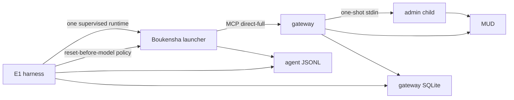

# Gateway journey benchmark

The benchmark measures correct game journeys and total model cost through the
same installed gateway used by the agent REPL and TUI.



## Setup

Install the gateway and benchmark as isolated user tools from the repository
root:

```console
uv tool install --editable ./week2_capable/gateway --force
uv tool install --editable ./week2_capable/benchmark --force
```

The repository configuration names player profiles. Each profile maps a public
character to the environment variable holding its password. The benchmark
overlay copies public settings only. Each attempt uses the normal launcher,
runtime registry, per-player session layout, and selected gateway control
endpoint.

## Run

The default command is free. It proves the installed 25-tool `direct-full`
surface and audits the tracked Week 1 corpus:

```console
boukensha-e1
```

A live attempt requires both an explicit spend flag and a cumulative cap:

```console
uv run --no-project --env-file .boukensha/.env boukensha-e1 --spend --cap 10
```

`--player-profile <id>` selects a configured player without editing
`settings.yaml`. Without it, the benchmark uses
`gateway.connection.player_profile`.

For interactive or piped automation, `--password-stdin` overrides the selected
profile's configured password source without exposing a secret in process
arguments:

```console
printf '%s' "$PLAYER_PASSWORD" | boukensha-e1 \
  --player-profile tester --password-stdin --spend --cap 3
```

For a one-off character that is not in `settings.yaml`, combine `--player`
with `--password-stdin`:

```console
printf '%s' "$PLAYER_PASSWORD" | boukensha-e1 \
  --player NewTester --password-stdin --spend --cap 3
```

The one-off identity exists only in the attempt's secret-free settings
overlay. A visible `--password` option is deliberately unavailable because
command arguments can leak through shell history and process inspection.

`--result-mode raw|minimal|full` selects the model-facing result shape for an
isolated run. The gateway journal always retains the complete typed envelope.
Use a fresh `--output-dir` for every measured mode.

`--journey J1|J2` selects the evidence-judged objective. J2 asks the agent to
find the Massive Minotaur in the newbie zone.

`--fresh-character` makes a new character for every attempt.

- The game keeps its switches, auto-flee threshold, inventory, equipment and
  skills on the character between sessions, and the reset restores none of
  them. Without a new character each time, one arm's settings reach the next.
- The name is derived from the ledger and the attempt, so it is unique per
  attempt and the same attempt always names the same character. It is letters
  only, which is all the game accepts.
- The attempt overlay gains a player profile marked `creates`, reusing the
  selected player's existing password secret. No secret is written to the
  overlay or the ledger.
- A name the game already knows fails the login before any model call, which
  the setup-failure path treats as fatal and stops the sequence. Entering it
  would hand back the character the previous attempt left behind.
- The ledger records the character, whether it was made, and the maxima it was
  rolled, because the game rolls a made character's stats and a difference
  between arms has to be told apart from a difference between characters.
- Characters are not deleted as part of a run. Isolation comes from the unique
  name, which survives a crash, so cleanup can never invalidate a result.

`--runs N` sets the target priced journey sample count for that output ledger.
A partial ledger can resume toward the same target:

```console
uv run --no-project --env-file .boukensha/.env boukensha-e1 \
  --spend --cap 3 --result-mode raw --runs 10 \
  --output-dir .boukensha/benchmarks/e1-render-raw-n10
```

`--max-iterations N` and `--max-sample-cost USD` apply per-sample stop
boundaries through the secret-free settings overlay. The Observatory uses
these arguments after validating an experiment and receiving explicit spend
confirmation. They do not replace the cumulative `--cap` boundary.

The controlled runner also pins `--profile`, `--model`, and
`--compaction-threshold` into each isolated attempt. Unsupported registry
changes fail validation before the runner starts.

Runtime artifacts go under `.boukensha/benchmarks/e1/`. A reset failure blocks
the first model call, is counted separately from journey outcomes, and stops
the batch for correction. The reset acts on the gateway session created for
that exact attempt. It never opens a second mortal connection. A setup failure
does not consume the requested sample count. An
unpriced model attempt is recorded for diagnosis but stops the paid sequence
and never enters aggregates.

Schema bytes are measured from the generated MCP JSON. The token field is an
explicit four-bytes-per-token estimate, so it is useful for comparing stable
profiles without pretending to be a provider tokenizer bill.

Multi-run reports include success rate and the mean, median and sample standard
deviation for cost, calls, correction counts and token classes.
Each attempt also records its cumulative model cost after every model call.
