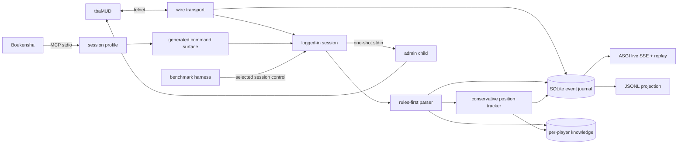
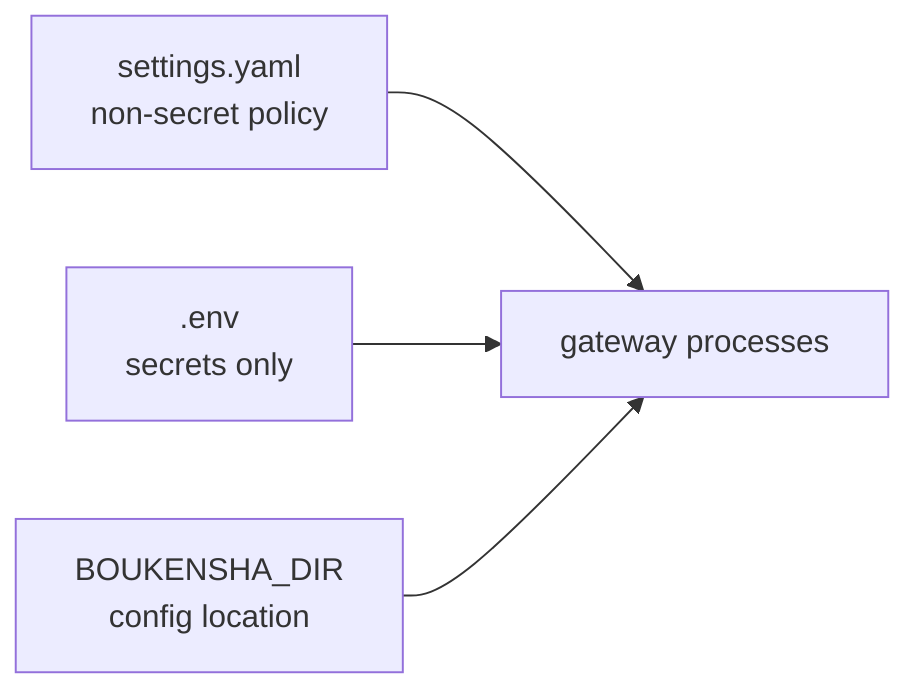
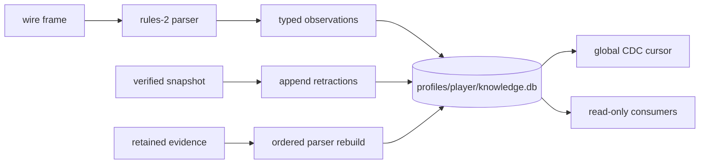

# MUD gateway

The gateway is the instrumented Python interface between Boukensha and the
game. It provides transport, login, wire capture, structured observations, and
a durable event journal.



## Layout

The project and its Python package use different names to keep their roles
clear.

```text
gateway/
├── admin_process/
│   ├── reset.py
│   └── server.py
├── mud_gateway/
│   ├── admin.py
│   ├── baseline.py
│   ├── reset_client.py
│   ├── reset_control.py
│   ├── wire.py
│   ├── session.py
│   ├── journal.py
│   ├── knowledge.py
│   ├── knowledge_models.py
│   ├── knowledge_projection.py
│   ├── knowledge_schema.py
│   ├── contracts.py
│   ├── commands.py
│   ├── observe.py
│   ├── observation_pipeline.py
│   ├── position.py
│   ├── stream.py
│   ├── api.py
│   ├── navigation/
│   │   ├── graph.py
│   │   ├── route.py
│   │   └── executor.py
│   ├── profiles.py
│   ├── raw.py
│   ├── results.py
│   └── mcp_server.py
├── scripts/
│   └── live_smoke.py
├── tests/
├── pyproject.toml
└── uv.lock
```

`mud_gateway` is the import namespace. The outer `gateway` directory is the
application project.

## Navigation capability

`navigation/` is the purposeful-movement capability, off by default behind
the `capabilities.navigation` settings flag.

- The learned map becomes a graph read from the knowledge store, and route
  planning is shortest-path search over it. Edge weights default to hop
  counts and accept an injected weight function.
- Two routine tools appear on the surface only while the flag is enabled:
  `sweep` explores from the nearest unexplored exit, `travel_to` walks a
  computed route to a remembered room title. Travel has its own
  `travel_enabled` setting inside the block.
- Routines execute through the ordinary session command path, so every
  step stays journaled wire evidence, and they stop with a typed reason:
  arrived, frontier exhausted, a bound, a blocked or unexpected room, low
  movement, or a health drop between steps.
- A routine also bounds itself in time, because the call carrying it is
  abandoned after a fixed number of seconds and a cut-off routine reports
  nothing. It stops with `time_limit` a margin before that, and the
  margin is `deadline_margin` inside the block, four seconds by default.
- The ceiling it works back from is the agent's own per-call timeout,
  read from the `mcp_servers` entry whose command is `boukensha-gateway`,
  so the two numbers cannot drift apart. Entries that disagree are
  refused rather than resolved by the order the file lists them.
- With no `timeout` stated, or a margin no smaller than the ceiling, the
  routines do not run and say why as `capability_unavailable` on the
  call. The decision is taken from settings before anything connects, so
  it never costs a login first and never reports a different reason.
- Every outcome other than a step taken or a route walked stops the
  sweep, including reasons added later. Naming what continues, rather
  than what stops, is what keeps a new reason from being read as "carry
  on" at one of the three places outcomes are handled.
- Routines never rest. A step that finds movement low stops with
  `needs_rest`, since a rest outlasts any call and recovery arrives on
  the game's tick. Resting is the model's to do between calls.
- A routine cut off despite the deadline still records its stop with the
  ground it covered, then lets the cancellation continue. No result can
  reach the model on that path, so the record is for the reader.
- With the flag off the advertised surface and its digest are unchanged.

## Knowledge capability

The first knowledge mechanism is the state block, off by default behind
the `capabilities.knowledge` settings flag.

- `state_block.py` renders one compact summary from the store and the
  session's retained observations: the current place, each exit marked
  known or unexplored, live vitals numbers, and map coverage.
- What is standing in the room comes from the game's last description of
  it, never from what was seen there before. A remembered creature may
  have been killed or wandered off, and in the dark the game reports
  nothing at all.
- Everything read from the store carries how long ago it was recorded.
  Readings under a minute old carry no age. Live health and movement are
  their own line and carry none, so the age on the character sheet never
  reads as if it dated them.
- Notes are carried only from the run that wrote them. An earlier run's
  note competes with the live state and with the objective the agent has
  now, and it stays available through `recall` instead.
- Hunger and thirst ride the character sheet as conditions and are not
  repeated as advice, which named no action the agent could take.
- The `recall_state` tool serves it while the flag is on, costing no game
  command. The agent also fetches it before every model call and injects
  it as a volatile final message that never persists in history.
- The agent's required per-response STATE fields arrive through the
  `note_state` tool and become belief-layer facts with model provenance
  (`state_notes.py`): perception, present threat, and durable notes,
  each low confidence and inspectable.

## Survival capability

`survival.py` is the reflex engine, off by default behind the
`capabilities.survival` settings flag. Reflexes act on typed numbers only.

- At session start the engine sets the game's own auto-flee threshold
  (`wimpy`) from the observed maximum hit points, and declines honestly
  when no maximum has been observed yet.
- `recover_movement` rests, polls recovery with a bounded wait, and
  stands back up. Routines do not call it: its full wait outlasts any one
  tool call, so recovery belongs between calls rather than inside one.
- Every reflex firing is journaled with its rule id, version, and the
  numbers that triggered it.

## Economy capability

`economy.py` is gold custody, off by default behind the
`capabilities.economy` settings flag.

- The model records recognized services (bank, shop, guild, fountain,
  food, grinding, healer) through `note_service`; the store keeps them as
  belief facts at the current place.
- `bank_surplus` deposits gold above the configurable carry ceiling at a
  recorded bank, travelling there over the learned map, and declines with
  a typed reason when gold is unknown, no surplus exists, no bank is
  recorded, or navigation is off.

## Campaign capability

`campaign.py` serves typed mission readiness, off by default behind the
`capabilities.campaign` settings flag: whether the named target has been
sighted and where, vitals against maxima, level, gold, and remaining
unexplored ground, assembled from facts the agent earned. The
`mission_readiness` tool exposes it, and the agent's campaign controller
reads it every call.

## Installation

Install the gateway as an isolated user-level command from the repository
root:

```bash
uv tool install --editable ./week2_capable/gateway
```

The editable install follows source changes without reinstalling:

```bash
boukensha-gateway --prove
boukensha-gateway-admin --help
boukensha-gateway-reset --help
boukensha-gateway-api --help
```

Run the install command again with `--force` after dependency or entry-point
changes. Do not install into the system Python and do not use `sudo`.

## Configuration

The gateway uses the repository's `.boukensha/settings.yaml`. Only secrets
belong in `.boukensha/.env`.



The `gateway:` block owns these durable settings:

| Settings key | Default | Purpose |
| --- | --- | --- |
| `connection.host` | `localhost` | MUD host |
| `connection.port` | `4000` | MUD port |
| `connection.player_profile` | `default` | Default configured mortal identity |
| `players.<id>.character` | profile id | MUD character for one player profile |
| `players.<id>.password_env` | `MUD_PASSWORD` | Secret name for that profile |
| `journal` | `.boukensha/gateway/gateway.db` | Fallback journal for a direct standalone launch |
| `surface.profile` | `direct-full` | Session-static projection preset |
| `surface.enable` | `[]` | Capabilities added to the preset |
| `surface.disable` | `[]` | Capabilities removed from the preset |
| `surface.allow_raw` | `false` | Explicitly permit reason-gated `send_raw` |
| `api.host` | `127.0.0.1` | Live API bind address |
| `api.port` | `8765` | Live API bind port |
| `admin.character` | `admin` | Immortal reset character |
| `admin.password_env` | `MUD_ADMIN_PASSWORD` | Secret name for the immortal identity |
| `reset.pause_timeout_seconds` | `15` | Wait for an in-flight mortal command |
| `reset.child_timeout_seconds` | `30` | Bound one privileged reset child |
| `reset.client_timeout_seconds` | `45` | Bound a control request |

The four surface presets are `direct-full`, `direct-core`, `hybrid-full`, and
`hybrid-core`. `disable` wins over `enable`. `send_raw` is controlled only by
`allow_raw`, so it cannot be enabled accidentally in a general list.

Valid typed capability names are:

```text
attack, cast_spell, channel_say, check, consider, consume_item, drop_item,
equip_item, examine, flee, get_item, look, move, mud_status, poll, practice,
put_item, save_character, say, set_position, shop, skill_strike, tell, track,
use_magic_item
```

Player identity is selected at runtime. A normal launch uses
`connection.player_profile`, while a one-off launch can override it:

```bash
boukensha-gateway --player-profile tester
```

An agent launch supplies an immutable runtime envelope. That envelope overrides
the default player profile and places the journal at
`.boukensha/profiles/<player>/sessions/<session>/gateway.db`. The gateway
validates the launcher-created gateway session id and gives reconnecting Telnet
connections separate transport ids.

Public identities stay in `settings.yaml`:

```yaml
gateway:
  connection:
    player_profile: poucet
  players:
    poucet:
      character: poucet
      password_env: MUD_PASSWORD
    tester:
      character: tester
      password_env: MUD_PASSWORD_TESTER
```

The matching secrets may live in the shared `.env` or in a profile-specific
`.boukensha/profiles/<id>/.env`. Process environment values take precedence.

| Secret | Used by |
| --- | --- |
| `MUD_PASSWORD` | Example `poucet` profile |
| `MUD_PASSWORD_TESTER` | Example `tester` profile |
| `MUD_ADMIN_PASSWORD` | One-shot administrator reset child |

Player and administrator identities use distinct secret names. The
administrator block never contains a player target. Reset targets are selected
per operation rather than stored as installation-level configuration. During a
launcher-managed reset, the gateway reads the named admin value from the shared
secret file only when it creates the one-shot child. The admin value never
enters the mortal agent or gateway process environment.

`BOUKENSHA_DIR` is the only configuration environment variable. It points to
the directory containing `settings.yaml` and `.env`. Without it, the gateway
finds the nearest `.boukensha` directory, then falls back to
`~/.boukensha`.

Runtime paths are fixed conventions because changing one side independently
would break identity and evidence joins:

| Convention | Location or rule |
| --- | --- |
| registry | `.boukensha/registry.db` |
| character locks | `.boukensha/locks/<character-digest>.lock` |
| session evidence | `.boukensha/profiles/<player>/sessions/<session>/` |
| player knowledge | `.boukensha/profiles/<player>/knowledge.db` |
| control token | `control.token` inside the protected session |
| control socket | short system-temporary path derived from the session id |
| gateway journal | `gateway.db` inside the selected session |
| reset baseline | versioned manifest in `mud_gateway.baseline` |
| legacy import source | explicit path passed to `boukensha-sessions import-legacy` |

These are not environment configuration knobs. The launcher creates and binds
them atomically. `BOUKENSHA_*` values used between supervised child processes
are internal runtime metadata, not settings users should export by hand.

CLI profile and allowlist flags remain available for one-off surface proofs.
Normal agent and API launches read YAML and need no repeated settings:

```bash
boukensha-gateway --prove
boukensha-gateway-api
```

## Behavior

- The transport preserves arbitrary socket chunk boundaries.
- Telnet negotiation bytes are filtered from game text and answered safely.
- Remote EOF marks the transport and logged-in session disconnected.
- EOF detected before a command triggers one fresh login. A command is never
  replayed after its send begins.
- Tool failures distinguish a lost established connection from a failed
  pre-command reconnect.
- Login follows name, password, MOTD, menu choice, then the vitals prompt.
- A name the game does not recognise is refused at once, naming the reason,
  instead of waiting for a password prompt that is never sent.
- A session opened with `creates` answers the game's questions for an unknown
  name instead: confirmation, the password twice, sex, and class. Sex and
  class are fixed in the gateway, because a character made with different
  answers is a different subject and an experiment comparing two of them
  would be comparing the characters. A made name is letters only, which the
  gateway checks before the game refuses it.
- A made character can be destroyed again, which is cleanup and not
  isolation. Isolation comes from every attempt making a name of its own,
  which survives a crash that skips the cleanup. Only a character this
  session made can be destroyed, so no configured player is reachable.
- Deletion is confirmed by asking the game whether it still knows the name.
  The game drops the connection as it deletes, so there is often nothing to
  read, and silence would otherwise read as success.
- The password is replaced with a length-preserving redacted event before
  anything is persisted, on the made passwords as well as the login one.
- SQLite runs in WAL mode with one journal writer.
- A runtime journal has one live writer lock. A second writer is refused, while
  a replacement gateway can reopen it after the prior process exits.
- A corrupt journal is preserved with a timestamped suffix and reported as a
  capture gap. It is never silently replaced.
- Live readers see only committed events.
- Unknown journal schema versions are refused.
- JSONL export provides a supported projection for file-based consumers.
- One typed registry generates command validation and every MCP projection.
- A deny-by-default profile fixes the advertised tools for the whole session.
- Direct and grouped surfaces are generated from the same capabilities.
- Disabled capabilities are rejected by the server as typed errors.
- Profile identity, capability digest, coverage, and schema bytes are recorded.
- Named profiles deny `send_raw`. An explicit allowlist can enable it, and
  every use records a capability-gap event with its reason.
- Reset pauses the selected authenticated mortal session at a command boundary.
- A one-shot admin child receives one typed stdin request and only the admin
  secret.
- A marked `score` probe captures player state after login. No background
  command or polling changes the game while an agent is idle.
- Mortal `save`, reconnect, marked `score`, and `look` verify the reset on that
  same session.
- Reset verifies a knowledge snapshot before game mutation. Learned facts are
  retracted and the starting room is observed only after mortal verification.
- Failure before mutation resumes with a receipt. Partial mutation quarantines
  the session until a linked retry succeeds or the session stops.
- Gateway control state is projected beside the session evidence. Discovery
  labels it separately from launcher-owned process state.
- Live SSE and historical replay use one deterministic event serializer.
- Live readers tail committed sequence cursors across process boundaries.
- `Last-Event-ID` resumes from the durable journal sequence.
- Slow readers catch up from SQLite without an in-memory event backlog.
- `/contracts` publishes canonical event, capability, query, and projection
  schemas.
- `/capabilities` identifies the exact contract and delivery guarantees.
- Canonical wire replay reconstructs exact captured bytes, including
  length-preserving zeroes for credentials redacted before persistence.
- ANSI colour and line shape produce typed room, exit, vital, and state
  observations.
- Unsolicited game output is parsed before the next command. Combat ticks and
  their prompt vitals therefore update the retained event stream without a
  `score` probe.
- Every observation records confidence, method, parser version, and its source
  wire range.
- Unknown lines remain `unparsed` events and contribute to the parse-miss rate.
- Position uses arrival paths, exits, and neighbourhoods. A duplicate title is
  never sufficient evidence to merge two places.
- The agent-facing `observe` and `navigate` capabilities remain disabled.
- Agent and gateway records preserve launcher-created player, agent, session,
  and gateway session identity without filename or time inference.

## Per-player knowledge

Each player has one append-only knowledge store. The gateway is its only writer
while the launcher holds that character lock. Agent discovery and future
observatory projections open it read-only.



The store keeps five layers separate:

| Layer | Meaning |
| --- | --- |
| `belief` | an agent claim, never promoted to game truth automatically |
| `parsed` | current player state and position derived from wire evidence |
| `learned` | cumulative rooms, sightings, and verified traversals |
| `observer_truth` | an independent observer result, never inferred from belief |
| `derived` | computed from other facts, dropped and rebuilt rather than edited |

Every assertion keeps its confidence, method, parser version, gateway session,
source sequence, wire digest, and observation time. Repeated values add
evidence. Parsed state changes append and supersede the prior current value.
Contradictory learned values coexist until an explicit resolution selects one.
Duplicate room titles remain separate sightings, and an exit becomes learned
only after a traversal.

CDC uses one monotonically increasing cursor per player. Source sequences remain
provenance and are not treated as a cross-session clock. Parser rebuilds order
sessions by registry creation time, then gateway sequence, and append results
under the new parser version.

Reset behavior is recoverable:

1. Verify and record the current assertion set.
2. Mutate and verify the selected authenticated game session.
3. Append learned-fact retractions.
4. Observe the verified starting room as new evidence.

Snapshot restore appends and selects new assertions for the retained snapshot
rather than deleting history. A knowledge failure after game mutation
quarantines the session, preserving the snapshot id and digest in the reset
receipt.

Freshness is evidence-based. Prompt vitals update when received. Full hit,
mana, move, experience, gold, quest points, level, alignment, posture, hunger,
thirst, drunkenness, poison, and encumbrance come from marked login or reset
probes and later game output. An absent or old field stays visibly unobserved
or stale. The gateway does not poll invisibly.

## Verification

Run the hermetic suite:

```bash
uv sync --extra dev
uv run pytest
```

Run the live smoke test against the local game:

```bash
uv run python scripts/live_smoke.py --player-profile poucet
```

The live smoke test logs in, runs `look`, `score`, and `exits`, reconstructs inbound
traffic from the journal, and checks that no credential reached persisted
evidence.

Measure the named candidate profiles:

```bash
uv run python -m mud_gateway.mcp_server --measure
```

Replay every retained session and report parser coverage:

```bash
uv run python scripts/replay_observations.py
```

Prove one configured surface:

```bash
uv run python -m mud_gateway.mcp_server --prove
uv run python -m mud_gateway.mcp_server \
  --profile direct-full --allow look,move,send_raw --prove
```

Run the repeatable live reset gate against a selected active session:

```bash
uv run python scripts/reset_smoke.py \
  --session-dir ../../.boukensha/profiles/poucet/sessions/<session-id>
```

Serve live and replay views locally:

```bash
boukensha-gateway-api
```

Verify a retained journal replays deterministically:

```bash
uv run python scripts/stream_smoke.py \
  --journal ../../.boukensha/gateway/live-smoke.db
```

Report capability and argument-shape coverage:

```bash
uv run python scripts/capability_report.py
```
