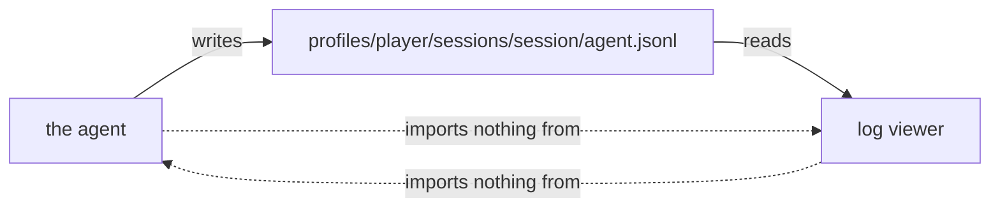

# Log viewer

A browser reader for the agent's session logs. Each run writes a JSONL log of
everything it did, and this serves that log as a set of views that surface a run's
findings first, rather than leaving the reader to scroll the whole record. It is a
standalone program: it reads the log file and imports nothing from the agent.

[](https://youtu.be/IzYEOPm49Mg)

*Reading one session, in the order a reader arrives: the session list ranked by spend,
the session's own summary of what stood out and why a turn cost what it did, the map of
where the agent went, the player findings, prompt size against the window, the tools
grouped by tool, the errors, the raw record, the journey of every move, and finally a
single turn opened down to its individual calls. Click through for the full recording.*

## Not part of the agent

The viewer is its own package with its own `pyproject.toml`, tests, and launcher,
sitting outside `agent/` with no step number. Its only coupling to the agent is the
JSONL file format, so a log written by any version stays readable.



It discovers isolated player sessions and legacy flat sessions by the same
documented root rules the writer uses, reimplemented rather than imported. A
reader meant to outlive its writer does not depend on it to find input.

## Run

```
bin/log_viewer                    # all player sessions and legacy recordings
bin/log_viewer latest             # the most recent session
bin/log_viewer 20260726T08        # any unambiguous prefix
bin/log_viewer --list             # print the sessions and exit
bin/log_viewer --dir PATH         # a sessions directory elsewhere
bin/log_viewer --port N           # another port, localhost only
bin/log_viewer --no-open          # do not launch a browser
uv run python -m unittest discover -s tests -t .    # every check
```

It binds to loopback, makes no network call, and needs no provider key. A busy port
is not an error: it moves to the next free port and reports where. `tests/` holds
every check, run without a browser.

## New Files

| File | What it is |
|---|---|
| `logviewer/logview.py` | Records, turns, tool pairing, totals, and window occupancy from a log. |
| `logviewer/world.py` | The MUD room graph: room resolution by exits and map layout from the world files. |
| `logviewer/sessions.py` | Which run to read, and where the logs live. |
| `logviewer/insights.py` | Findings, relative outliers, attribution, the player findings, and the pressure series. |
| `logviewer/html.py` | Escaping, value formatters, ANSI to spans, and inline SVG. |
| `logviewer/style.py` | One stylesheet for both themes. |
| `logviewer/logweb.py` | The only module that emits HTML. |
| `logviewer/cli.py` | The routes, the server, and the command surface. |

Every module except `logweb` is independent of the rendering and tested without a
browser.

## Views

A session opens on a narrative of its turns, with nine further lenses over the same
data, each addressable by URL:

| Lens | Shows |
|---|---|
| narrative | What happened, turn by turn. |
| map | The route walked, with rooms identified by their exits. |
| player | Confused, blocked, bored, stuck, overpowered, and drained, each with the threshold that decided it. |
| pressure | Prompt size per call against the window, with compactions marked. |
| timeline | Wall-clock time per call, against this session's median. |
| context | What each prompt added over the previous one. |
| tools | One tool's use across the whole session. |
| journey | Every movement the agent made and what the world said back. |
| errors | Failures, retries, and tripped ceilings together. |
| raw | The underlying record, so any other view can be checked. |

Findings lead each page in the order a reader opens a log for: what failed, then what
limited the run, then what was slow or expensive. An outlier is measured against the
session's own median, so an expensive run does not flag every turn and a cheap one
still flags its worst.

## Two views built on the world files

- Map: room titles are not unique, so a trail built from titles merges distinct
  places. The MUD's world files identify a room by number and typed exits, so a
  shared title is resolved by the exit taken to reach it. Those files are read as
  data, not imported, and where they are absent the map says so rather than drawing
  a false path.
- Player: the findings are computed, not left to the reader. Confused is a room
  entered three or more times, blocked is the same action refused twice or more, bored
  is four identical actions in a row, stuck is a turn spending eight or more actions to
  reach at most one new room, overpowered is the world naming a zone above the agent's
  level, and drained is the game reporting exhaustion. Each threshold is printed beside
  its finding, and the criteria show even when nothing is found.

## Deliberately not here

- A second cost calculation, session editing, or authentication. Cost is logged as a
  fact, the log is a record, and the server binds to localhost only.
- Cross-session analytics and model comparison, which need every model's rates and
  belong to the week-2 observability component.
- Live follow of a running session. The directory is re-read on each request, so a
  finished run appears on a refresh.
