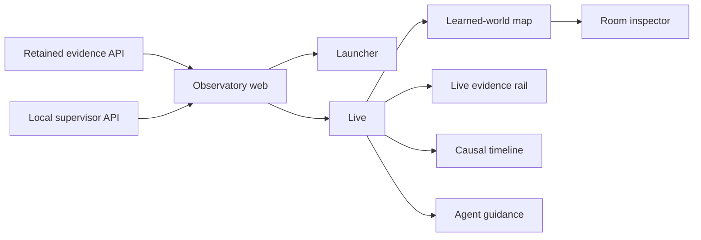

# Boukensha Observatory

## What it is

The Observatory is the operator surface for Boukensha. It is built on the
retained Python data layer, typed evidence contracts, and read API. The local supervisor API adds typed start, stop, and
agent-message actions without changing the evidence boundary.



Detailed behavior and acceptance contracts live in the
[Observatory plans](../../docs/plans/week2_observ/observatory/).

## Layout

```text
observatory/
├── backend/
│   ├── launcher/
│   │   └── server.py
│   ├── projections/
│   ├── sources/
│   └── app.py
├── tests/
├── web/
│   ├── src/
│   │   ├── live/
│   │   ├── sessions/
│   │   ├── experiments/
│   │   ├── knowledge/
│   │   ├── shell/
│   │   ├── App.tsx
│   │   ├── Launcher.tsx
│   │   └── contracts.ts
│   ├── package.json
│   ├── tsconfig.json
│   └── vite.config.ts
├── pyproject.toml
├── uv.lock
└── README.md
```

- `backend/` owns the typed evidence API, the projections, and the static
  application host.
- `backend/launcher/` owns the loopback-only session supervisor used by
  launcher and lifecycle controls.
- `web/` owns the React application, strict TypeScript contracts, theme,
  launcher, the shared header in `shell/`, Live shell, map, room inspector,
  Sessions, Experiments, Knowledge, and component tests.

## Install

From `week2_capable/observatory`:

```bash
uv sync --extra dev
cd web
npm ci
npm run build
```

Python and JavaScript dependencies are pinned. Virtual environments,
`node_modules`, and frontend build output remain uncommitted.

## Launch

Build the frontend, then run the supervisor and retained Observatory host in
separate terminals from the repository root:

```bash
cd week2_capable/observatory/web
npm run build
```

```bash
uv run --project week2_capable/observatory observatory-launcher
```

```bash
./week2_capable/bin/observatory
```

Open <http://127.0.0.1:8787>. The launcher is served at `/`. A Live deep link
uses `/live?player=<player>&session=<session>`.

For frontend development, keep both Python processes running and start Vite:

```bash
cd week2_capable/observatory/web
npm run dev
```

Open <http://127.0.0.1:8791>. Vite proxies evidence requests to port `8787`
and lifecycle requests to port `8792`.

## Configure

Durable non-secret source policy lives in `.boukensha/settings.yaml`. These
environment variables affect the launch directly:

| Variable | Default | Purpose |
| --- | --- | --- |
| `BOUKENSHA_DIR` | repository `.boukensha` | Player profiles, registered sessions, and supervisor state |
| `BOUKENSHA_OBSERVATORY_IDLE_TIMEOUT_SECONDS` | `1800` | Stop a persistent session after this many idle seconds. `0` disables the timeout. |

The `week2_capable/bin/observatory` command always selects the production
build for the retained static host. It exits with a build instruction when the
build output is unavailable.

The retained API accepts additional evidence-source settings documented in
the [Observatory README](../observatory/README.md#configure). Missing sources
remain visibly unavailable. Neither API invents replacement evidence.

## Screens

### Launcher

The launcher lists registered players and sessions, starts a supervised run,
and opens an existing live session. Session state and available actions come
from typed runtime contracts. An optional first goal starts turn one through
the persistent plain REPL. Completing that turn leaves the session available
for later instructions. The supervisor stops it after the configured idle
timeout, 30 minutes by default. Starting owns the launcher with a named
connecting state until Live opens or a typed failure restores the form.

### Live shell

The Live shell keeps player, lifecycle state, and session identity in one
context control. It provides theme, scoped Ask, valid lifecycle actions, and
navigation without changing the selected evidence source. The objective strip,
evidence rail, active-combat panel, and thought age expose retained state
without claiming that a stale observation is current. Message agent retains
one authenticated Goal or Nudge, makes it available at the next active
iteration boundary, and also queues a persistent wake envelope. An active turn
consumes the directive and later ignores the wake. An idle agent uses the wake
to start a turn whose first checkpoint consumes the directive. This removes
the turn-end race without placing internal wake data in model context.
The thought dock carries the agent's own latest statement in sequence: the
newest planning while a turn runs, then the prose the turn ended on, held
until newer planning follows a nudge. A completion is marked apart from
planning, so a finished goal does not read like a stalled one.
The active-combat panel follows the initial Live mock's left-side spotlight,
streams retained MUD combat lines in sequence order, and follows the newest
line as the fight grows. Unsolicited combat frames update the stream and prompt
vitals without a `score` probe. It participates in Focus camera occlusion, so
the panel does not hide the current room.
The objective strip always renders: structured current metadata wins, retained
compatibility text remains visible for older sessions, and an unset objective
is stated directly. Applied replacements carry their revision count, while
Nudge guidance never becomes the displayed goal.
The rail keeps navigation progress in one stable block, emphasizes retained
friction rules when they fire, and states lifecycle or capture conditions when
measurements would be unsafe. The causal timeline keeps a current snapshot
beside any selected historical prefix, so room and level-up landmarks can step
backward and forward without losing the route back to live. Pause becomes
Resume while a prefix is held. Step buttons enable only when an adjacent
retained event exists, and Jump to live enables only outside the live edge.
Its cost curve comes only from retained response economics. Quiet room markers
establish the journey baseline. Emphasized level-up, fired-friction, and
applied operator-message markers select the first prefix that contains their
evidence. Combat boundaries remain absent until typed episode history exists.

### Sessions

Sessions opens any registered run, including stopped, crashed, empty, and
ordinary non-experiment runs. Story, Map, Cost, and Ask share one selection.

- Story reads from session start through objective epochs, turns, iterations,
  model exchanges, tool cycles, gateway work, MUD text, parsing, and the exact
  result delivered upstream.
- Applied Goals form collapsible chapters. Applied Nudges form collapsible
  subchapters containing the iterations influenced by that guidance.
- Goal chapters start collapsed. Selecting a Goal updates the shared title and
  selection, jumps to its first iteration, and toggles the Story or Map group.
- Turn and iteration form the replay identity, so iteration numbering may
  restart without merging evidence from different turns.
- Map reuses the Live map, camera, presentation controls, pan, zoom, room
  detail, and current-room treatment.
- The map remains spatially continuous across goals. Goal headers divide its
  collapsible iteration rail without resetting learned world state.
- Replay has first, previous, play, pause, next, last, and scrub actions with
  valid boundary states.
- Cost shows reconciled response cost, context growth, token classes, and exact
  response contributors that return to Story.
- Wire and raw detail links original bytes, ANSI-preserving decoded text,
  normalized parser input, typed observations, and delivered model input.
- The exact model request, system prompt, messages, and tool schemas load one
  record at a time, on the reader's press rather than on expanding a section.
  The story carries every other field, so the response is a fraction of its
  former size without losing a step.
- The session start card carries the standing instructions the model was given,
  collapsed, so the rules behind every later decision are readable in one place
  rather than only inside a request body.
- A room is named by the game's own number as well as its title, so several
  rooms sharing a title stay distinct. The number a session opens in is
  attributed to the iteration it precedes.
- The state block the agent is handed before each model call has its own
  record, titled by what it is: what the agent was told. It never reads as the
  objective, and its absence is recorded as plainly as its content.
- A tool result carries how it was presented and how much of it was cut, so a
  reply the model saw in part is never mistaken for one it saw whole.
- A nudge that arrives mid-turn contains the iterations it interrupted, rather
  than sitting beside the turn it changed.
- Missing historical bodies stay explicit as capture gaps.
- Ask defaults to the complete session and cites retained lifecycle or record
  evidence. A selected-record boundary is explicit and optional.
- Story filtering reports matching iterations from readable evidence text. It
  does not search accumulated raw request bodies or appear in other views.
- The header is the shared Observatory header with the context chip, Ask, and
  theme. The chip lists the five latest sessions with their goals, and View all
  opens the session finder over the complete player history. Finder search
  matches goal, displayed lifecycle, displayed or ISO date, and session id.
- The route bypasses browser caching, refreshes on return, and polls a selected
  live session without resetting the reader's view. The poll asks what changed
  and refetches the story only when the journal or the agent log has moved.
- Launcher load links route terminal sessions here. Running sessions retain the
  valid path back to Live.

### Knowledge

Knowledge renders the per-player store as inspectable state: every current
fact with its subject, predicate, value, layer, and confidence, plus the
session evidence behind it.

- Metrics summarize current facts, known subjects, open conflicts, and
  source sessions.
- Search covers subject, predicate, value, layer, and confidence. Layer
  filters and an include-superseded toggle bound the view.
- Belief-layer facts (the agent's own assertions) stay visually distinct
  from learned and parsed facts, and each evidence link opens the session
  that produced the assertion.

### Experiments

Experiments opens retained controlled comparisons without turning them into a
winner dashboard. Compare, Paths, Samples, Definition, and Replay keep one
question and one immutable definition in context.

- Changed registered values stay visible on every arm.
- Success, cost, cost deviation, calls, token classes, payload, schema, and
  corrective-call evidence remain cohort measurements.
- Representative paths expose the first semantic divergence and stay labelled
  as examples.
- Every sample preserves its outcome, timestamp, cost, turns, calls, and route
  into the standard Sessions workspace.
- The Definition lens identifies runner-supported and observe-only
  configuration dimensions.
- Rendering and parser counterfactuals use retained evidence without a model
  call.
- Paid execution remains absent while local policy is disabled.

### Learned-world map

The map renders the agent's retained room, traversal, frontier, visit, mob,
object, and thought evidence inside the final Live map pane. Grow, Focus, and
Lantern change presentation without changing learned coordinates. Follow,
Manual, Fit, drag, and zoom operate against the map viewport while the thought
dock and legend remain overlays. Reflow compares evidence-order and topology
layouts, swaps rooms and relocates them into free lattice cells to minimize
connection crossings, keeps compass direction as a soft constraint, and fits
the result without changing evidence. The soft constraint keeps non-Euclidean
CircleMUD mazes readable instead of forcing impossible compass geometry.
Follow holds the camera while the current room stays inside its central dead
zone, then catches up without overshoot. An unconnected position jump snaps
instead of imitating observed traversal.

### Room inspector

Selecting a room opens its retained description, exits, visits, sightings,
cost, confidence, and provenance. Agent observations remain distinct from the
separately labelled Atlas reference, and the selected room is restorable from
the `room` URL parameter.

## Verify

From `week2_capable/observatory/web`:

```bash
npm test
npm run build
```

The frontend suite contains 182 tests across 26 files. `npm run build` runs
strict TypeScript checking with `tsc --noEmit` before producing the Vite
production bundle.

The supervisor boundary is covered by the same suite, in
`tests/test_launcher_server.py`.

## Dependencies

- React and React DOM provide the component application.
- Lucide React provides accessible interface icons.
- Vite builds and serves the frontend.
- TypeScript checks the public frontend contracts in strict mode.
- Vitest, jsdom, and React Testing Library verify behavior and routing.
- The supervisor API uses the Python standard library and has no runtime
  package dependencies.
